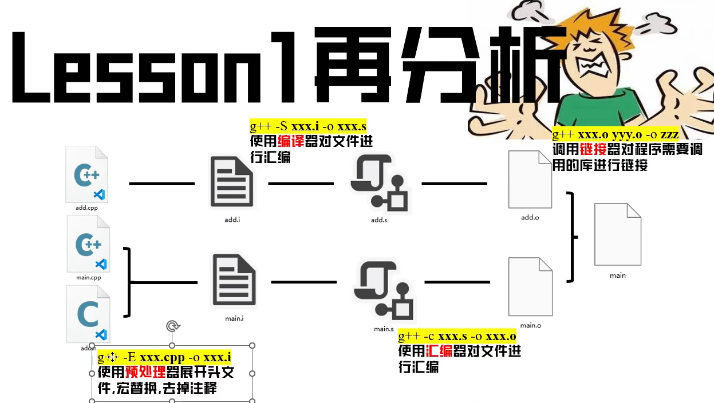

这篇笔记来自于B站UP主[比飞鸟贵重的多_HKL](https://space.bilibili.com/218427631)

### CMake底层逻辑

插件列表：

+ c/c++
+ c/c++ Extension Pack
+ c/c++ Themes
+ Cmake
+ Cmake tools
+ Output Colorizer


visual studio code底部出现控制bar？

设置搜索：cmake.options.statusBarVisibility，设置为true

output输出乱码？修改`output log encoding`值为 `UTF-8withBOM`


+ 需要知道用哪些库，以及这些库所在的位置。


为什么cpp/c需要头文件？

+ 第一步，展开头文件（将头文件中的内容复制到当前文件中）（预编译）
+ 头文件的意义：被展开到源文件里


编程技术优化升级在做的三件事情

1、提升效率

2、减少重复（头文件）

3、减少依赖


```cmake
project() # 项目名称，类似于visual studio 新建项目时起的项目名

add_subdirectory() # 找子cmake

include_directories() # 相当于包含目录

add_executable() # 编译链接文件
```


### 静态库与动态库

静态库：在编译的时候，把库里的所有内容压入可执行文件，可以单独执行。

```cmake
add_library(静态库名， 源码文件) # 生成静态库

target_link_libraries(目标，库路径.lib) # 目标就是 add_executable() 中的第一个参数，也就是可执行文件名 因此需要放在add_excutable后面
# 库路径可以使用${CMAKE_CURRENT_SOURCE_DIR} 

# 也可以使用link_directories 指定库路径，后面直接用lib名称
```


动态库：在程序执行的时候，必须能找到动态库。

```cmake
add_library(静态库名，shared, 源码文件) # 生成动态库

target_link_libraries(目标，库路径.lib) # 目标就是 add_executable() 中的第一个参数，也就是可执行文件名 因此需要放在add_excutable后面
# 库路径可以使用${CMAKE_CURRENT_SOURCE_DIR} 

# 也可以使用link_directories 指定库路径，后面直接用lib名称
# MSVC 会把刻链接的东西放入lib里
```


动态库

```cmake
add_library(target SHARED ...) # 动态库
target_compile_definitions(target PRIVATE 宏定义)
```

dll动态库都在bin中。windows中的msvc编译动态库会得到.lib和.dll两个文件。MSVC中需要加入`__declspec(dllexport)`.

当导出类，类里面有静态变量的时候，就有差别。

dll文件需要exe运行程序能够找到。


### cmake 跨平台



```cmake
cmake .. # 在linux上就是生成Makefile，在Windows则是生成sln
# 作用就是将CMakeLists.txt翻译成目标平台的makefile或者sln。linux是g++

cmake --build . # 生成可执行文件，在Windows与linux通用 

# 开关，用于构建时候的过程信息
cmake ../path -DCMAKE_VERBOSE_MAKEFILE=ON
```


### 再探静态库与动态库

linux中动态库结尾为`.so`，linux的target_link_libraries中指定的lib目录，那么在运行的时候，可以直接找个该路径的库，而不需要像windows那样，DLL文件需要与exe文件在同一目录。

linux静态库是**lib*.a**，静态库以.a结尾。生成静态库用`ar`命令

但是链接的时候，不能加上lib。因为前面的lib是linux自动给生成的。


**`add_definitions()`**

- **作用范围**：全局生效，对**当前目录及子目录**的所有目标（可执行文件、库等）添加宏定义。
- **适用场景**：旧版本CMake（兼容性优先），需要为整个项目或目录树统一添加某些定义。
- **缺点**：
  - 缺乏针对性，可能污染不需要该定义的目标。
  - 无法区分 `PRIVATE`/`PUBLIC`/`INTERFACE` 依赖关系。


**`target_compile_definitions()`**

- **作用范围**：仅对**特定目标**（如某个库或可执行文件）生效。
- **适用场景**：现代CMake（推荐），需要为特定目标精确控制宏定义。
- **优点**：
  - 支持 `PRIVATE`、`PUBLIC`、`INTERFACE` 关键字，控制宏的传播。
  - 避免全局污染，提高构建系统的模块化。


### 减轻依赖（现代CMake）

vscode在linux上使用的默认编译器为Ninja

```cmake
include_directory() # 不推荐用

target_include_directories() # 现代cmake推荐使用的
```

没有通过其他库再生成库的过程。有一个传递的过程。

interface：将头文件简介暴露给调用者。interface是把头文件打包到库里面。这时候头文件就变成了一份真正的说明书。完全不用考虑头文件的路径的。在代码里面哪里要用到，只要一个include加上头文件的名。里面的函数就能直接调用了。

项目结构如下：

LESSON3_1
│  main.cpp
│  CMakeLists.txt
│  
├─add
│      add.h
│      add.cpp
│      CMakeLists.txt
│      
├─sub
│      sub.h
│      sub.cpp
│      CMakeLists.txt
│      
├─caculator
│      caculator.h
│      caculator.cpp
│      CMakeLists.txt
│      
└─common
        common.h
        common.cpp
        CMakeLists.txt

各个文件内容如下：

add

```cpp
// add.h
#include "common.h"
void add(int a, int b);

// add.cpp
#include "add.h"
void add(int a, int b)
{
    int c = a + b;
    printResult(c);
}
```

add/CMakeLists.txt

```cmake
add_library(add STATIC add.cpp)
target_include_directories(add INTERFACE ./)
target_link_libraries(add common)
```


sub

```cpp
// sub.h
#include "common.h"
void sub(int a, int b);

// sub.cpp
#include "sub.h"
void sub(int a, int b)
{
    int c = a - b;
    printResult(c);
}
```

sub/CMakeLists.txt

```cmake
add_library(sub STATIC sub.cpp)
target_include_directories(sub INTERFACE ./)
target_link_libraries(sub common)
```


common

```cpp
// common.h
#include <iostream>
void printResult(int result);

// common.cpp
#include "common.h"
void printResult(int result)
{
    std::cout << result << std::endl;
}
```


common/CMakeLists.txt

```cmake
add_library(common STATIC common.cpp)
target_include_directories(common INTERFACE ./)
```


calculator

```cpp
// calculator.h
class calculator
{
private:
    /* data */
public:
    calculator(/* args */);
    ~calculator();
    void calAdd(int a, int b);
    void calSub(int a, int b);
};


// calculator.cpp
#include "calculator.h"
#include "add.h"
#include "sub.h"

calculator::calculator(/* args */)
{
}

calculator::~calculator()
{
}

void calculator::calAdd(int a, int b)
{
    add(a, b);
}

void calculator::calSub(int a, int b)
{
    sub(a, b);
}
```


calculator/CMakeLists.txt

```cmake
add_library(calculator STATIC calculator.cpp)
target_include_directories(calculator INTERFACE ./) # 将头文件嵌入库中
target_link_libraries(calculator sub add) # 这里并不会嵌入依赖的库，只是在生成可执行文件时，会将这些以来的库都链接上。
```


main

```cpp
#include "calculator.h"

int main()
{
    calculator cal;
    cal.calAdd(19, 21);
    return 0;
}
```


main/CMakeLists.txt

```cmake
add_subdirectory(common)
add_subdirectory(add)
add_subdirectory(sub)
add_subdirectory(calculator)

add_executable(lesson3_1 main.cpp)
target_link_libraries(lesson3_1 calculator)
# 不仅会链接 calculator库还会链接 add， sub 和common三个库
```


### find_package

解决问题：就是前面路径写死了，如果其他人要用，那么就要改路径。（比如每个人的路径都不一样）

find_package(packageName)

首先找packageNameConfig.cmake（新版本），然后找findpackageName.cmake（老版本）文件。

从系统环境变量中找。

find_package寻找的是cmake配置文件。


### CMake变量作用域

参考知乎文章：https://zhuanlan.zhihu.com/p/669103269

**局部变量**：通过`set`创建的变量，只被设置其值的CMakeLists.txt文件**同目录**以及**子目录**中可见。

```cmake
set(LOCAL_VARIABLE "local value")  # 局部变量定义
```


**缓存变量**（Cache Variables）：存储在CMake缓存中，在整个项目构建过程中保持不变。能够在多次运行CMake时保持不变，适合跨项目会话存储配置和偏好

```cmake
set(VARIABLE_NAME VALUE CACHE TYPE DESCRIPTION)
```

在这里，`VARIABLE_NAME` 是变量的名称，`VALUE` 是它的初始值，`TYPE` 指定了变量的类型（如 `INTERNAL`，`STRING`），而 `DESCRIPTION` 则提供了变量的简短描述。**类似于const变量**


**PARENT_SCOPE**（有点像冒泡，值从底部传递到顶部，使用PARENT_SCOPE时，变量会在**当前作用域的父作用域**中设置）

每次PARENT_SCOPE只能影响上一层。

在 CMake 中，PARENT_SCOPE 是一种特殊的选项，用于将变量的作用域从当前的函数或宏扩展到包含该函数或宏的上级目录。当在一个函数或宏内部使用 `set()` 命令并指定 `PARENT_SCOPE` 时，它会影响父级作用域中同名变量的值。这对于在模块化或层次化项目中传递和更新数据非常有用。

```cmake
set(VARIABLE_NAME VALUE PARENT_SCOPE)
```

在这里，`VARIABLE_NAME` 是要设置的变量名，而 `VALUE` 是其值。当这行代码在函数或宏内执行时，它会在父作用域中设置或更新 `VARIABLE_NAME` 的值。


**全局属性**

在 CMake 中，全局属性是**跨整个项目共享的属性**。这些属性可以被设置来存储特定的值，然后可以在项目的任何地方检索。这种方法特别适用于那些需要在多个目录和子项目中访问的数据。

```text
set_property(GLOBAL PROPERTY PROPERTY_NAME VALUE)
```

在这个命令中，`GLOBAL` 指定了属性的作用域是全局的，`PROPERTY_NAME` 是属性的名称，而 `VALUE` 是其值。

