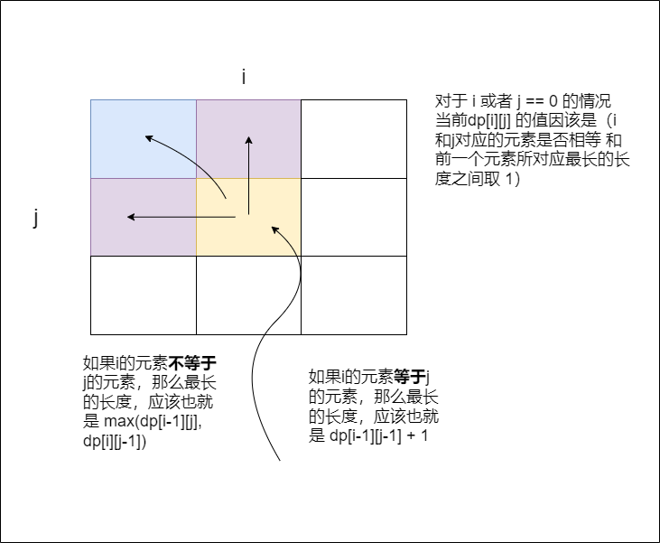

动态规划


状态、 转移方程；有向无环图

DP状态确定的原则：

+ 最优子结构

  将原有问题化分为一个个子问题，即为**子结构**。而对于每一个子问题，其最优值均由[更小规模的子问题的最优值]推导而来，即为最优子结构

+ 无后效性

  只关心子问题的最优解，不关心子问题的最优值是怎么得到的。


### 1、递推1

[LCR 127. 跳跃训练](https://leetcode.cn/problems/qing-wa-tiao-tai-jie-wen-ti-lcof/)


### 2、递推2


### 3、递推 3


### 4、递推4


### 5、递推5


### 6、线性DP-O(1)状态转移1

[198. 打家劫舍](https://leetcode.cn/problems/house-robber/)

``` c++
dp[i] = max(dp[i-1], dp[i-2] + nums[i]); 
```


### 7、线性DP-O(1)状态转移2

[213. 打家劫舍 II](https://leetcode.cn/problems/house-robber-ii/)

```c++
// 分两种情况，第零个元素：选择、不选择
```


### 8、线性DP-O(1)状态转移3

[91. 解码方法](https://leetcode.cn/problems/decode-ways/)

```c++
// 状态转移方程
1、合并的情况，10 <= s[i-1]*10 + s[i] < =26，s[i] == '0'
    s[i] == '0'; dp[i] = dp[i-2]
    否则，dp[i] = dp[i-1] + dp[i-2];
2、不能合并的情况， 和大于26， 或者小于10
    dp[i] = dp[i-1]
```


### 9、线性DP-O(1)状态转移4

[1646. 获取生成数组中的最大值](https://leetcode.cn/problems/get-maximum-in-generated-array/)


### 10、线性DP-O(n)状态转移1

[1043. 分隔数组以得到最大和](https://leetcode.cn/problems/partition-array-for-maximum-sum/)

```c++
// 状态转移方程 dp[i] 从 0-i个元素划分的最大值
// 找出 当前dp[i] 前k个里的最大元素
// dp[i] = (i-j+1) * maxval;
// 找到目标j，j满足的条件是 j-i 组成的新的分割方式 比原有的要大

```


### 11、线性DP-O(n)状态转移2

[139. 单词拆分](https://leetcode.cn/problems/word-break/)

dp[i] 表示的是从 0-i的字符串能被能否被匹配.

对于当前的dp[i]，遍历字典表里的每一个单词：

+ 如果单词长度查超过了字符串的长度，继续匹配下一个单词
+ 如果当前单词（长度 L）匹配的前面（也就是s[i-L]， 即 0 ~ i-L 的字符没有被匹配），也继续匹配下一个单词。
+ 否则，从 S[i-L+ 1] ~ s[i] 判断是否与word[0] ~ word[L]匹配，如果匹配，则dp[i]为1；


dvs可以去了解一下，到底是什么


### 12、线性DP - 前缀和 1

[1869. 哪种连续子字符串更长](https://leetcode.cn/problems/longer-contiguous-segments-of-ones-than-zeros/)

单独找出最长的'1'串和'0'串的长度，然后返回最长的长度比较。


---

### 14、二维DP - 二维前缀和

[1277. 统计全为 1 的正方形子矩阵](https://leetcode.cn/problems/count-square-submatrices-with-all-ones/)

dp\[L\]\[i\][j]表示从i，j开始长度为l的方阵。

如果长度为1，那么matrix\[i\][j]为1就行了

如果大于1，那么matrix\[i\][j]为1，同时，长度为l-1的三个方阵（i+1,j）(i,j+1) (i+1, j+1)的三个方阵都为1，才能保证长度为l的方阵均为一。


### 15、二维DP1

[LCR 091. 粉刷房子](https://leetcode.cn/problems/JEj789/)

这个题挺简单的，当前房价刷某一颜色+（上一个房价刷另一个颜色的值的最小值的和）


### 16、二维DP 2

就是刷房子


### 17、经典DP - 最大子数组 1

[53. 最大子数组和](https://leetcode.cn/problems/maximum-subarray/)


### 18、经典DP - 最大子数组 2

LCR42


### 19、经典DP - 最长单调子序列 1

[300. 最长递增子序列](https://leetcode.cn/problems/longest-increasing-subsequence/)


### 20、经典DP - 最长单调子序列 2

[673. 最长递增子序列的个数](https://leetcode.cn/problems/number-of-longest-increasing-subsequence/)


### 21、经典DP - 最长单调子序列 3

[1027. 最长等差数列](https://leetcode.cn/problems/longest-arithmetic-subsequence/)


### 22、经典DP - 最长单调子序列 4

[LCR 093. 最长的斐波那契子序列的长度](https://leetcode.cn/problems/Q91FMA/)

这应该是个二维DP，

```c++
dp[i][j] 
// 表示倒数第一个数为 j， 倒数第二个数为 i 的斐波那契数列
// arr[i], arr[j]
// 那么前一个应该也就是， arr[j]-arr[i], arr[i]
// 找到 arr[j]-arr[i]是否存在，存在的下标为index，
```


### 23 经典DP - 最长单调子序列 5

和22题一样


### 24 经典DP - 最长公共子序列 1

[LCR 095. 最长公共子序列](https://leetcode.cn/problems/qJnOS7/)

```c++
dp[i][j] 表示text1的前i个字符与text2的前j个字符能够组成的最长公共子序列的长度
```



+ 对于 i 或者 j == 0 的情况
  当前dp[i][j] 的值因该是（i和j对应的元素是否相等 和 前一个元素所对应最长的长度之间取 1）

+ 如果i的元素**等于**j的元素，那么最长的长度，应该也就是 dp\[i-1\]\[j-1\] + 1

+ 如果i的元素**不等于**j的元素，那么最长的长度，应该也就是 

  max(dp\[i-1\]\[j\], dp\[i\]\[j-1\])


### 25、经典DP - 最长公共子序列 2

1143题


### 26、经典DP - 最长公共子序列 3

[516. 最长回文子序列](https://leetcode.cn/problems/longest-palindromic-subsequence/)


### 27、编辑距离

[72. 编辑距离](https://leetcode.cn/problems/edit-distance/)

dp\[i\]\[j\]，表示text1 的0-i个字符于text2的 0-j个字符的最短编辑距离。

- 修改A串的第i个字符成B串的第j个字符，之后仅需要计算A[i+1...lenA]和B[j+1...lenB]的距离即可；
- 删除A串的第i个字符，之后仅需要计算A[i+1...lenA]和B[j...lenB]的距离即可；
- 把B串的第j个字符插入到A串的第i个字符之前，之后仅需要计算A[i...lenA]和B[j+1...lenB]的距离即可。

tips: 0x7f7f7f7f表示无穷大。


### 28、经典DP - 杨辉三角 1

[118. 杨辉三角](https://leetcode.cn/problems/pascals-triangle/)


### 29、经典DP - 杨辉三角 2

[LCR 098. 不同路径](https://leetcode.cn/problems/2AoeFn/)


### 30、经典DP - 杨辉三角 3

[62. 不同路径](https://leetcode.cn/problems/unique-paths/)


### 31、经典DP - 杨辉三角 4

[LCR 166. 珠宝的最高价值](https://leetcode.cn/problems/li-wu-de-zui-da-jie-zhi-lcof/)


### 32、经典DP - 杨辉三角 5

[LCR 099. 最小路径和](https://leetcode.cn/problems/0i0mDW/)


### 33、经典DP - 杨辉三角 6

[64. 最小路径和](https://leetcode.cn/problems/minimum-path-sum/)


### 34、经典DP - 经典股票问题 1

[121. 买卖股票的最佳时机](https://leetcode.cn/problems/best-time-to-buy-and-sell-stock/)

用dp[i]表示第0 - i天最小值，当天的最大收益也就应该是price[i] - dp[i];

dp[i] = min(dp[i-1], price[i])


### 35、经典DP - 经典股票问题 2

[122. 买卖股票的最佳时机 II](https://leetcode.cn/problems/best-time-to-buy-and-sell-stock-ii/)

有点像马尔可夫模型，当前状态由之前的多种状态决定。

当天有四种状态：持有，未持有，买入，卖出。这四种状态之间的关系：

+ 持有：买入，持有

+ 未持有：未持有，卖出

+ 买入：未持有，卖出
+ 卖出：持有，买入


### 36、经典DP - 经典股票问题 3

[123. 买卖股票的最佳时机 III](https://leetcode.cn/problems/best-time-to-buy-and-sell-stock-iii/)


### 37、经典DP - 经典股票问题 4

[188. 买卖股票的最佳时机 IV](https://leetcode.cn/problems/best-time-to-buy-and-sell-stock-iv/)

这个很好理解，关键点在于

对于第0次交易：

+ 未买入：前一天 0 也是 未买入
+ 买入：前一天 0 也是 未买入 - 买入价格
+ 持有：前一天 0 买入或者持有
+ 卖出：前一天 0 买入或者持有 + 卖出收益

对于k次交易：关键在于 k 次买入的前提是 k-1次已经完成了交易，也就是卖出了。

+ 未买入：前一天 k 未买入， k-1 卖出
+ 买入：前一天 k 未买入， k-1 卖出 - 买入价格
+ 持有：前一天 k 持有，k 买入
+ 卖出：前一天 k 持有，k 买入 + 卖出收益


### 38、经典DP - 经典股票问题 5

[309. 买卖股票的最佳时机含冷冻期](https://leetcode.cn/problems/best-time-to-buy-and-sell-stock-with-cooldown/)

多加一个冷静期状态，但是如果冷冻期很长应该怎么办呢？ 

未买入：未买入、冷冻期

买入：未买入、冷冻期

持有：买入、持有

卖出：买入、持有

冷冻期：卖出


如果冷冻期过长：

未买入：未买入、-1-cold 卖出

买入：未买入、-1-cold 卖出

持有：买入、持有

卖出：买入、持有

这里要注意的是，最后n-1只能覆盖0~n-1-cold这个区间，而 n-1-cold ~n-1这个区间由于冷冻期无法交易，产生的最大值需要手动遍历。


正解：

未买入：未买入、卖出(为什么这里可以是卖出呢？，因为只需要关注前一个状态)

买入：未买入（前一天只能是未买入）

持有：买入、持有

卖出：买入、持有


### 39、经典DP - 经典股票问题 6

[714. 买卖股票的最佳时机含手续费](https://leetcode.cn/problems/best-time-to-buy-and-sell-stock-with-transaction-fee/)

加上手续费就行了