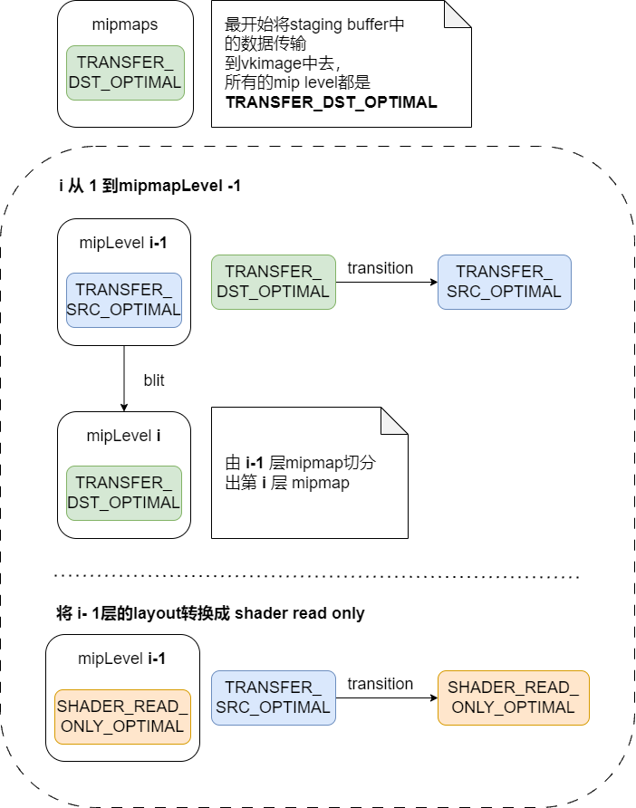

### MipMap

生成mipmap，有点像LOD， level of detial

"mip" comes from the latin "multim in parvo", meaning a multitude in a small space

每一层为上一层的 1/4，我们可以得出如下的公式
$$
\sum_{n=0}^{n=\infty}\frac{1}{4^n} \\
=\frac{1-\frac{1}{4^n}}{1-\frac{1}{4}}\\
=4/3
$$
也就是一个初项为1公比为1/4的等比数列求和。额外的1/3存储。


### image creation

在vulkan中，不同层级的mip images存储在一个 `VkImage`对象中。

mip level 0为原始图像。在创建`VkImage`的时候指定mip levels的层级。

在创建`VkImage`对象的时候

+ 根据加载的纹理图像，计算出miplevels

  ```c++
  mipLevels = static_cast<uint32_t>(std::floor(std::log2(std::max(texWidth, texHeight)))) + 1;
  ```

+ 在 `createImage`, `createImageView`，`transitionImageLayout`这三个函数中，添加上levelcount

  ```c++
  void createImage(uint32_t width, 
                   uint32_t height, 
                   uint32_t mipLevels, 
                   VkFormat format, VkImageTiling tiling, 
                   VkImageUsageFlags usage, 
                   VkMemoryPropertyFlags properties, 
                   VkImage& image, 
                   VkDeviceMemory& imageMemory) {
      ...
      imageInfo.mipLevels = mipLevels; // 创建图像的miplevel的层数
      ...
  }
  
  VkImageView createImageView(
      VkImage image, 
      VkFormat format, 
      VkImageAspectFlags aspectFlags, 
      uint32_t mipLevels) {
      ...
      // 这一段用不到，但是我不理解，所以我加上了。
      // layerCount 图像视图中子资源的层数。在Vulkan中，数组层数是指一个图像中的数组元素数量。
      // 例如，如果一个图像是一个二维纹理数组，那么它的数组层数就是纹理数组中纹理的数量。
      // 在这种情况下，VkImageViewCreateInfo.subresourceRange.layerCount指定了视图可以访问的纹理数量。
      viewInfo.subresourceRange.layerCount = 1; 
      // 表示的是图像视图中的子资源级别数量。指定了视图可以访问的mipmap级别数
      viewInfo.subresourceRange.levelCount = mipLevels; 
      ...
  }
  
  void transitionImageLayout(
      VkImage image, 
      VkFormat format, 
      VkImageLayout oldLayout, 
      VkImageLayout newLayout, 
      uint32_t mipLevels) {
      ...
      // VkImageMemoryBarrier结构体中的subresourceRange.levelCount成员用于指定图像内存屏障的子资源级别数。
      // 这个值指定了屏障可以访问的mipmap级别的数量。
      // 例如，如果levelCount被设置为1，则只有基本mipmap级别可用于屏障。
      // 如果levelCount被设置为n，则屏障可以访问从基本级别到第n-1级别的所有mipmap级别。
      barrier.subresourceRange.levelCount = mipLevels;
      ...
  }
  ```

  

### Generating Mipmaps

+ `vkCmdBlitImage`可以用来产生各个层级的mipmap。

+ blit需要依赖于image的layout。因此每次blit之前都需要把image的**layout**转换到所需的layout上去。

+ 在vulkan中可以**独立地**转换图像的每一层mip level。

+ 每次blit操作只会**同时处理两层** mip level。由上一层生成下一层。

+ `vkCmdBlitImage`必须得要submitted到一个有graphics capability地queue中去。




### Linear filtering support

使用内建的 `vkCmdBlitImage`产生所有mip level层，需要所使用的图像的format支持linear filtering。

使用`vkGetPhysicalDeviceFormatProperties`来检查是否受支持。

在运行的时候产生mipmap是不常用的，更多的时候是预先生成好的。

```c++
VkFormatProperties formatProperties;
vkGetPhysicalDeviceFormatProperties(physicalDevice, imageFormat, &formatProperties);
if (!(formatProperties.optimalTilingFeatures & VK_FORMAT_FEATURE_SAMPLED_IMAGE_FILTER_LINEAR_BIT)) {
    throw std::runtime_error("texture image format does not support linear blitting!");
}
```


### sampler

因为在vulkan中sampler控制了获取资源的方式，因此也需要在sampler中进行相应的设置。

```c++
void createTextureSampler() {
    ...
    samplerInfo.mipmapMode = VK_SAMPLER_MIPMAP_MODE_LINEAR;
    samplerInfo.minLod = 0.0f; // Optional 采样器可以使用的最小的LOD值
    samplerInfo.maxLod = static_cast<float>(mipLevels); // 同理 最大的
    samplerInfo.mipLodBias = 0.0f; // Optional 用于控制纹理的mipmap级别偏移量
    ...
}
```


### 好处

最直观的就是，有效避免了摩尔纹
