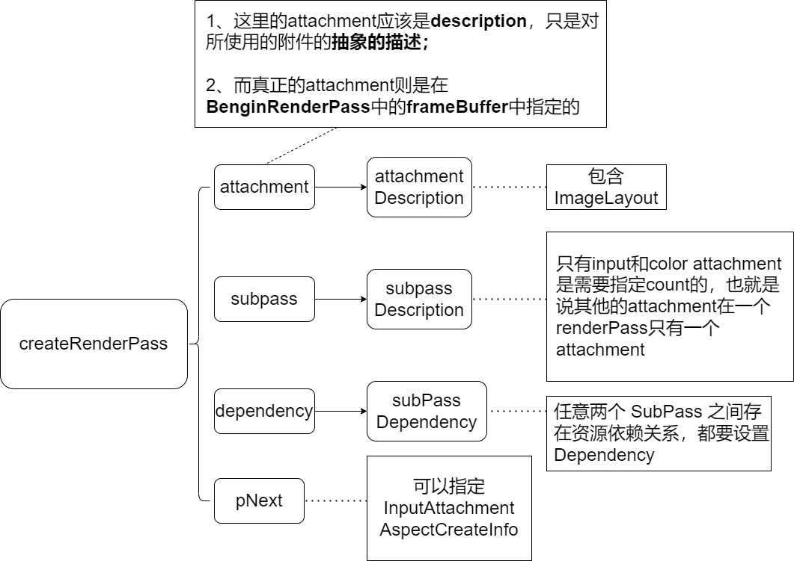
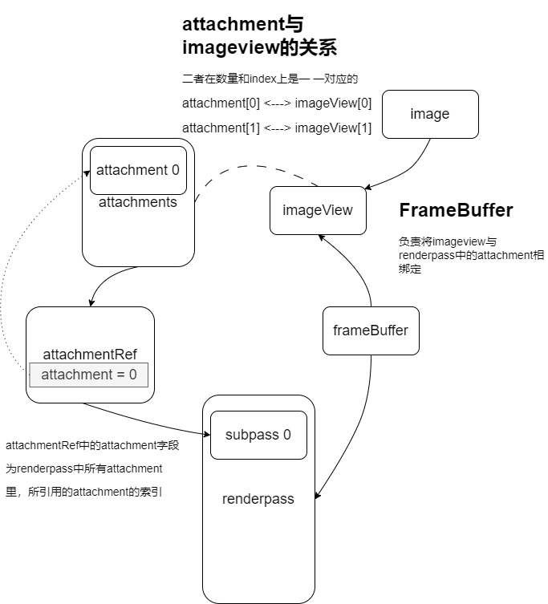

<center>Render passses</center>

为什么我们需要`renderpasses`呢，这里我就引用一下知乎上justin的文章。下面很多都是他的原话

地址：https://zhuanlan.zhihu.com/p/404118061

当一个或多个像素变得昂贵的时候，例如对于多光源

+ 可以用一个着色器来处理多光源，这么做就会很复杂，而要是不同类型的光，那就真的是寄了，难度直接上天
+ 为每个光源创建一个单独的着色器，对每个光源渲染一次，分别进行计算，再将每个结果添加到framebuffer中。这样做更系统，更简单。


对于`renderpass`的理解参考了math philosohpy的文章

地址：https://zhuanlan.zhihu.com/p/418277173

`renderPass`里存了些啥：

1，一堆附件（两种类型，颜色，深度）

2， 一堆附件引用（和上面的附件基本是1对1）

3，若干`SubPass `,每个`SubPass`对应一堆附件引用

4，若干`SubPassDependency`, 每个子通道依赖对应一个源`SubPass`,一个目标`SubPass`

5, 最后1个`RenderPass`对应上面所有。


附件引用的作用仅仅只是表达一个附件可以同时被两个`subpass`引用


pipeline相当于是铺设的管道，这个管道里可以是石油也可以是天然气（`attachment`），而`renderpass`就相当于是组织管道内流通的物质的


#### set up

让vulkan在渲染的时候知道 哪些`framebuffer attachments`会被使用

需要指定有多少 ==颜色==和==深度==缓存等信息，这些信息都封装在==render pass==对象中

附件是我们在绘图命令期间渲染的图像，换句话说它们是渲染目标。可用于片段着色器内部的像素局部加载操作，在后续子通道中的同一像素处读取在一个子通道中写入的帧缓冲附件。


#### Attachment description

`loadOp`和`storeOp`决定`attachment`里的数据在渲染前后如何处理,应用于颜色和深度

还有个`stencilLoadOp`和`stencilStoreOp`，则应用于`stencil `数据


`Textures` 和 `framebuffers` 被 带有具体像素格式的`VkImage`所表示。


#### Subpasses and attachment references

一个渲染过程可以由多个子过程组成。

每个子过程可以引用多个附件

reference里的attachment指的是 该引用对应的attachment在attachment description里的索引。


---

---


### 关于renderPass新的理解

知乎上的CreateX Engine讲得很不错，我就把他的笔记基本照抄下来，链接如下：

https://zhuanlan.zhihu.com/p/131392827#:~:text=AF%20%E5%9C%A8%20Vulkan%20%E4%B8%AD%E7%9A%84%E5%AE%9E%E7%8E%B0%201%201%E3%80%81RenderPass%20%E8%AE%BE%E7%BD%AE%20SubPass,4%204%E3%80%81Shader%20%E7%BC%96%E5%86%99%20...%205%205%E3%80%81%E6%B8%B2%E6%9F%93%E6%97%B6%E5%88%87%E6%8D%A2%20SubPass%20


#### renderPass 的创建

首先renderPass得创建包含以下步骤：





`VkAttachmentReference`结构体用于描述一个子通道中的附件。它包含了以下成员变量：

- `attachment`：附件的索引。
- `layout`：==附件在管线中的使用方式==。


#### Image Attachment 创建

Vulkan规定`Input Attachment`**只能**用于`Image`资源,且**只能**用于Fragment Shader，并且资源（指的是image object）的`usage`必须是:

+ `VK_IMAGE_USAGE_INPUT_ATTACHMENT_BIT`与下面两个bit的组合，且该bit不能单独存在
+ `VK_IMAGE_USAGE_COLOR_ATTACHMENT_BIT`、`VK_IMAGE_USAGE_DEPTH_STENCIL_ATTACHMENT_BIT`


#### Descriptor配置

与 `Color Attachment` 不同的是，`SubPass` 的 `Input Attachment` 被视为 `Shader` **可访问资源**，只是读取方式与 `Sampled Image` 不同，因此需要在渲染时将 `Input Attachment` 对应的资源绑定在管线中。Vulkan 中绑定资源到管线需要通过 `Descriptor` 完成，因此要将 `Input Attachment` 的**描述符类型**指定为 `VK_DESCRIPTOR_TYPE_INPUT_ATTACHMENT`，剩余的操作和绑定普通的 Shader 资源一样。

由于`Input attachment`只能用于Fragment Shader中，因此在对应的`descriptorSetLayout`的`binding`中对于`stageFlags`只能是`VK_SHADER_STAGE_FRAGMENT_BIT`


#### Shader编写

Shader中使用Input Attachment 需要特殊的Shader语法

在GLSL中input声明代码如下：

```c++
layout (input_attachment_index = 0, binding = 0) uniform subpassInput inputColor;
layout (input_attachment_index = 1, binding = 1) uniform subpassInput inputDepth;
```

使用代码如下：

```c++
vec3 color = subpassLoad(inputColor).rgb;
....
float depth = subpassLoad(inputDepth).r;
```


#### 渲染时切换SubPass

在渲染时 `BeginRenderPass` 之后，可以通过 `vkCmdNextSubpass` 命令来切换 `SubPass`，每次调用时会自动切换到下一个 `SubPass`，并且自动执行 `SubPass` 之间的 `Dependency` 以保证资源数据同步。


#### 限制

直接是老哥的原话

由 `VkAttachmentReference` 结构可以看出，不能将一个 `Attachment` 同时设置为 `COLOR_ATTACHMENT_OPTIMAL` 和 `SHADER_READ_ONLY_OPTIMAL`，否则会违反 `VkImageLayout` 的**唯一性**，因此 Vulkan 也就不能在一个 `SubPass` 中对一个 `Attachment` 既写又读。


### FrameBuffer

为什么需要frameBuffer呢？这里我把知乎YOung的回答记录了下来，方便以后回看。链接如下：

https://zhuanlan.zhihu.com/p/48066609

+ Frame Buffer概念

  `Frame Buffer`封装了 `color buffer image` 和 `depth buffer image`。其中`color buffer image` 为从`swap chain` 获取的`image`，`frame buffer`创建个数 等于 `swap chain`的`image`的数量，比如，双缓冲的swap chain需要对应建立2个frame buffer。

  此外，Frame Buffer 还负责把 render pass 的 attachment 跟 image 关联起来

+ 帧缓冲的作用（来自知乎洛阳李四）

  https://zhuanlan.zhihu.com/p/373993587

  + 当创建并绑定了一个帧缓冲后，再进行的渲染操作都将会绘制到这个帧缓冲中，由于这不是默认的缓冲，所以不会对屏幕上的结果产生任何影响，这个过程也被称为离屏渲染。
  + 我们拿离屏渲染的结果进行一系列“黑处理”，然后再到默认帧缓冲当中，让他显示到屏幕上，完成一次渲染操作。其中帧缓冲中的结果，即离屏渲染的结果，是一个半成品；一系列黑处理就是所谓的后期处理；

+ 有一个问题？就是为啥不对attachment使用sampler呢？

  这个问题，则说呢。如果仔细看一下renderpass创建的时候会指定attachment description，在description就已经说了如何处理attachment中的数据。

  + attachment主要目的是作为渲染通道的输出目标，而不是作为着色器的采样源。
  + attachment的数据通常是直接由渲染管线（render pipeline）处理的，而不需要着色器进行显式的采样操作。渲染管线会在渲染通道的过程中自动将数据写入attachment。
  + Vulkan中的渲染通道（render pass）和帧缓冲（framebuffer）的概念允许您**明确定义附件的用途和格式**（attachment description），以及如何在渲染通道中使用它们。这种灵活性使得在渲染通道中处理附件的数据变得更加高效和直观。


### descriptor与description的区别：

在Vulkan API中，`descriptor`和`description`是两个不同的概念。

+ `descriptor`是一个特殊的不透明的shader变量，用于**以间接方式访问缓冲区和图像资源**。它可以被认为是指向某个资源的“指针”。在绘制操作之间，这些变量可以被改变，因此shader每次绘制时可以访问不同的资源。在Vulkan API中，所有的操作都以`descriptor set`为单位，不论是绑定到pipeline还是更新set中的一个descriptor。因此，Vulkan API并没有给出一个descriptor的handle，而是以`WriteDescriptorSet`的形式来完成一个buffer和descriptor的binding工作.

+ 相比之下，`description`是一个抽象的描述，用来**描述数据块或解释数据块**。在Vertex Input中，描述符描述了数据块的组织方式。例如，在Vulkan Tutorial Descriptor layout and buffer中，我们首先建立DescriptorSetLayoutBindings，这个部分由多个DescriptorSetLayoutBinding组成，描述了一个set的数据组织。它们共同构成了一个DescriptorSetLayout的描述。在Shader中，我们最终通过

​	ayout(set = 0, binding = 0) uniform MyBuffer { 

​		mat4 model; mat4 view; mat4 proj; 

​	} ubo[\]; 

​	来获取我们写入的对应数据

因此，这两个概念是不同的：前者是用于访问缓冲区和图像资源的变量；后者是用于描述数据块或解释数据块的抽象描述。


### 设置clearValues

在renderpass中设置多个 clear Value，它们的顺序应该与attachments中的顺序相对应。
