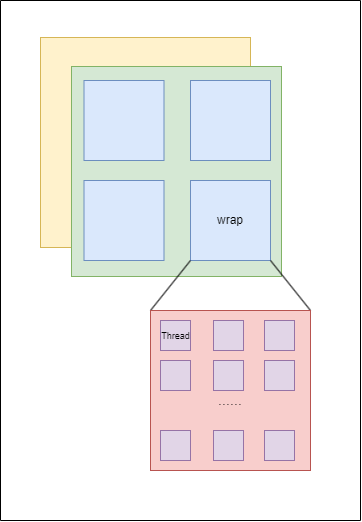
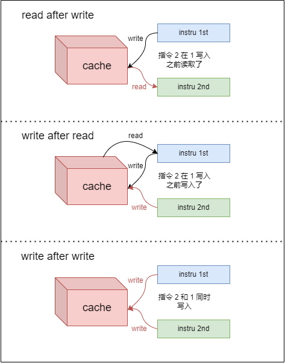

compute shader

### 介绍

与老的API（OpenGL）不同，在vulkan中 compute shader是被要求强制支持的。

+ GPGPU：General Purpose Graphics Processor Units，一种利用图形处理单元（GPU）进行通用计算的技术。可以将其理解为一个辅助CPU的工具，能够帮助CPU进行非图形相关程序的计算。

+ 通常电脑端的GPU负责电脑的图形渲染，这是一个负荷较大的工作。为了给GPU分担一部分压力，一些非图形相关程序的运算就会交给电脑的CPU来完成，而GPGPU则是主要负责**非图形相关程序**的运算。例如，GPGPU主要用于物理计算、加密解密、科学计算以及比特币等加密货币的生成。

  在设计GPGPU时，去掉了GPU为了图形处理而设计的加速硬件单元，**保留了GPU的SIMT架构（一条指令多个线程）**和通用计算单元。因此，GPGPU并不比GPU更厉害，只是去掉了GPU的图形显示部分，将其余部分全部投入通用计算。

  总的来说，GPGPU技术的出现使得GPU不再局限于图形和图像处理，而是成为了一种通用的计算资源

+ 但随着GPU变得越来越强大和灵活，许多需要CPU通用功能的工作负载现在可以在GPU上实时完成。


### 优点

+ 减少CPU的工作量
+ 减少了CPU与GPU的交互（这个开销很大）
+ GPU相比于CPU更适合高度并行的工作流


### Vulkan pipeline

 在计算机图形处理中，计算与图形是分离的。如下图所示，传统的管线的图形部分位于图的左侧，而右侧的几个阶段则不属于图像渲染管线。

随着计算着色器阶段从图形管道分离，我们将能够在任何我们认为合适的地方使用它。在计算着色器中，我们仍然可以使用descriptor来访问外部资源，毕竟计算着色器已经从渲染管道中分离了。


### 粒子系统

粒子系统由两部分组成：

+ 顶点
+ 一种更新顶点的方式

传统的基于CPU的粒子系统，会将数据保存到系统的主存中去，然后使用CPU去更新这些数据。之后在将这些更新完的数据传输回GPU中去。数据在CPU与GPU中进行往返，开销非常大。限制在于主存与PCIE贷款之间。

基于GPU的粒子系统，只需要在最开始的时候，将顶点数据传输到GPU即可，之后的数据更新在GPU中使用compute shader完成。


### 数据操作

在前面，我们有传输vertex 和index buffer到管线，也有利用uniform buffer 传输数据到shader中。当然还有图片，进行纹理映射。但是这些数据，都是CPU写，GPU读的。

在compute shader中一个非常重要的概念就是，compute shader有能力对buffers 进行随机读**写**。

vulkan提供了两种专用的存储类型。（shader storage buffer object， ssbo；storage images ）


### SSBO

SSBO允许shader去读写一个buffer。

SSBO是一种缓冲区对象，允许着色器从中读取和写入数据。使用它们与使用Uniform Buffer Objects类似，但是它们有以下几个主要区别：

1. 可以将其他缓冲区类型别名为SSBOs。

   // 应该说没有具体的SSBO类型，而是将其他类型加入一个SSBO标志，

   在vulkan中可将buffer和images可以设置多种usages

2. SSBOs可以是**任意大小**，而不像UBOs一样有16KB的大小限制。

   不必指定元素的数量

3. SSBOs是**可写的**，甚至可以原子地写入；而UBOs是只读的。

4. SSBOs的**读取和写入使用不一致的内存访问**，因此需要适当的屏障，就像Image Load Store操作一样。

5. SSBO允许在运行时动态更改元素数量，这是UBO所不能做到的。

[这些区别使得SSBOs成为在计算着色器中存储大量数据的理想选择。](https://www.khronos.org/opengl/wiki/Shader_Storage_Buffer_Object)


`std140`是一个内存布局限定符，它规定了着色器存储缓冲中元素如何在内存中对齐。

compute shader 相关

+ 创建buffer，这是storage bit
+ 获取支持compute的queuefamily
+ 从family中获取queue
+ 加载compute shader
+ 加载shader的时候在pipeline中的shader stage设置为：`VK_SHADER_STAGE_COMPUTE_BIT`
+ 然后就是descriptor的bindingpoint 中设置为`VK_PIPELINE_BIND_POINT_COMPUTE`

  对于同一个layout binding，的stageFlags可以设置多个stage bit


怎么说？感觉SSBO应该不算是一个特定的buffer类型，更像是给unifrom 或者image加上一个可写的操作。


### compute pipeline

因为compute不是渲染管线的一部分，我们需要使用`vkCraeteComputePipeline`单独创建一个compute pipeline来运行compute commands。


### compute space

两个重要的计算概念：

+ work groups（工作组）

  这是一个基本的3D工作块，其中每个工作由运行你的代码的计算着色器调用来处理，每个局部工作组在x，y，z维度上的大小是通过在你的着色器源代码中使用输入布局限定符来设置的。

+ invocations（调用）

  定义了在每个工作组内将执行的着色器次数。如果计算着色器的局部大小为[64, 1, 1]，并且你以工作组数[32, 32, ,1]执行它，那么你将获得64 x 32 x 32 = 65,536个单独的着色器调用。


首先，让我们了解一些基本概念：
- **工作组**：工作组是计算着色器中的一组线程，它们协同执行相同的计算任务。工作组通常用三维索引来标识，比如 `[x, y, z]`。

- **本地尺寸**：本地尺寸是一个指定的线程组的维度，即在一个工作组中有多少个线程。它通常是一个三维向量，如 `[x, y, z]`。

- **分派调用**：分派调用是指计算着色器被执行的次数。分派调用的参数是一个工作组的数量，通常用一个三维向量来表示，如 `[x, y, z]`。

在给定的示例中，我们有以下参数：
- 工作组数量（dispatch call）是 `[64, 1, 1]`，这意味着我们将启动 64 个工作组，每个工作组在 x 方向上有 64 个线程，而在 y 和 z 方向上都只有 1 个线程。

- 本地尺寸（local size）是 `[32, 32, 1]`，这表示每个工作组中有 32 x 32 个线程。

现在，我们来计算计算着色器将被调用多少次：
- 在 x 方向上，有 64 个工作组，每个工作组有 32 个线程，所以在 x 方向上总共有 64 * 32 = 2048 个线程。
- 在 y 方向上，只有 1 个工作组，每个工作组有 32 个线程，所以在 y 方向上总共有 1 * 32 = 32 个线程。
- 在 z 方向上，只有 1 个工作组，每个工作组有 1 个线程，所以在 z 方向上总共有 1 * 1 = 1 个线程。

现在，将这三个方向的线程数量相乘，我们得到总的线程数：
- 总线程数 = 2048 (x 方向) * 32 (y 方向) * 1 (z 方向) = 65,536

因此，根据给定的分派调用和本地尺寸，计算着色器将会被调用 65,536 次，每次调用都在不同的线程组内执行，以完成计算任务。这种分派调用和本地尺寸的配置可以帮助并行执行计算任务，提高性能。

他们定义了一个抽象的执行模型，说明了计算工作负载如何被GPU的计算硬件在三维（x，y，z）上处理




### 关于工作组维度划分的问题，其实本质就是对任务进行分解

在计算着色器（Compute Shader）中，工作组（Work Group）的划分通常都是三维的。这样设计的主要原因是为了方便处理各种不同的计算场景，包括**一维、二维图形、三维粒子**等。

具体来说，**工作组的每一个单元被称为工作项（Work Item）**，**每次调用称为一次执行**。执行的单元之间可以通过变量和显存进行通信，且可以通过执行同步操作保持一致性。尽管在图示中，全局和本地工作组都是2维的，但实际上它们都是3维的。为了适应1维、2维的任务，只需把额外的2维或1维设为0即可。

这样的设计使得计算着色器能够根据任务的实际需求灵活地调整工作组的结构，从而提高并行计算的效率。这也是为什么在设置threadgroup size时通常保险的做法是设成64的倍数，这样能够保证thread尽可能完整的被打包成wavefront并分配给各个SIMD，从而避免性能浪费。

工作组的维度是根据数据的维度来判断的。如果数据的维度超过三维，那就要降维

```glsl
// 指的是每个工作组内的线程数
layout (local_size_x = 256, local_size_y = 1, local_size_z = 1) in; 
```

软件结构：

- **thread:** 一个CUDA的并行程序会被以许多个thread来执行。
- **block:** 数个thread会被群组成一个block，同一个block中的thread可以同步，也可以通过shared memory进行通信。一个线程块的thread只能在一个SM上调度，一个SM同时并发的warp是有限的，一个CUDA core可以执行一个thread，一个SM的CUDA core会分成几个warp（即CUDA core在SM中分组)，由warp scheduler负责调度。
- **grid:** 多个block则会再构成grid。

---

如果block大小为256，而一个SM处理器有128个CUDA核心，那么这个block会被分成8个warp（每个warp包含32个线程）。然后，这些warp会被分配到SM上进行执行。

由于一个SM只能同时执行128个线程，因此在任何时刻，只有4个warp（128个线程）会被同时执行。其余的warp会等待直到有足够的CUDA核心可用。

---


block大小的选择：

1. **线程数量**：理论上，线程越多，就越能弥补单个线程读取数据的延迟。但是，当线程越多，每个线程可用的寄存器也就越少，严重的时候甚至能造成Kernel无法启动。
2. **Block大小**：每个Block最少应包含64个线程，一般选择128或者256，具体视MP数目而定。
3. **SM最大线程数**：一个MP最多可以同时运行768个Thread，但每个MP最多包含8个Block。因此要保持100%利用率，Block数目与其Size有如下几种设定方式：
   - 2 blocks x 384 threads
   - 3 blocks x 256 threads
   - 4 blocks x 192 threads
   - 6 blocks x 128 threads
   - 8 blocks x 96 threads
4. **32的倍数**：还有一种说法，就是开的 thread per block 数应该尽可能是 32 的 倍数 ，好像 GPU 硬件层面开的时候，都是按 32 的倍数开的。


### 执行compute

与`vkCmdDraw`对图像相似的是，`vkCmdDispatch`用于告知GPU进行一些计算

+ 在dispatch里指定的是工作组
+ 而在compute shader里指定的是工作组内的线程数


最后将commandbuffre submit到支持compute的queue上去。


### 在graphics 和 compute之间进行同步

使用semaphores 和 fences 来保证vertex shader在 compute shader完成更新之后再读取。

即使指令被按照顺序提交，但它们不一定会被GPU按顺序执行。


### 关于vulkan中的信号量

+ fence

  在Vulkan中，`vkWaitForFences`函数**用于等待GPU来激活围栏**（fence）. 围栏是一种同步机制，用于CPU和GPU之间的同步，提供了一种粗粒度的，**从Device向Host单向传递信息的机制**。Host可以使用围栏来查询通过 `vkQueueSubmit` / `vkQueueBindSparse` 所提交的操作是否完成。简言之，在 `vkQueueSubmit` / `vkQueueBindSparse` 的时候，可以附加带上一个围栏对象。之后就可以使用这个对象来查询之前提交的状态了.

  请注意，信号量是一种同步机制，用于同步不同的队列之间或同一个队列不同提交之间的执行顺序

  ```c++
  VkCommandBuffer A = ... // record command buffer with the transfer
  VkFence F = ... // create the fence
  
  // enqueue A, start work immediately, signal F when done
  vkQueueSubmit(work: A, fence: F)
  
  vkWaitForFence(F) // blocks execution until A has finished executing
  
  save_screenshot_to_disk() // can't run until the transfer has finished
  ```

  

+ semaphore

  Semaphore是Vulkan中用于同步队列操作的一种机制。它可以协调队列内和队列之间的操作。在Vulkan中，Semaphore主要用于同步交换链的图像获取和呈现。Semaphore的使用需要在调用顺序上有先后顺序的情况下进行同步。Semaphore的使用可以通过在`vkAcquireNextImageKHR`和`vkQueuePresentKHR`接口中传递信号量来实现。具体来说，当一个图像被获取时，需要使用一个信号量来同步，以确保该图像不会被重复获取或呈现。当一个图像被呈现时，需要使用另一个信号量来同步，以确保该图像不会被重复呈现或获取。

  pWaitSemaphores和pSignalSemaphores的作用范围如下：

  - pWaitSemaphores：表示在**提交**命令缓冲区**之前**必须**等待**哪些信号量。这些信号量必须是未完成信号或等待操作的信号量或围栏。Semaphore必须是二进制信号量。如果在提交命令缓冲区之前没有需要等待的信号量，则可以将其设置为NULL。
  - pSignalSemaphores：表示命令缓冲区**执行完毕**后需要**发出**哪些信号量。这些信号量必须是未完成信号或等待操作的信号量或围栏。Semaphore必须是二进制信号量。如果不需要发出任何信号量，则可以将其设置为NULL。


### 数据冒险

+ read after write hazard

  先写后读相关性。当第二条指令在第一条指令写入寄存器之前读取该寄存器时，就会产生RAW相关性。

+ write after read hazard

  当第一条指令读取一个寄存器，而第二条指令在第一条指令写入该寄存器之前写入该寄存器时，就会产生WAR相关性。

+ write after write hazard

  先写后写相关性。当两条指令都试图写入同一个寄存器时，就会产生WAW相关性。




### glsl 内置变量

| 内置变量      | 含义                               | 值数据类型 |
| ------------- | ---------------------------------- | ---------- |
| gl_PointSize  | 点渲染模式，方形点区域渲染像素大小 | float      |
| gl_Position   | 顶点位置坐标                       | vec4       |
| gl_FragColor  | 片元颜色值                         | vec4       |
| gl_FragCoord  | 片元坐标，单位像素                 | vec2       |
| gl_PointCoord | 点渲染模式对应点像素坐标           | vec2       |


还需要创建一个 绘制粒子系统的graphics pipeline，然后单独写一个recordParticleCommandBuffer


