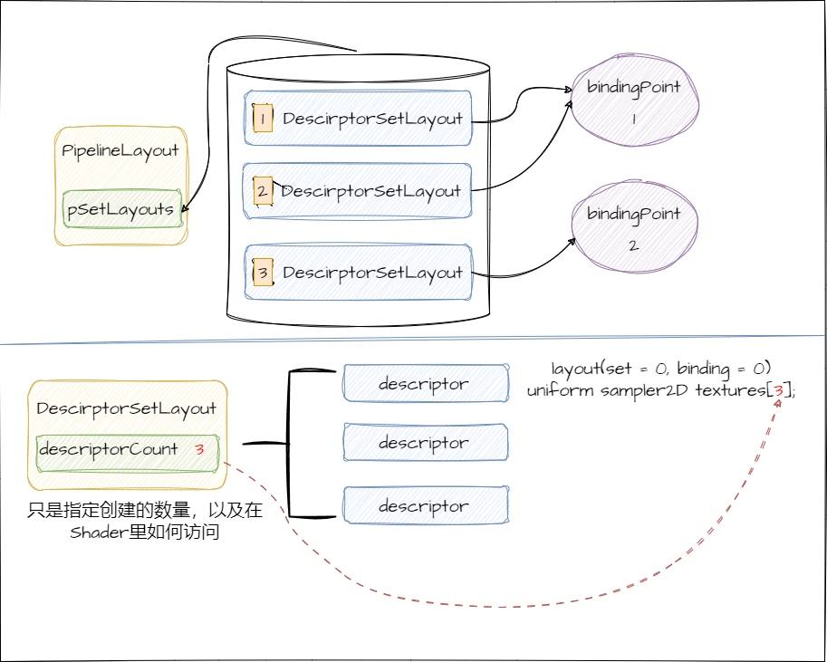

Uniform buffers

用途：主要是为了能够更新全局变量的值，而不是每次刷新vertex buffer，用resource descriptors

descriptor：一种shader可以自由获取资源（buffers，images）的方式，更像是一种映射，将资源暴露出来，shader可以访问

使用descriptors的步骤：

+ 指定一个descriptor layout（指定资源的类型） 在 pipeline 构造的时候
+ 从descriptor pool 中分配一个 descriptor set（指定真实的资源）
+ 在rendering的时候绑定 descriptor（绑定到drawing commands）

目前主要是 uniform buffer objects（UBO）

### 什么是资源描述符呢：

其实这个问题我想了很久，但是在vulkan相关的教材里没有找到令我满意的回答，不经意间翻了翻d3d12的书，发现里面对资源秒速符的解释很通透。故记录下来：

+ GPU资源并不是直接和渲染管线相绑定
+ 描述符是对资源的一种间接引用
+ 是一种对 送往gpu的资源进行描述的轻量级结构
+ 从本质上来说是个中间件

那么为什么我们需要这个中间件呢：

+ 可以让资源在渲染管线的不同阶段被使用
+ 将资源的部分而非整体绑定到渲染管线上
+ 对于无类型格式的资源，需要告诉GPU其具体的格式
+ 描述符除了指定资源数据，还会为GPU解释资源（告诉GPU如何使用这些资源，此资源绑定到流水线的那个阶段）

描述符堆(descriptor heap)也就是vulkan中的descriptor set

+ 是存放用户程序中，某种特定类型描述符的一块内存
+ {一种类型}的描述符 对应 {一或多个}描述符堆
+ 可以用多个描述符来引用同一资源

#### 使用descriptor set

+ 首先创建descriptorsetlayout bingding

  + pimmutablesamplers 只有在纹理的时候会用到
  + 所有的descriptor bingdings 都被绑定在 vkdescriptorsetlayout中

+ 关于各对象的理解可以看

  https://zhuanlan.zhihu.com/p/450434645

+ Set 高于Descriptor。

+ 一个Set下有若干个Binding Point，

+ Binding Point下有一个Descriptor Array，

+ Descriptor Array中含有一个或多个Descriptor

+ 最终利用Command绑定的单位是Set

在DescriptorSetLayout的指导下，利用Descriptor Pool提供的Descriptors，**组装**（这个词很重要，之前不理解，现在理解了）成一个符合DescriptorSetLayout的Set

#### 和vertex中的description的比较

同样是描述和解释数据块。Description是抽象的描述，真正绑定到Pipeline Vertex Input Stage的是Vertex Buffer本身，而Descriptor是描述器，可以认为他对数据进行了一层封装，连同自己一起参与到了数据解析的全过程中，使得真正绑定到Pipeline的是Descriptor而不再是Buffer。

c++ 关于时间的头文件， chrono头文件

#### layout 和 buffer的作用

在c++端将buffer暴露出来，可以让host修改，layout的作用是为了指导set的创建

#### descriptor pool and sets

+ descriptor set 是为每一个vkbuffer资源创建的，为的是将vkbuffer和descriptor相绑定
+ descriptor set 要从pool中分配
+ 指定类型

+ 和commandbuffer一样，sets 会随着pool一起销毁

### 如何在vulkan中使用Descriptor和UniformBuffer

+ 创建descriptorsetlayout
  + 使用`vkCreateDescriptorSetLayout`函数
  + vulkan中创建对象，都需要createInfo
  + 在pipeline的创建中需要指定descriptorsetlayout
+ 创建buffer的过程
  + 创建vkBuffer和VkDeviceMemory(手动分配内存)对象，并将两者bind
  + 向buffer中传输数据，vkMapMemory ---》memcpy ---》 vkUnmapMemory
+ 创建descriptorpool
+ 分配descriptorset
+ 将descriptorset与uniformBuffer相绑定
+ 在使用的时候bind所需的descriptor即可
