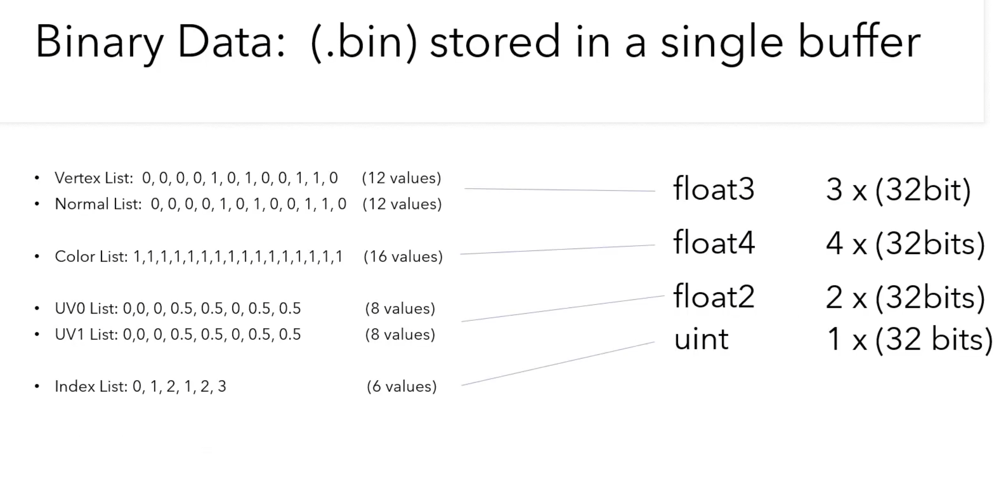

### glTF文件组织形式

glTF格式本质上是一个JSON文件。这一文件描述了整个3D场景的内容。它包含了对场景结构进行描述的场景图。**场景中的3D对象通过场景结点引用网格进行定义**。**材质**定义了3D对象的**外观**，**动画**定义了3D对象的变换操作(比如选择、平移操作)。**蒙皮**定义了3D对象如何进行骨骼变换，**相机**定义了渲染程序的**视锥体**设置。

glTF组织形式：


- [scene](https://link.zhihu.com/?target=https%3A//github.com/KhronosGroup/glTF/tree/master/specification/2.0/%23reference-scene)：glTF格式的场景结构描述条目。它通过**引用node**来定义场景图。
- [node](https://link.zhihu.com/?target=https%3A//github.com/KhronosGroup/glTF/tree/master/specification/2.0/%23reference-node)：场景图中的一个结点。它可以包含一个变换(比如旋转或平移)，**引用更多的子结点**。它可以**引用网格**和**相机**，以及描述网格变换的蒙皮。
- [camera](https://link.zhihu.com/?target=https%3A//github.com/KhronosGroup/glTF/tree/master/specification/2.0/%23reference-camera)：定义了用于渲染场景的视锥体配置。
- [mesh](https://link.zhihu.com/?target=https%3A//github.com/KhronosGroup/glTF/tree/master/specification/2.0/%23reference-mesh)：描述了场景中出现的3D对象的网格数据。它**引用的accessor对象**可以用来**访问真实的几何数据**。它引用的material对象定义了3D对象的外观。
- [skin](https://link.zhihu.com/?target=https%3A//github.com/KhronosGroup/glTF/tree/master/specification/2.0/%23reference-skin)：定义了用于蒙皮的参数，参数的值通过一个accessor对象获得。
- [animation](https://link.zhihu.com/?target=https%3A//github.com/KhronosGroup/glTF/tree/master/specification/2.0/%23reference-animation)：描述了一些结点如何随时间进行变换(比如旋转或平移)。
- [accessor](https://link.zhihu.com/?target=https%3A//github.com/KhronosGroup/glTF/tree/master/specification/2.0/%23reference-accessor)：一个**访问任意数据的抽象数据源**。被mesh、skin和animation元素使用来提供几何数据，蒙皮参数和基于时间的动画值。它通过引用一个bufferView对象，来引用实际的二进制数据。
- [material](https://link.zhihu.com/?target=https%3A//github.com/KhronosGroup/glTF/tree/master/specification/2.0/%23reference-material)：包含了定义**3D对象外观的参数**。它通常引用了用于3D对象渲染的texture对象。
- [texture](https://link.zhihu.com/?target=https%3A//github.com/KhronosGroup/glTF/tree/master/specification/2.0/%23reference-texture)：定义了一个sampler对象和一个image对象。sampler对象定义了image对象在3D对象上的张贴方式。
- buffer: 一个buffer对象表示了一个**没有任何层次结构**和意义的二进制数据块。缓冲的数据通过uri属性引用。uri属性可以引用一个外部文件作为缓冲的数据，也可以直接使用数据URI作为缓冲的数据
- bufferView: bufferView对象代表了一个buffer对象的部分数据。这一部分数据的范围通过一个偏移值和长度定义。
- primitive: 一个Mesh可以包含**多个Primitive**。每个Primitive定义了一组**共享相同材质和渲染属性的几何形状**。通过将多个Primitive组合在一起，可以创建更复杂的3D模型。


### glTF模型加载

#### LoadASCIIFromFile

`LoadASCIIFromFile` 函数是 tinyGLTF 库中的一个函数，用于从磁盘上的 GLTF 文件加载 3D 模型数据。这个函数的具体用途如下：

```cpp
bool LoadASCIIFromFile(model, err, warn, filename);
```

- `model`：这是一个用于**存储加载的 3D 模型数据的数据结构**，通常是一个 `tinygltf::Model` 对象，可以在加载后用于访问模型的各个部分，如几何数据、材质、纹理和动画等。
- `err` 和 `warn`：这是用于存储加载时的错误信息和警告信息的字符串，通常是 `std::string` 类型的引用。如果加载过程中出现了错误或警告，这些字符串将包含相关信息。
- `filename`：这是要加载的 GLTF 文件的路径和文件名。

`LoadASCIIFromFile` 函数的主要作用是**将指定的 GLTF 文件加载到 `model` 中**，以便后续的操作。它会解析 GLTF 文件的内容，包括几何数据、材质信息、纹理、动画和场景层次结构等，并将这些数据填充到 `model` 对象中，以便您可以在应用程序中使用这些数据来渲染 3D 模型或进行其他操作。

如果加载过程中出现错误或警告，这些信息将会被记录到 `err` 和 `warn` 字符串中，以便您可以在需要时检查和处理它们。

总之，`LoadASCIIFromFile` 函数是 tinyGLTF 库用于加载 GLTF 格式的 3D 模型文件的函数之一，它可以让您方便地将这些模型数据加载到应用程序中，以便进行渲染和交互。


#### LoadBinaryFromFile

`LoadASCIIFromFile` 和 `LoadBinaryFromFile` 是 tinyGLTF 库中两个不同的函数，用于加载不同格式的 GLTF 文件，它们的主要区别在于文件格式：

1. `LoadASCIIFromFile`：
   - 用于加载 GLTF 文件的 ASCII 格式版本。
   - ASCII 格式的 GLTF 文件是一种文本文件，其中包含了以可读文本形式编码的 JSON 数据。这种格式通常用于人类可读的 GLTF 文件，因此更容易调试和编辑。
   - 这个函数会解析 GLTF 文件中的 JSON 数据，然后将数据填充到 `model` 对象中，以供后续使用。
   - 使用 ASCII 格式的 GLTF 文件可能会占用更多的存储空间，但对于人类来说更容易理解。

2. `LoadBinaryFromFile`：
   - 用于加载 GLTF 文件的二进制（Binary）格式版本。
   - 二进制格式的 GLTF 文件包含了经过紧凑编码的二进制数据，通常比 ASCII 格式的文件更小，加载更快。
   - 这个函数会解析 GLTF 文件中的二进制数据，并将其填充到 `model` 对象中，以供后续使用。
   - 使用二进制格式的 GLTF 文件通常更适合在生产环境中使用，因为它们具有更小的文件大小和更快的加载速度。

选择使用哪个函数取决于您的需求和 GLTF 文件的格式。如果您需要在开发过程中进行调试、查看或编辑 GLTF 文件，那么使用 `LoadASCIIFromFile` 可能更方便，因为它加载的是人类可读的文本格式。但如果您要在生产环境中使用，或者需要更小的文件大小和更快的加载速度，那么 `LoadBinaryFromFile` 可能是更好的选择，因为它加载的是经过紧凑编码的二进制格式。


`material`对象是用来表示GLTF模型中的材质的。


#### tinyglTF

```c++
struct Material {
  std::string name;

  std::vector<double> emissiveFactor;  // length 3. default [0, 0, 0]
  std::string alphaMode;               // default "OPAQUE"
  double alphaCutoff{0.5};             // default 0.5
  bool doubleSided{false};             // default false;

  PbrMetallicRoughness pbrMetallicRoughness;

  NormalTextureInfo normalTexture;
  OcclusionTextureInfo occlusionTexture;
  TextureInfo emissiveTexture;

  // For backward compatibility
  // TODO(syoyo): Remove `values` and `additionalValues` in the next release.
  ParameterMap values;
  ParameterMap additionalValues;

  ExtensionMap extensions;
  Value extras;

  // Filled when SetStoreOriginalJSONForExtrasAndExtensions is enabled.
  std::string extras_json_string;
  std::string extensions_json_string;

  Material() : alphaMode("OPAQUE") {}
  DEFAULT_METHODS(Material)

  bool operator==(const Material &) const;
};

// pbrMetallicRoughness class defined in glTF 2.0 spec.
struct PbrMetallicRoughness {
  std::vector<double> baseColorFactor;  // len = 4. default [1,1,1,1]
  TextureInfo baseColorTexture;
  double metallicFactor{1.0};   // default 1
  double roughnessFactor{1.0};  // default 1
  TextureInfo metallicRoughnessTexture;

  Value extras;
  ExtensionMap extensions;

  // Filled when SetStoreOriginalJSONForExtrasAndExtensions is enabled.
  std::string extras_json_string;
  std::string extensions_json_string;

  PbrMetallicRoughness()
      : baseColorFactor(std::vector<double>{1.0, 1.0, 1.0, 1.0}) {}
  DEFAULT_METHODS(PbrMetallicRoughness)
  bool operator==(const PbrMetallicRoughness &) const;
};

struct TextureInfo {
  int index{-1};    // required.
  int texCoord{0};  // The set index of texture's TEXCOORD attribute used for
                    // texture coordinate mapping.

  Value extras;
  ExtensionMap extensions;

  // Filled when SetStoreOriginalJSONForExtrasAndExtensions is enabled.
  std::string extras_json_string;
  std::string extensions_json_string;

  TextureInfo() = default;
  DEFAULT_METHODS(TextureInfo)
  bool operator==(const TextureInfo &) const;
};
```


### 关于tinygltf模型的索引

tinyglTF是一个用于加载和处理glTF格式的库，它使用索引（index）来引用模型中的不同元素，例如节点、材质和纹理等。

根据glTF规范，每个模型元素都有一个**唯一**的索引值。这意味着**不同的模型**中的相同类型的元素（例如两个模型都有一个节点或一个材质）将具有**不同的索引值**，即使它们的属性相同。

因此，如果你使用tinyglTF加载不同的模型，它们的元素的索引值不会相同。每个模型的索引值都是独立的，并且不会发生冲突。这使得tinyglTF可以正确地引用和加载glTF模型中的各种元素。


## glTF解析


### 1、core concepts of polygonal 3D models (vertices, normals, uvs, etc)

##### 1、verticies(葡萄牙语?)

3D Graphics (polygonal data) starts with points in 3D space. Each point is represented in an x-y-z cartesian coordinate system as a single vertex

+ Storing Verticies

vertices can be stored as a list of values(usually an array of floats)， example

```c++
Vertices: (0, 0, 0), (1, 0, 0), (0, 1, 0), (1, 1, 0)
vertex list: 0, 0, 0, 1, 0, 0, 0, 1, 0, 1, 1, 0
```


+ Defining a surface with Triangles

order is important(clock wise, anti-clockwise)


+ indices

To prevent **duplicate** data storage, we instead create another list of **Indices**


##### 2、Surface Normals

A normal is the vector perpendicular to the surface. (Important for lighting)

+ Adding vertex Normals

By including normals for each vertex, graphics systems create smoother surface lighting.

Since every **vertex** should have a **normal**, there is a **1:1** match between the **vertex** and **normal** list.

(因此indices不仅是vertices的索引，也是normal的索引 )


##### 3、Adding vertex Colors

similarily, we can support a color(4 values per vertex **RGBA**) for every vertex


##### 4、Adding UVs

In practice, it's easier to store an image (or a texture) and map it to the surface. The maps of the texture to the vertices is called a UV map. (纹理映射) （2 values per vertex）


### 2、The storage options for glTF files(glTF, encoded, binary)

The Transmission Format glTF2.0

JSON and Binary Data!


glTF, the 't' does not stand for text it stands for transmission


+ glTF is JSON + Binary Data


+ glTF includes multiple files:


+ Binary Data




buffer: offset, length


 

+ Binary Meta Data：we have a **buffer** and **where** we find thing in that buffer
+ Scene Hierarchy:  the information about how do we build a 3D scene based on the data that we've pulled out from the binary file. (就是如何依据binary 中的数据来组织构建三维模型)


uri: 指向外部的binary 二进制文件


### 3、The ability to make sense of the JSON inside a .glTF (from buffer view to accessor)


### 4、 Insight into how .bin data is packed within a binary array and what the data represents


## gltfTutorial

problems: there are so many 3D files format. these file formats do not contain information about the scene structure or how the objects should be rendered


gltf's golal is to define a standard for representing 3D content.

+ The **scene structure** is described with **JSON**, which is very compact and can easily be parsed
+ The 3D data of the objects are stored in a form that can be directly used by the common graphics APIs, so there is no overhead for decoding or pre-processing the 3D data.


一个 `buffer` contains a `uri` 指向包含raw， binary buffer data的文件

## Binary data in data URIs

Usually, **the URIs that are contained in the `buffer` and `image` objects will point to a file that contains the actual data**. As an alternative, the data may be *embedded* into the JSON, in binary format, by using a [data URI](https://developer.mozilla.org/en-US/docs/Web/HTTP/Basics_of_HTTP/Data_URIs).


URI的指向：

+ point to an **external file** that contains the data
+ **encodes** the binary data directly in the **JSON file**


一个例子： 

```json
{
  "scene": 0, // 当存在多个scene时，指定哪一个是默认的scene
  "scenes" : [ // 描述存储在gltf中的scene的entry point
    {
      "nodes" : [ 0 ] // 每一个scene都包含一个nodes数组，包含了node对象的索引
    }
  ],
  
  "nodes" : [
    {
      "mesh" : 0
    }
  ],
  
  "meshes" : [ // 一个mesh代表了一个出现在场景中的几何体
    {
      "primitives" : [ { // 包含了对组成mesh的几何数据的描述
        "attributes" : { // 描述的是mesh geometry的vertices的attributes
          "POSITION" : 1,
          "NORMAL" : 2 // 这个是accessor的坐标，用于表示从哪个accessor中获取顶点的法向量
        },
        "indices" : 0 // 用于描述indexed geometry, 默认是三角形
      } ] // 这两者都引用了 accessor对象
    }
  ],

  "buffers" : [
    {
      "uri" : "data:application/octet-stream;base64,AAABAAIAAAAAAAAAAAAAAAAAAAAAAIA/AAAAAAAAAAAAAAAAAACAPwAAAAA=",
      "byteLength" : 44
    }
  ],
  "bufferViews" : [
    {
      "buffer" : 0,
      "byteOffset" : 0,
      "byteLength" : 6,
      "target" : 34963 // 在渲染的时候会用到，用于明确由buffer view指向的数据的类型或者特性
    },
    {
      "buffer" : 0,
      "byteOffset" : 8,
      "byteLength" : 36,
      "target" : 34962
    }
  ],
  "accessors" : [ // 一个accessor指向一个bufferview，包含了一些用于定义bufferview中的数据的type与layout
    {
      "bufferView" : 0,
      "byteOffset" : 0,
      "componentType" : 5123, // 指定这些数据元素的组件类型, FLOAT ,INT, UNSIGNED_SHORT
      "count" : 3, // 用于指定由多少元素，
      "type" : "SCALAR", // 指向的数据的类型，SCALAR, VEC3, MATR
      "max" : [ 2 ], // min,max逐组件地限制最大值，最小值。在优先加载以及可视性检测的时候很有用
      "min" : [ 0 ]
    },
    {
      "bufferView" : 1,
      "byteOffset" : 0,
      "componentType" : 5126,
      "count" : 3, 
      "type" : "VEC3",
      "max" : [ 1.0, 1.0, 0.0 ],
      "min" : [ 0.0, 0.0, 0.0 ]
    }
  ],
  
  "asset" : {
    "version" : "2.0"
  }
}
```


全局与局部变换

+ 局部变换就是node里的matrix，或者是scale，translate，rotation，如果没有的默认为单位矩阵或者向量
+ 全局变换，则是从根节点到当前节点的matrix的累计

```c
Structure:           local transform      global transform
root                 R                    R
 +- nodeA            A                    R*A
     +- nodeB        B                    R*A*B
     +- nodeC        C                    R*A*C
```


## Material

the object surface is encoded with three main parameters:

- The ***base color***, which is the "main" color of the object surface.
- The ***metallic*** value. This is a parameter that describes how much the reflective behavior of the material resembles that of a metal.
- The ***roughness*** value, indicating how rough the surface is, affecting the light scattering.

metallic-roughness model is the representation that is used in glTF.

other material representations, like the specular-glossiness-model, are supported vis extensions.

additional effects:

- An ***emissive*** texture describes the parts of the object surface that emit light with a certain color.
- The ***occlusion*** texture can be used to simulate the effect of objects self-shadowing each other.
- The ***normal map*** is a texture applied to modulate the surface normal in a way that makes it possible to simulate finer geometric details without the cost of a higher mesh resolution.

```json
  "materials" : [
    {
      "pbrMetallicRoughness": {
        "baseColorFactor": [ 1.000, 0.766, 0.336, 1.0 ],
        "metallicFactor": 0.5,
        "roughnessFactor": 0.1
      }
    }
  ],
```


Fatal : VkResult is "ERROR_DEVICE_LOST" in E:\models\VulkanReSTIR\base\vulkanexamplebase.cpp at line 779
ERROR: [774851941][VUID-vkQueueSubmit-pCommandBuffers-00071] : Validation Error: [ VUID-vkQueueSubmit-pCommandBuffers-00071 ] Object 0: handle = 0x19971b96840, type = VK_OBJECT_TYPE_DEVICE; | MessageID = 0x2e2f4d65 | vkQueueSubmit(): pSubmits[0].pCommandBuffers[0] VkCommandBuffer 0x19903f8ca60[] is already in use and is not marked for simultaneous use. The Vulkan spec states: If any element of the pCommandBuffers member of any element of pSubmits was not recorded with the VK_COMMAND_BUFFER_USAGE_SIMULTANEOUS_USE_BIT, it must not be in the pending state (https://vulkan.lunarg.com/doc/view/1.3.231.1/windows/1.3-extensions/vkspec.html#VUID-vkQueueSubmit-pCommandBuffers-00071)
