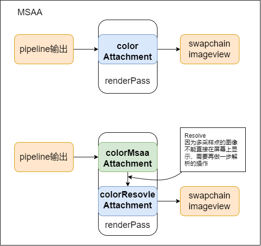

multi sampling

用于解决，对于近处的物体，会有锯齿（走样，aliasing）。

MSAA（multisample anti-aliasing）增加每个像素的采样点数。


### 找到能用的 sample count

使用`VkSampleCountFlagBits` 来存储GPU所支持的采样数

```c++
VkSampleCountFlagBits msaaSamples = VK_SAMPLE_COUNT_1_BIT;
```

通过`VkPhysicalDeviceProperties`，获取到GPU所支持的最大采样数。

```c++
VkSampleCountFlagBits getMaxUsableSampleCount() {
    VkPhysicalDeviceProperties physicalDeviceProperties;
    vkGetPhysicalDeviceProperties(physicalDevice, &physicalDeviceProperties);

    VkSampleCountFlags counts = physicalDeviceProperties.limits.framebufferColorSampleCounts & physicalDeviceProperties.limits.framebufferDepthSampleCounts;
    if (counts & VK_SAMPLE_COUNT_64_BIT) { return VK_SAMPLE_COUNT_64_BIT; }
    if (counts & VK_SAMPLE_COUNT_32_BIT) { return VK_SAMPLE_COUNT_32_BIT; }
    if (counts & VK_SAMPLE_COUNT_16_BIT) { return VK_SAMPLE_COUNT_16_BIT; }
    if (counts & VK_SAMPLE_COUNT_8_BIT) { return VK_SAMPLE_COUNT_8_BIT; }
    if (counts & VK_SAMPLE_COUNT_4_BIT) { return VK_SAMPLE_COUNT_4_BIT; }
    if (counts & VK_SAMPLE_COUNT_2_BIT) { return VK_SAMPLE_COUNT_2_BIT; }

    return VK_SAMPLE_COUNT_1_BIT;
}
```

这一步在选取合适的物理设备的时候，就设置了。


### 设置 渲染目标（render target）

*根据Vulkan规范，如果一张图像的单个像素有多个采样点（也就是进行了多重采样），那么只能使用一个mip等级*。因为如果对同一像素进行多次采样，但每次采样使用的**纹理详细程度（即mip等级）不同**，那么最终的**颜色值**可能会出现**不一致**。

*一旦创建了一个多重采样缓冲区，就需要将其解析到默认的帧缓冲区*。在计算机图形学中，多重采样（Multisampling）是一种抗锯齿技术。它在每个像素中使用多个采样点来确定最终的颜色值。这个过程通常在一个特殊的离屏缓冲区（Off-screen Buffer）中进行，这个缓冲区被称为多重采样缓冲区（Multisampled Buffer）。

然而，我们**不能直接将多重采样缓冲区的内容显示到屏幕上**。因为**屏幕上每个像素的颜色只能由一个单一的颜色值来确定**，而不是多个采样点的颜色值。因此，我们需要将多重采样缓冲区的内容“**解析**”（Resolve）到默认的帧缓冲区（Default Framebuffer）。

**解析的过程就是将多重采样缓冲区中每个像素的多个采样点的颜色值合并成一个单一的颜色值**，并将这个颜色值存储到默认帧缓冲区中对应的像素。这样，我们就可以将默认帧缓冲区的内容显示到屏幕上，从而实现抗锯齿效果。



新创建一个image，然后将这个image设置为multi sample。在renderpass里，设置将管线输出的结果保存在这个新的image（attachment）里，最后再rensolve一下，将multisample图像中的数据解析到swapchain image view所对应的attachment中。其中解析的步骤是vulkan自动完成的，只需要在subpass的`pResolveAttachments`里设置需要解析到的attachement（也就是目标附件）就行了。

ps: msaa 是对**管线最终输出的结果**，进行多采样的。


### 一些小问题

对与swapchian image view 所对应的layout为`VK_IMAGE_LAYOUT_ATTACHMENT_OPTIMAL` 而支持多采样的图像所对应的layout为`VK_IMAGE_LAYOUT_COLOR_ATTACHMENT_OPTIMAL`

- [`VK_IMAGE_LAYOUT_COLOR_ATTACHMENT_OPTIMAL`：这种布局可能会为作为颜色附件的图像提供最优性能](https://registry.khronos.org/vulkan/specs/1.3-extensions/man/html/VkImageLayout.html)[1](https://registry.khronos.org/vulkan/specs/1.3-extensions/man/html/VkImageLayout.html)[2](https://blog.csdn.net/u014535072/article/details/115278337)[。当图像被用作颜色附件（即在渲染过程中，图像被用来存储颜色缓冲区）时，应该使用这种布局](https://registry.khronos.org/vulkan/specs/1.3-extensions/man/html/VkImageLayout.html)[1](https://registry.khronos.org/vulkan/specs/1.3-extensions/man/html/VkImageLayout.html)。
- [`VK_IMAGE_LAYOUT_ATTACHMENT_OPTIMAL`：这种布局允许以只读方式访问作为附件的图像，或者在着色器中作为采样图像、组合图像/采样器或输入附件](https://registry.khronos.org/vulkan/specs/1.3-extensions/man/html/VkImageLayout.html)[1](https://registry.khronos.org/vulkan/specs/1.3-extensions/man/html/VkImageLayout.html)[。这种布局是Vulkan 1.3版本引入的](https://registry.khronos.org/vulkan/specs/1.3-extensions/man/html/VkImageLayout.html)[1](https://registry.khronos.org/vulkan/specs/1.3-extensions/man/html/VkImageLayout.html)。


### 总结

+ 查询物理设备，GPU所支持的最大采样数
+ 创建一个image 用于多采样。
+ 创建对应的attachment
+ 将swapchain image view所对应attachment设置为pResolveAttachments
+ 设置 renderpass中的对应参数与变量
+ 设置 framebuffer中的对应参数与变量
+ 设置 pipeline中的multisampling中的对应变量