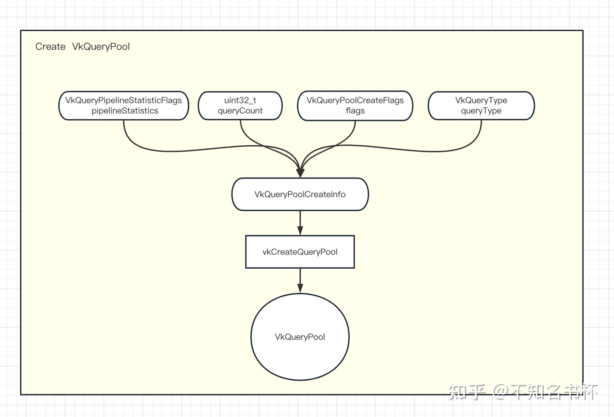
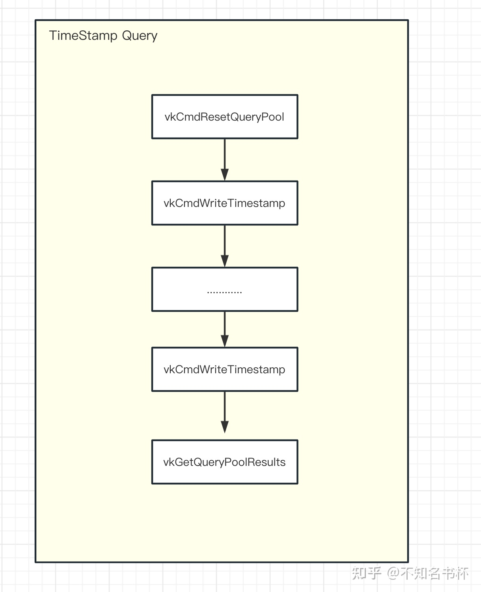
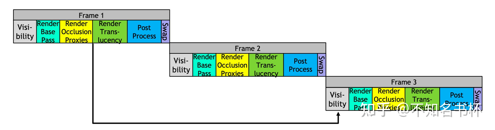

### queryPool

主要看的是知乎一个老哥分享的，理解 Vulkan GPU Query - 不知名书杯的文章 - 知乎
https://zhuanlan.zhihu.com/p/628146308

基本上是照抄的，如果有人看到的话，推荐去看知乎老哥写的原文。


- Query Pool
- TimeStamp Query
- Occlusion Queries
- Pipeline Statistics Query
- Performance Query


### GPU Query的作用

作用相当于是让vulkan具有一定的如 `nVidia的Nsight`、`RenderDoc`、`AMD的Radeon Tool`等Profile的能够获取GPU内部状态和数据的功能。让开发者拥有一定的**获取GPU状态**的能力。

GPU Query精度不算太高，如果需要特别详细的数据，知乎老哥是建议使用各平台的Profile，功能更强大并且数据更精准。


为什么在CPU端查询一次drawcall花费的时间是不准确的？

因为CPU和GPU是异构硬件，两者可以相互**并行**完成各自的任务无需等待，这也就导致了在CPU端查询GPU一次drawcall的开销并不能代表实际的开销的。


GPU Query的分类：

+ `TimeStamp Query`: 通过在一个某个函数调用前后写入一个TimeStamp，然后通过计算其两个TimeStamp之间的差值得到本次**函数调用开销**。
+ `Occlusion Query`：会跟踪通过一组Draw Command的通过Fragment Test的Sample数量。因此Occlusion Queries只适用于支持图形操作的Queue。应用程序可以使用这些结果来影响未来的渲染决策(比如一些物体可以不渲染等等)。(在每个Fragment中，Coverage Value为1的每个Smaple点，如果能通过所有的Fragment Test(包括Scissor、Exclusive Scissor、Sample Mask、Alpha To Coverage,、Depth/Stencil Test)Occlusion Query的 Sample计数器就会增加1。)
+ `Pipeline Statistics Query`：可以让应用程序对一组指定的VkPipeline计数器进行采样。当开启Pipeline Statistics Query时这些计数器可以为一组Draw/Dispatch递增。因此Pipeline Statistics Query在支持图形或计算的Queue上是可用的。可以借助Pipeline Statistics Query来统计比如Vertex/Tessellation/Fragment Shader的调用次数等等，这些数据都有助于我们**定位性能问题**。
+ `Performance Query`：可以为应用程序提供了一种机制以获得关于Command Buffer、RenderPass和其他Command执行的性能计数器。


GPU Query 的具体使用步骤：

+ 创建对应不同类型的Query 的QueryPool。
+ GPU Query操作(比如TimeStamp Query的vkCmdWriteTimestamp，Pipeline Statistics Query和 Occlusion Query的 vkCmdBeginQuery/vkCmdEndQuery等等)
+ 获取GPU Query的结果（通过vkGetQueryPoolResults）


### 创建Query Pool

为什么要用pool呢？这其实是一种池化技术。

**为什么要用池化技术呢？**我在我自己电脑上做了一个实验，得出如下结果：

分配400MB内存

+ 一亿次分配，每次分配4字节，所花费的时间15718 ms
+ 一次性分配400MB，所花费时间79 ms

两者在时间上相差了近200倍，如果数据更大可能相差的时间更多。

ChatGPT是这样说的，直接创建和销毁每个资源不仅会**引入额外的性能开销**，还会使资源管理变得复杂，**增加内存碎片化的风险**，且不利于多线程环境下的资源管理。资源池提供了一种更高效、更清晰和更灵活的管理机制，允许开发者专注于渲染逻辑，而不是底层的资源分配细节。通过集中管理相似类型的资源，池有助于减少内存碎片化。这是因为池中的资源通常具有**相似的大小和生命周期**，使得内存管理更加高效和可预测。


一次性分配很大一块内存池，与按照任务分配多个小内存池的区别。


了解了池化技术后，再看看GPU Query的创建。在vulkan中，GPU Query都是通过Query Pool来管理的。每个Query Pool都是由**特定数量的特定类型**的GPU Query组成的。

Query Pool需要通过`vkCreateQueryPool`创建，同时需要填充`VkQueryPoolCreateInfo`结构体。`VkQueryPoolCreateInfo`字段作用如下所示：

- `flags`是一个`VkQueryPoolCreateFlags`类型的字段，暂时**没有什么功能**，该字段可以忽略。
- `queryType`是一个VkQueryType类型的字段，用于指定该Query Pool用于**什么类型的GPU Query**。如下所示：
  - `VK_QUERY_TYPE_OCCLUSION`用于Occlusion Query。
  - `VK_QUERY_TYPE_TIMESTAMP`用于TimeStamp Query。
  - `VK_QUERY_TYPE_PIPELINE_STATISTICS`用于Pipeline Statistics Query。
  - `VK_QUERY_TYPE_PERFORMANCE_QUERY_KHR`用于Performance Query。
- `queryCount`是一个uint32_t类型的字段用于指定该Query Pool**管理的Query数量**。
- `pipelineStatistics`是一个`VkQueryPipelineStatisticFlagBits`类型的字段，用于指定该`Query Pool`中的`Pipeline Statistics Query`**需要累加的计数器**。
  - 假如设置为`VK_QUERY_PIPELINE_STATISTIC_VERTEX_SHADER_INVOCATIONS_BIT`则会根据Vertex Shader调用次数累加该计数器。

如果queryType没有设置为`VK_QUERY_TYPE_PIPELINE_STATISTICS`，则`pipelineStatistics`字段会被忽略。

```c++
typedef struct VkQueryPoolCreateInfo {
    VkStructureType                  sType;
    const void*                      pNext;
    VkQueryPoolCreateFlags           flags;
    VkQueryType                      queryType;
    uint32_t                         queryCount;
    VkQueryPipelineStatisticFlags    pipelineStatistics;
} VkQueryPoolCreateInfo;
```




### 重置Query Pool

vulkan中的每个Query都有**可用**和**不可用**两种状态。

+ 不可用：在每次GPU Query之前，状态都应该是不可用的。
+ 可用：GPU Query之后，会自动将query的状态变为可用，并更新查询结果。


重置Query Pool的函数：`vkCmdResetQueryPool`和`vkResetQueryPool`；主要区别是一个是前者是在Command Buffer中通过**GPU重置**，后者是**CPU侧的重置**。vkCmdResetQueryPool所需参数如下所示：这是一个在1.2之后加入core的扩展。

```c++
void vkCmdResetQueryPool(
    VkCommandBuffer                             commandBuffer,
    VkQueryPool                                 queryPool,
    uint32_t                                    firstQuery,
    uint32_t                                    queryCount);
```

- commandBuffer是一个VkCommandBuffer字段，该Command将被记录到其中。
- queryPool指定需要被重置的Query Pool。
- firstQuery指定需要被重置的Query的起始索引
- firstQuery指定需要被重置的Query的终点索引

当vkCmdResetQueryPool执行时会将索引为[firstQuery, firstQuery + queryCount - 1]的Query的状态设置为不可用。vkCmdResetQueryPool同样指定了两条Query 之间的依赖关系。

似乎只有，`vkResetQueryPool`从CPU端重置才会需要开启`hostQueryReset`，physicalDeviceFeature。


### TimeStamp Query

#### 前置条件检查

在使用TimeStamp Query之前需要查询**GPU**该是否**支持**TimeStamp Query(并不是所有的硬件都支持)，可通过VkPhysicalDeviceProperties::timestampPeriod来判断。如下所示：

```c++
// 通过vkGetPhysicalDeviceProperties查询该GPU属性。
VkPhysicalDeviceProperties properties;
vkGetPhysicalDeviceProperties(physical_device, &properties);
// 在这里只需要判断timestampPeriod是否大于零即可。
if (properties.timestampPeriod == 0)
{
    throw std::runtime_error{"The selected device does not support timestamp queries!"};
}
```

接下来是该**Queue是否支持**`TimeStamp Query`能力。可以通过`VkPhysicalDeviceLimits::timestampComputeAndGraphics`字段检测`Graphics/Computer Queue`是否支持`TimeStamp Query`。并且在`Timestamp Query`的结果是存在有效位数的，这个有效位数由所在的 Queue 的 `VkQueueFamilyProperties :: timestampValidBits`确定，如果该 Queue 支持`TimeStamp Query`，该数值的有效范围是36到64位或者如果为0则表示不支持`TimeStamp Query`。如下所示：

```c++
VkPhysicalDeviceProperties properties;
vkGetPhysicalDeviceProperties(physical_device, &properties);
VkPhysicalDeviceLimits device_limits = properties.limits;
if (!device_limits.timestampComputeAndGraphics)
{
    // 通过检测该Queue是否支持TimeStamp Query，通过timestampValidBits来判断。
    uint32_t queue_family_properties_count = 0;
    vkGetPhysicalDeviceQueueFamilyProperties(physical_device, &queue_family_properties_count, nullptr);
    queue_family_properties = std::vector<VkQueueFamilyProperties>(queue_family_properties_count);
    vkGetPhysicalDeviceQueueFamilyProperties(physical_device, &queue_family_properties_count, queue_family_properties.data());
    if (graphics_queue_family_properties.timestampValidBits == 0)
    {
        throw std::runtime_error{"The selected graphics queue family does not support timestamp queries!"};
    }
}
```


#### 使用TimeStamp Query

与获得CPU侧的TimeStamp可以立即查询不同。对于GPU的TimeStamp则**需要在`Command Buffer`内告诉需要何时/何地写入**`TimeStamp`之后再获取相应的结果。这是通过在`Command Buffer`内用`vkCmdWriteTimestamp`完成的。这个函数将让GPU为某个`Pipeline Stage`执行之后写入一个`TimeStamp`，并将该值写入内存。所需参数如下所示：

- `commandBuffer`是一个`VkCommandBuffer`字段，该`Command将`被记录到其中。
- `pipelineStage`是一个`VkPipelineStageFlagBits`值，指定对应的`PipelineStage`，`TimeStamp`将在这个阶段被写入。
- `queryPool`指定对应的`Query Pool`。
- `query`会对应到某个`Query`的索引，该`Query`将包含`TimeStamp`数据。

```c++
void vkCmdWriteTimestamp(
    VkCommandBuffer                             commandBuffer,
    VkPipelineStageFlagBits                     pipelineStage,
    VkQueryPool                                 queryPool,
    uint32_t                                    query);
```

当`vkCmdWriteTimestamp`被提交到`Queue`时，它定义了对在它之前提交的`Command`的执行依赖并将`TimeStamp`写入`Query Pool`。第一个同步范围包括所有在`Submission Order`中较早出现的`Command`。该同步范围仅限于对`pipelineStage`指定的`Pipeline Stage`的操作。第二个同步范围只包括写入`TimeStamp`的操作。当`TimeStamp`被写入时，`Query`被设置为可用状态。如果`TimeStamp`是由提交给不同`Queue`的`Command`写入的，那么这次获取到的`TimeStamp`和其他`Queue`的`TimeStamp`作比较是没有意义的。

调用这个函数需要注意的是Pipeline Stage参数。在GPU中使用TimeStamp Query与在CPU上用高性能计时器等进行计时的方式有很大不同。理论上可以在这里使用任何Pipeline Stage，但是**GPU的并行的工作方式(乱序或者重叠)**会导致很多Pipeline Stage的组合和顺序都不会产生有意义的数据。因此虽然直接一个接一个地为顶点和片段着色器阶段写入TimeStamp来统计不同阶段的耗时可能听起来很合理，但是通常不会得到有意义的数据。所以**在真正的实践当中一般只使用Pipeline的顶部和底部阶段**(`TOP_OF_PIPE_BIT`和`BOTTOM_OF_PIPE_BIT`)。这种组合在大多数GPU上可以得到适当的近似结果。还需要注意的如果 Vulkan 的实现没有检测到指定Pipeline Stage 完成并且锁定计时器，则可以按 Stage 的逻辑顺序任意后续Pipeline Stage执行完成以上操作。

所以在真正的实践如下所示，统计这次`DrawCall`的大致调用时间。首先调用`vkCmdWriteTimestamp`并且`Pipeline Stage`设置为`TOP_OF_PIPE_BIT`，它告诉GPU在所有先前的`Command`被GPU的命令处理器处理完后才写入`TimeStamp`。这可以确保我们在开始`DrawCall`之前得到一个`TimeStamp`，这将是计算时间差的基础。接着在塞入所有的`DrawCall`之后，调用`vkCmdWriteTimestamp`并且`Pipeline Stage`设置为`BOTTOM_OF_PIPE_BIT`，告诉GPU在所有工作完成后才写入`TimeStamp`。

```c++
vkCmdWriteTimestamp(commandbuffer, VK_PIPELINE_STAGE_TOP_OF_PIPE_BIT, timestamps_query_pool, 0);
// Do some work
for (int i = 0; i < draw_call_count; i++) {
    vkCmdDraw(...);
}
vkCmdWriteTimestamp(commandbuffer, VK_PIPELINE_STAGE_BOTTOM_OF_PIPE_BIT, timestamps_query_pool, 1);
```


#### 获取结果

当已经完成了`TimeStamp`的写入，现在应该去获取到写入的数据啦。在这里有两种途径可以获取到对应的数据:

- 使用`vkCmdCopyQueryPoolResults`将结果复制到的一个`VkBuffer`中。
- 在`Command Buffer`执行完毕后，使用`vkGetQueryPoolResults`获取结果。

这两个函数的调用方式都大同小异，在这里主要就是使用`vkGetQueryPoolResults`来讲解。`vkGetQueryPoolResults`所需参数如下所示：

- `queryPool`指定该次Query结果存储在哪个Query Pool里面。
- `firstQuery`本次需要获取数据Query的索引。
- `queryCount`代表本次要读取的Query数量。
- `dataSize`是pData所指向的Buffer的字节大小。
- `pData`是一个指向Buffer的指针，本次查询的结果将被写入其中。
- `stride`是pData中各个Query结果之间的步长，以字节为单位。
- `flags`是一个VkQueryResultFlagBits，该字段指定如何和何时返回结果。

```c++
VkResult vkGetQueryPoolResults(
    VkDevice                                    device,
    VkQueryPool                                 queryPool,
    uint32_t                                    firstQuery,
    uint32_t                                    queryCount,
    size_t                                      dataSize,
    void*                                       pData,
    VkDeviceSize                                stride,
    VkQueryResultFlags                          flags);
```

在这里不同的`flags`参数很重要，需要理解不同的`flag`将会有什么效果。

+ 首先是`VK_QUERY_RESULT_64_BIT`，使用了`VK_QUERY_RESULT_64_BIT`则告诉Vulkan我们希望得到的是**64位的数据**，如果没有这个参数将只能得到32位的值，一般来说需要的都是**纳秒级**，假如使用的是**32位**的话的最大值是4294967295。假设即使第一次查询是0ns，也只能测量两个TimeStamp之间的4294967295纳秒也就是**0.43秒**。当然第一次查询会在0和uint32_t::max()之间的某个地方，如果测量比较耗时的工作很可能会遇到**整数溢出**，最后的结果会是错误的。所以一般**推荐**都保持设置为`VK_QUERY_RESULT_64_BIT`。
+ 在提交`vkCmdWriteTimestamp`的时候，在**GPU中不知道什么时候开始执行也不知道什么时候完成执行。所以不能随意找个时间点的去读取TimeStamp数据**，为了保证TimeStamp数据是可用一般会设置为`VK_QUERY_RESULT_WAIT_BIT`。`VK_QUERY_RESULT_WAIT_BIT`会**等待所有TimeStamp数据可用**。因此当使用这个flag时，在调用`vkGetQueryPoolResults`后写入TimeStamp的值被保证是可用的。这对想要立即访问结果的情况来说是好的，但在其他情况下可能会带来不必要的停顿。因为**CPU会等待直到所有的Query全部写入**。在CPU上发射一个单一的比较耗时调度并等待其完成是非常容易的。但在像游戏的主循环中这个性能损耗还是过大的，所以**一般都不会**设置为`VK_QUERY_RESULT_WAIT_BIT`。
+ 为了避免`VK_QUERY_RESULT_WAIT_BIT`可能会**导致CPU侧停顿**的问题，新的解决方案出现了那就是`VK_QUERY_RESULT_WITH_AVAILABILITY_BIT`。这**将让轮询Query结果的可用性并推迟写入新的TimeStamp**，直到Query结果是可用的。这应该是**实践中的首选**方式。使用这个flag还会在每个Query结果中插入一个**额外的值**代表其Query的可用性。如果该值不为零则该结果是可用的。然后在再次写入TimeStamp之前检查上次Query的可用性，如果不可用则不写入。这样**避免了CPU的停顿**，但是这个方案可能会错过一些帧的数据没统计上。


#### 实际使用

```c++
// Commoand完成提交即可开始查询
vkQueueSubmit();
std::vector<uint64_t> time_stamps(2);
vkGetQueryPoolResults(
    device->get_handle(),
    timestamps_query_pool,
    0,
    count,
    time_stamps.size() * sizeof(uint64_t),
    time_stamps.data(),
    sizeof(uint64_t),
    VK_QUERY_RESULT_64_BIT | VK_QUERY_RESULT_WAIT_BIT);
```

在这里就是等待写入TimeStamp全部执行完成后，CPU侧才继续往下执行。

```c++
std::array<uint64_t, max_frames_in_flight * 2> time_stamp_with_availibility{};
vkBeginCommandBuffer(command_buffer, &command_buffer_begin_info);

// 检测上次的Query是否可用，Query可用才可以写入新的时间戳
if (time_stamp_with_availibility[current_frame * 2 + 1] != 0) {
    vkCmdWriteTimestamp(command_buffer, VK_PIPELINE_STAGE_TOP_OF_PIPE_BIT, query_pool_timestamps, 0);
}
.......
vkEndCommandBuffer(command_buffer);

vkGetQueryPoolResults(
    device,
    query_pool_timestamps,
    0,
    1,
    2 * sizeof(uint64_t),
    &time_stamp_with_availibility[Current_frame * max_frames_in_flight],
    2 * sizeof(uint64_t),
    VK_QUERY_RESULT_64_BIT | VK_QUERY_RESULT_WITH_AVAILABILITY_BIT);        

if (time_stamp_with_availibility[current_frame * 2 + 1] != 0) {
    std::cout << "Timestamp = " << time_stamp_with_availibility[current_frame * 2] << "\n";
}
```


#### 单位转换

到目前为止已经可以拿到真正的Query结果，还有一个步骤那就是对数据进行处理以便用于最后的展示。Query结果实际上并不是真正的时间值，而是一个"刻度"数。为了得到实际的时间值还需要做一个转换。这是通过`VkPhysicalDeviceLimits::timestampPeriod`字段来完成的。它包含了一个`TimeStamp Query`值**增加1刻度所需的纳秒数**。如下所示：

```c++
// 通过vkGetPhysicalDeviceProperties查询该GPU属性。
VkPhysicalDeviceProperties properties;
vkGetPhysicalDeviceProperties(physical_device, &properties);
VkPhysicalDeviceLimits device_limits = properties.limits;
// 计算出最后的纳秒数
float delta_in_ns = float(time_stamps[1] - time_stamps[0]) * device_limits.timestampPeriod;
```




### Occlusion Query

简单来说`Occlusion Query`可以通过查询前几帧的信息来影响本帧渲染决策，可以用来决定是否要渲染一些几何图形。所以在使用`Occlusion Query`，需要增加一帧额外的延迟，以确保能够获取正确的结果。如下图所示：




#### 前置检查

对于Occlusion Query来说应该PC和移动端全部是支持的。但是有一个`occlusionQueryPrecise`字段会控制在Occlusion Query中会**返回实际通过的Sample数量**。这种类型的Query可以在`vkCmdBeginQuery`的flags参数中启用`VK_QUERY_CONTROL_PRECISE_BIT`。如果不支持这个功能，那么当有任何Sample通过时该Occlusion Query只会返回一个布尔值。

