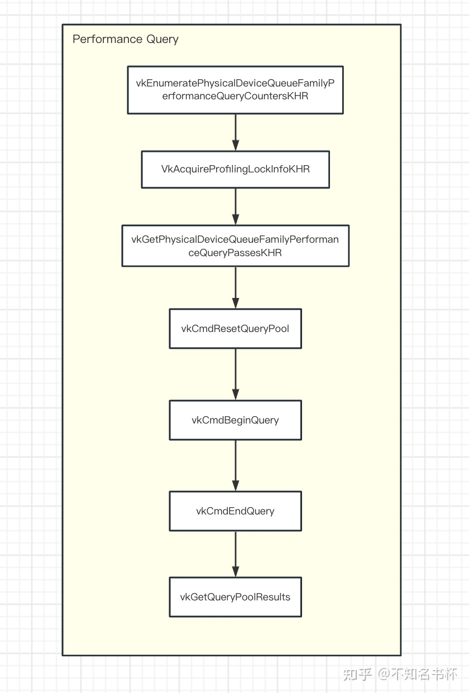
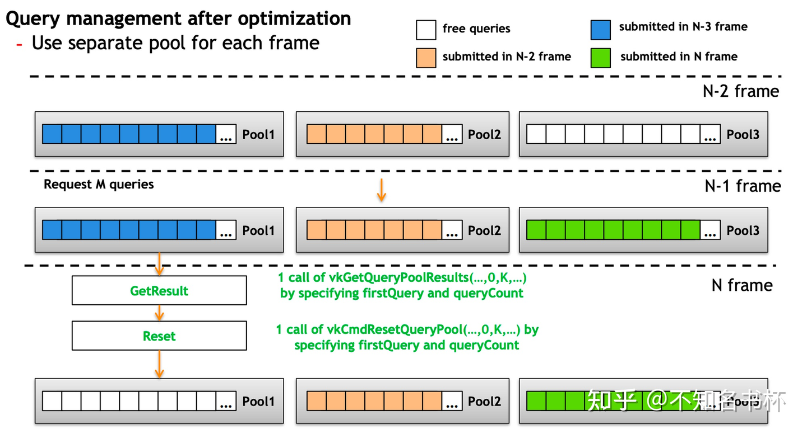

### queryPool

主要看的是知乎一个老哥分享的，理解 Vulkan GPU Query - 不知名书杯的文章 - 知乎
https://zhuanlan.zhihu.com/p/628146308

基本上是照抄的，如果有人看到的话，推荐去看知乎老哥写的原文。


- Query Pool
- TimeStamp Query
- Occlusion Queries
- Pipeline Statistics Query
- Performance Query


### GPU Query的作用

作用相当于是让vulkan具有一定的如 `nVidia的Nsight`、`RenderDoc`、`AMD的Radeon Tool`等Profile的能够获取GPU内部状态和数据的功能。让开发者拥有一定的**获取GPU状态**的能力。

GPU Query精度不算太高，如果需要特别详细的数据，知乎老哥是建议使用各平台的Profile，功能更强大并且数据更精准。


为什么在CPU端查询一次drawcall花费的时间是不准确的？

因为CPU和GPU是异构硬件，两者可以相互**并行**完成各自的任务无需等待，这也就导致了在CPU端查询GPU一次drawcall的开销并不能代表实际的开销的。


GPU Query的分类：

+ `TimeStamp Query`: 通过在一个某个函数调用前后写入一个TimeStamp，然后通过计算其两个TimeStamp之间的差值得到本次**函数调用开销**。
+ `Occlusion Query`：会跟踪通过一组Draw Command的通过Fragment Test的Sample数量。因此Occlusion Queries只适用于支持图形操作的Queue。应用程序可以使用这些结果来影响未来的渲染决策(比如一些物体可以不渲染等等)。(在每个Fragment中，Coverage Value为1的每个Smaple点，如果能通过所有的Fragment Test(包括Scissor、Exclusive Scissor、Sample Mask、Alpha To Coverage,、Depth/Stencil Test)Occlusion Query的 Sample计数器就会增加1。)
+ `Pipeline Statistics Query`：可以让应用程序对一组指定的VkPipeline计数器进行采样。当开启Pipeline Statistics Query时这些计数器可以为一组Draw/Dispatch递增。因此Pipeline Statistics Query在支持图形或计算的Queue上是可用的。可以借助Pipeline Statistics Query来统计比如Vertex/Tessellation/Fragment Shader的**调用次数**等等，这些数据都有助于我们**定位性能问题**。
+ `Performance Query`：可以为应用程序提供了一种机制以获得关于Command Buffer、RenderPass和其他Command执行的性能计数器。


GPU Query 的具体使用步骤：

+ 创建对应不同类型的Query 的QueryPool。
+ GPU Query操作(比如TimeStamp Query的vkCmdWriteTimestamp，Pipeline Statistics Query和 Occlusion Query的 vkCmdBeginQuery/vkCmdEndQuery等等)
+ 获取GPU Query的结果（通过vkGetQueryPoolResults）


### 创建Query Pool

为什么要用pool呢？这其实是一种池化技术。

**为什么要用池化技术呢？**我在我自己电脑上做了一个实验，得出如下结果：

分配400MB内存

+ 一亿次分配，每次分配4字节，所花费的时间15718 ms
+ 一次性分配400MB，所花费时间79 ms

两者在时间上相差了近200倍，如果数据更大可能相差的时间更多。

ChatGPT是这样说的，直接创建和销毁每个资源不仅会**引入额外的性能开销**，还会使资源管理变得复杂，**增加内存碎片化的风险**，且不利于多线程环境下的资源管理。资源池提供了一种更高效、更清晰和更灵活的管理机制，允许开发者专注于渲染逻辑，而不是底层的资源分配细节。通过集中管理相似类型的资源，池有助于减少内存碎片化。这是因为池中的资源通常具有**相似的大小和生命周期**，使得内存管理更加高效和可预测。


一次性分配很大一块内存池，与按照任务分配多个小内存池的区别。


了解了池化技术后，再看看GPU Query的创建。在vulkan中，GPU Query都是通过Query Pool来管理的。每个Query Pool都是由**特定数量的特定类型**的GPU Query组成的。

Query Pool需要通过`vkCreateQueryPool`创建，同时需要填充`VkQueryPoolCreateInfo`结构体。`VkQueryPoolCreateInfo`字段作用如下所示：

- `flags`是一个`VkQueryPoolCreateFlags`类型的字段，暂时**没有什么功能**，该字段可以忽略。
- `queryType`是一个VkQueryType类型的字段，用于指定该Query Pool用于**什么类型的GPU Query**。如下所示：
  - `VK_QUERY_TYPE_OCCLUSION`用于Occlusion Query。
  - `VK_QUERY_TYPE_TIMESTAMP`用于TimeStamp Query。
  - `VK_QUERY_TYPE_PIPELINE_STATISTICS`用于Pipeline Statistics Query。
  - `VK_QUERY_TYPE_PERFORMANCE_QUERY_KHR`用于Performance Query。
- `queryCount`是一个uint32_t类型的字段用于指定该Query Pool**管理的Query数量**。
- `pipelineStatistics`是一个`VkQueryPipelineStatisticFlagBits`类型的字段，用于指定该`Query Pool`中的`Pipeline Statistics Query`**需要累加的计数器**。
  - 假如设置为`VK_QUERY_PIPELINE_STATISTIC_VERTEX_SHADER_INVOCATIONS_BIT`则会根据Vertex Shader调用次数累加该计数器。

如果queryType没有设置为`VK_QUERY_TYPE_PIPELINE_STATISTICS`，则`pipelineStatistics`字段会被忽略。

```c++
typedef struct VkQueryPoolCreateInfo {
    VkStructureType                  sType;
    const void*                      pNext;
    VkQueryPoolCreateFlags           flags;
    VkQueryType                      queryType;
    uint32_t                         queryCount;
    VkQueryPipelineStatisticFlags    pipelineStatistics;
} VkQueryPoolCreateInfo;
```


### 重置Query Pool

vulkan中的每个Query都有**可用**和**不可用**两种状态。

+ 不可用：在每次GPU Query之前，状态都应该是不可用的。
+ 可用：GPU Query之后，会自动将query的状态变为可用，并更新查询结果。


重置Query Pool的函数：`vkCmdResetQueryPool`和`vkResetQueryPool`；主要区别是一个是前者是在Command Buffer中通过**GPU重置**，后者是**CPU侧的重置**。vkCmdResetQueryPool所需参数如下所示：这是一个在1.2之后加入core的扩展。

```c++
void vkCmdResetQueryPool(
    VkCommandBuffer                             commandBuffer,
    VkQueryPool                                 queryPool,
    uint32_t                                    firstQuery,
    uint32_t                                    queryCount);
```

- commandBuffer是一个VkCommandBuffer字段，该Command将被记录到其中。
- queryPool指定需要被重置的Query Pool。
- firstQuery指定需要被重置的Query的起始索引
- firstQuery指定需要被重置的Query的终点索引

当vkCmdResetQueryPool执行时会将索引为[firstQuery, firstQuery + queryCount - 1]的Query的状态设置为不可用。vkCmdResetQueryPool同样指定了两条Query 之间的依赖关系。

似乎只有，`vkResetQueryPool`从CPU端重置才会需要开启`hostQueryReset`，physicalDeviceFeature。


### TimeStamp Query

#### 前置条件检查

在使用TimeStamp Query之前需要查询**GPU**该是否**支持**TimeStamp Query(并不是所有的硬件都支持)，可通过VkPhysicalDeviceProperties::timestampPeriod来判断。如下所示：

```c++
// 通过vkGetPhysicalDeviceProperties查询该GPU属性。
VkPhysicalDeviceProperties properties;
vkGetPhysicalDeviceProperties(physical_device, &properties);
// 在这里只需要判断timestampPeriod是否大于零即可。
if (properties.timestampPeriod == 0)
{
    throw std::runtime_error{"The selected device does not support timestamp queries!"};
}
```

接下来是该**Queue是否支持**`TimeStamp Query`能力。可以通过`VkPhysicalDeviceLimits::timestampComputeAndGraphics`字段检测`Graphics/Computer Queue`是否支持`TimeStamp Query`。并且在`Timestamp Query`的结果是存在有效位数的，这个有效位数由所在的 Queue 的 `VkQueueFamilyProperties :: timestampValidBits`确定，如果该 Queue 支持`TimeStamp Query`，该数值的有效范围是36到64位或者如果为0则表示不支持`TimeStamp Query`。如下所示：

```c++
VkPhysicalDeviceProperties properties;
vkGetPhysicalDeviceProperties(physical_device, &properties);
VkPhysicalDeviceLimits device_limits = properties.limits;
if (!device_limits.timestampComputeAndGraphics)
{
    // 通过检测该Queue是否支持TimeStamp Query，通过timestampValidBits来判断。
    uint32_t queue_family_properties_count = 0;
    vkGetPhysicalDeviceQueueFamilyProperties(physical_device, &queue_family_properties_count, nullptr);
    queue_family_properties = std::vector<VkQueueFamilyProperties>(queue_family_properties_count);
    vkGetPhysicalDeviceQueueFamilyProperties(physical_device, &queue_family_properties_count, queue_family_properties.data());
    if (graphics_queue_family_properties.timestampValidBits == 0)
    {
        throw std::runtime_error{"The selected graphics queue family does not support timestamp queries!"};
    }
}
```


#### 使用TimeStamp Query

与获得CPU侧的TimeStamp可以立即查询不同。对于GPU的TimeStamp则**需要在`Command Buffer`内告诉需要何时/何地写入**`TimeStamp`之后再获取相应的结果。这是通过在`Command Buffer`内用`vkCmdWriteTimestamp`完成的。这个函数将让GPU为某个`Pipeline Stage`执行之后写入一个`TimeStamp`，并将该值写入内存。所需参数如下所示：

- `commandBuffer`是一个`VkCommandBuffer`字段，该`Command将`被记录到其中。
- `pipelineStage`是一个`VkPipelineStageFlagBits`值，指定对应的`PipelineStage`，`TimeStamp`将在这个阶段被写入。
- `queryPool`指定对应的`Query Pool`。
- `query`会对应到某个`Query`的索引，该`Query`将包含`TimeStamp`数据。

```c++
void vkCmdWriteTimestamp(
    VkCommandBuffer                             commandBuffer,
    VkPipelineStageFlagBits                     pipelineStage,
    VkQueryPool                                 queryPool,
    uint32_t                                    query);
```

当`vkCmdWriteTimestamp`被提交到`Queue`时，它定义了对在它之前提交的`Command`的执行依赖并将`TimeStamp`写入`Query Pool`。第一个同步范围包括所有在`Submission Order`中较早出现的`Command`。该同步范围仅限于对`pipelineStage`指定的`Pipeline Stage`的操作。第二个同步范围只包括写入`TimeStamp`的操作。当`TimeStamp`被写入时，`Query`被设置为可用状态。如果`TimeStamp`是由提交给不同`Queue`的`Command`写入的，那么这次获取到的`TimeStamp`和其他`Queue`的`TimeStamp`作比较是没有意义的。

调用这个函数需要注意的是Pipeline Stage参数。在GPU中使用TimeStamp Query与在CPU上用高性能计时器等进行计时的方式有很大不同。理论上可以在这里使用任何Pipeline Stage，但是**GPU的并行的工作方式(乱序或者重叠)**会导致很多Pipeline Stage的组合和顺序都不会产生有意义的数据。因此虽然直接一个接一个地为顶点和片段着色器阶段写入TimeStamp来统计不同阶段的耗时可能听起来很合理，但是通常不会得到有意义的数据。所以**在真正的实践当中一般只使用Pipeline的顶部和底部阶段**(`TOP_OF_PIPE_BIT`和`BOTTOM_OF_PIPE_BIT`)。这种组合在大多数GPU上可以得到适当的近似结果。还需要注意的如果 Vulkan 的实现没有检测到指定Pipeline Stage 完成并且锁定计时器，则可以按 Stage 的逻辑顺序任意后续Pipeline Stage执行完成以上操作。

所以在真正的实践如下所示，统计这次`DrawCall`的大致调用时间。首先调用`vkCmdWriteTimestamp`并且`Pipeline Stage`设置为`TOP_OF_PIPE_BIT`，它告诉GPU在所有先前的`Command`被GPU的命令处理器处理完后才写入`TimeStamp`。这可以确保我们在开始`DrawCall`之前得到一个`TimeStamp`，这将是计算时间差的基础。接着在塞入所有的`DrawCall`之后，调用`vkCmdWriteTimestamp`并且`Pipeline Stage`设置为`BOTTOM_OF_PIPE_BIT`，告诉GPU在所有工作完成后才写入`TimeStamp`。

```c++
vkCmdWriteTimestamp(commandbuffer, VK_PIPELINE_STAGE_TOP_OF_PIPE_BIT, timestamps_query_pool, 0);
// Do some work
for (int i = 0; i < draw_call_count; i++) {
    vkCmdDraw(...);
}
vkCmdWriteTimestamp(commandbuffer, VK_PIPELINE_STAGE_BOTTOM_OF_PIPE_BIT, timestamps_query_pool, 1);
```


#### 获取结果

当已经完成了`TimeStamp`的写入，现在应该去获取到写入的数据啦。在这里有两种途径可以获取到对应的数据:

- 使用`vkCmdCopyQueryPoolResults`将结果复制到的一个`VkBuffer`中。
- 在`Command Buffer`执行完毕后，使用`vkGetQueryPoolResults`获取结果。

这两个函数的调用方式都大同小异，在这里主要就是使用`vkGetQueryPoolResults`来讲解。`vkGetQueryPoolResults`所需参数如下所示：

- `queryPool`指定该次Query结果存储在哪个Query Pool里面。
- `firstQuery`本次需要获取数据Query的索引。
- `queryCount`代表本次要读取的Query数量。
- `dataSize`是pData所指向的Buffer的字节大小。
- `pData`是一个指向Buffer的指针，本次查询的结果将被写入其中。
- `stride`是pData中各个Query结果之间的步长，以字节为单位。
- `flags`是一个VkQueryResultFlagBits，该字段指定如何和何时返回结果。

```c++
VkResult vkGetQueryPoolResults(
    VkDevice                                    device,
    VkQueryPool                                 queryPool,
    uint32_t                                    firstQuery,
    uint32_t                                    queryCount,
    size_t                                      dataSize,
    void*                                       pData,
    VkDeviceSize                                stride,
    VkQueryResultFlags                          flags);
```

在这里不同的`flags`参数很重要，需要理解不同的`flag`将会有什么效果。

+ 首先是`VK_QUERY_RESULT_64_BIT`，使用了`VK_QUERY_RESULT_64_BIT`则告诉Vulkan我们希望得到的是**64位的数据**，如果没有这个参数将只能得到32位的值，一般来说需要的都是**纳秒级**，假如使用的是**32位**的话的最大值是4294967295。假设即使第一次查询是0ns，也只能测量两个TimeStamp之间的4294967295纳秒也就是**0.43秒**。当然第一次查询会在0和uint32_t::max()之间的某个地方，如果测量比较耗时的工作很可能会遇到**整数溢出**，最后的结果会是错误的。所以一般**推荐**都保持设置为`VK_QUERY_RESULT_64_BIT`。
+ 在提交`vkCmdWriteTimestamp`的时候，在**GPU中不知道什么时候开始执行也不知道什么时候完成执行。所以不能随意找个时间点的去读取TimeStamp数据**，为了保证TimeStamp数据是可用一般会设置为`VK_QUERY_RESULT_WAIT_BIT`。`VK_QUERY_RESULT_WAIT_BIT`会**等待所有TimeStamp数据可用**。因此当使用这个flag时，在调用`vkGetQueryPoolResults`后写入TimeStamp的值被保证是可用的。这对想要立即访问结果的情况来说是好的，但在其他情况下可能会带来不必要的停顿。因为**CPU会等待直到所有的Query全部写入**。在CPU上发射一个单一的比较耗时调度并等待其完成是非常容易的。但在像游戏的主循环中这个性能损耗还是过大的，所以**一般都不会**设置为`VK_QUERY_RESULT_WAIT_BIT`。
+ 为了避免`VK_QUERY_RESULT_WAIT_BIT`可能会**导致CPU侧停顿**的问题，新的解决方案出现了那就是`VK_QUERY_RESULT_WITH_AVAILABILITY_BIT`。这**将让轮询Query结果的可用性并推迟写入新的TimeStamp**，直到Query结果是可用的。这应该是**实践中的首选**方式。使用这个flag还会在每个Query结果中插入一个**额外的值**代表其Query的可用性。如果该值不为零则该结果是可用的。然后在再次写入TimeStamp之前检查上次Query的可用性，如果不可用则不写入。这样**避免了CPU的停顿**，但是这个方案可能会错过一些帧的数据没统计上。


#### 实际使用

```c++
// Commoand完成提交即可开始查询
vkQueueSubmit();
std::vector<uint64_t> time_stamps(2);
vkGetQueryPoolResults(
    device->get_handle(),
    timestamps_query_pool,
    0,
    count,
    time_stamps.size() * sizeof(uint64_t),
    time_stamps.data(),
    sizeof(uint64_t),
    VK_QUERY_RESULT_64_BIT | VK_QUERY_RESULT_WAIT_BIT);
```

在这里就是等待写入TimeStamp全部执行完成后，CPU侧才继续往下执行。

```c++
std::array<uint64_t, max_frames_in_flight * 2> time_stamp_with_availibility{};
vkBeginCommandBuffer(command_buffer, &command_buffer_begin_info);

// 检测上次的Query是否可用，Query可用才可以写入新的时间戳
if (time_stamp_with_availibility[current_frame * 2 + 1] != 0) {
    vkCmdWriteTimestamp(command_buffer, VK_PIPELINE_STAGE_TOP_OF_PIPE_BIT, query_pool_timestamps, 0);
}
.......
vkEndCommandBuffer(command_buffer);

vkGetQueryPoolResults(
    device,
    query_pool_timestamps,
    0,
    1,
    2 * sizeof(uint64_t),
    &time_stamp_with_availibility[Current_frame * max_frames_in_flight],
    2 * sizeof(uint64_t),
    VK_QUERY_RESULT_64_BIT | VK_QUERY_RESULT_WITH_AVAILABILITY_BIT);        

if (time_stamp_with_availibility[current_frame * 2 + 1] != 0) {
    std::cout << "Timestamp = " << time_stamp_with_availibility[current_frame * 2] << "\n";
}
```


#### 单位转换

到目前为止已经可以拿到真正的Query结果，还有一个步骤那就是对数据进行处理以便用于最后的展示。Query结果实际上并不是真正的时间值，而是一个"刻度"数。为了得到实际的时间值还需要做一个转换。这是通过`VkPhysicalDeviceLimits::timestampPeriod`字段来完成的。它包含了一个`TimeStamp Query`值**增加1刻度所需的纳秒数**。如下所示：

```c++
// 通过vkGetPhysicalDeviceProperties查询该GPU属性。
VkPhysicalDeviceProperties properties;
vkGetPhysicalDeviceProperties(physical_device, &properties);
VkPhysicalDeviceLimits device_limits = properties.limits;
// 计算出最后的纳秒数
float delta_in_ns = float(time_stamps[1] - time_stamps[0]) * device_limits.timestampPeriod;
```


### Occlusion Query

简单来说`Occlusion Query`可以通过查询前几帧的信息来影响本帧渲染决策，可以用来决定是否要渲染一些几何图形。所以在使用`Occlusion Query`，需要增加一帧额外的延迟，以确保能够获取正确的结果。如下图所示：


#### 前置检查

对于Occlusion Query来说应该PC和移动端全部是支持的。但是有一个`occlusionQueryPrecise`字段会控制在Occlusion Query中会**返回实际通过的Sample数量**。这种类型的Query可以在`vkCmdBeginQuery`的flags参数中启用`VK_QUERY_CONTROL_PRECISE_BIT`。如果不支持这个功能，那么当有任何Sample通过时该Occlusion Query只会返回一个布尔值。


#### 开始查询

接下来看看如何完成Occlusion Query吧，和上面的TimeStamp Query不同这里需要的使用到是`vkCmdBeginQuery`和`vkCmdEndQuery`。Occlusion Query只会对在指定`Command Buffer`内`vkCmdBeginQuery`和`vkCmdEndQuery`之间记录的Command有效果，可以对一组DrawCall进行查询。

vkCmdBeginQuery和vkCmdEndQuery所需参数如下:

- `commandBuffer`指定完成该`Record Command`的`Command Buffer`。
- `queryPool`指定该次`Query`结果存储在哪个`Query Pool`里面。
- `query`指定本次开启的`Query`的索引。

`vkCmdBeginQuery`和`vkCmdEndQuery`的参数基本一致但是只有一个`VkQueryControlFlags`字段`flag`有所不同，如果开启了`occlusionQueryPrecise`能力，并且在`vkCmdBeginQuery`的调用中flag参数设置为`VK_QUERY_CONTROL_PRECISE_BIT`。本次Occlusion Query便会**返回具体的Sample Count**而不是一个布尔值。


Occlusion Query的例子：

```c++
{
    // Occluder first
    draw(command_buffer);
    // Teapot
    vkCmdBeginQuery(command_buffer, queryPool, 0, VK_FLAGS_NONE);
    draw(command_buffer);
    vkCmdEndQuery(drawCmdBuffers[i], queryPool, 0);
    // Sphere
    vkCmdBeginQuery(dcommand_buffer, queryPool, 1, VK_FLAGS_NONE);
    draw(command_buffer);
    vkCmdEndQuery(command_buffer, queryPool, 1);
}
```

需要注意，调用vkCmdBeginQuery和vkCmdEndQuery**必须在RenderPass实例的同一个SubPass内开始和结束或者必须在RenderPass实例之外开始和结束**（即包含整个RenderPass实例）。

在 Vulkan 中，Occlusion Query 被用来确定一个渲染操作中有**多少个片段（或者说像素）**实际上**被写入到了帧缓冲区**。它主要用于性能优化，比如决定是否需要渲染一个复杂的物体，如果该物体在当前视角下被其他物体遮挡，那么可能就不需要渲染了。

Occlusion Query 通常用于**下一帧或之后帧**中的决策。例如，你可以在第一帧中对一个可能很复杂的物体进行渲染和遮挡查询，**基于查询结果决定在后续帧中是否需要再次渲染该物体**。如果该物体在当前视角下基本不可见（即 Occlusion Query 返回的通过样本数很低或为零），那么在接下来的几帧里，你可以选择不渲染这个物体，从而节省大量的渲染资源。

Occlusion Query 的结果也可以用于实现一些更高级的渲染技术，比如**延迟渲染**（Deferred Rendering）中的**灯光剔除**（Light Culling）。在这种情况下，渲染每个光源之前使用 Occlusion Query 可以帮助确定光源是否真的对最终图像有贡献，如果一个光源完全被遮挡，那么它的光照计算就可以被跳过。

还有一种情况是利用**分层渲染**（Hierarchical Rendering）或类似的技术，**先渲染一个对象的简化版本**（比如低多边形模型或边界盒），并使用 Occlusion Query 来检测它。**如果简化模型都被遮挡了**，那么就**没有必要渲染该对象**的高精度模型。


#### 获取结果

与timestamp一样

 #### 流程


#### 视角快速移动导致的物体闪烁的问题

由于Occlusion Query基于先前帧的结果来做出决策，可能会导致所谓的“**时间滞后**”效应，即根据之前帧的遮挡查询结果决定不渲染某些物体，而在当前帧中这些物体实际上应该是可见的。

解决办法：

+ 预测和插值

+ 延迟遮挡决策：利用前几帧query的结果来判断当前帧是否渲染该物体，例如假如前几帧query都是零那么当前帧可以选择不渲染。
+ 分级细节（LOD）和简化模型
+ 使用更宽松的遮挡查询标准


### Pipeline Statistics Query

#### 前置检查

Pipeline Statistics Query并不是所有的机型都会支持，所以需要先检测该机型是否支持该能力。可以通过`VkPhysicalDeviceFeatures::pipelineStatisticsQuery`字段来判断该机型是否支持Pipeline Statistics Query。

```c++
VkPhysicalDeviceProperties properties;
vkGetPhysicalDeviceProperties(physical_device, &properties);
if(!properties.pipelineStatisticsQuery){
        throw std::runtime_error{"The selected device does not support Pipeline Statistics Query!"};
}
```


#### 使用

Pipeline Statistics Query的使用和Occlusion Query大致相同，但是有一个特殊的点。在创建QueryPool的时候需要在`VkQueryPoolCreateInfo`中设置`pipelineStatistics`字段，这个字段代表需要查询的是不同的`Pipeline Stage`的调用次数。比如下面这个QueryPool就是查询顶点着色器和曲面细分着色器的调用次数。

```c++
VkQueryPoolCreateInfo query_pool_info = {};
query_pool_info.sType = VK_STRUCTURE_TYPE_QUERY_POOL_CREATE_INFO;
query_pool_info.queryType = VK_QUERY_TYPE_PIPELINE_STATISTICS;
query_pool_info.pipelineStatistics =
    VK_QUERY_PIPELINE_STATISTIC_VERTEX_SHADER_INVOCATIONS_BIT |
    VK_QUERY_PIPELINE_STATISTIC_TESSELLATION_EVALUATION_SHADER_INVOCATIONS_BIT;
query_pool_info.queryCount = 2;
vkCreateQueryPool(get_device().get_handle(), &query_pool_info, NULL, &query_pool);
```

通过调用`vkCmdBeginQuery`和`vkCmdEndQuery`分别代表开始和结束一个`Pipeline Statistics Query`。当一个Pipeline Statistics Query开始时，所有的计数器被设置为零。**如果一个计数器是在不支持相应操作的Command Buffer上发出的，那么在本次Query会被设置为可用后，但是该计数器的值就无法定义**。必须启用至少一个与记录Command Buffer上支持的操作相关的计数器。Pipeline Statistics Query和Occlusion Query使用方式基本一致，如下所示：

```c++
vkCmdBeginQuery(command_buffer, queryPool, 0, VK_FLAGS_NONE);
    draw(command_buffer);
vkCmdEndQuery(drawCmdBuffers[i], queryPool, 0);
```


#### 获取结果

和上面TimeStamp Query基本保持一致，不再重复赘述。


#### 整体流程

和Occlusion Query基本一致不再重复。


### Performance Query

#### 前置条件

首先是想要使用Performance Query必须**开启**`VK_KHR_performance_query`这个**设备扩展**，这是最前置的一个条件，其次还需要**查询硬件是否有Performance Query这个功能**，可以通过以下方式来查询：

```c++
VkPhysicalDevicePerformanceQueryFeaturesKHR perf_query_features{};
perf_query_features.sType = VK_STRUCTURE_TYPE_PHYSICAL_DEVICE_PERFORMANCE_QUERY_FEATURES_KHR;

VkPhysicalDeviceFeatures2KHR device_features{};
device_features.sType = VK_STRUCTURE_TYPE_PHYSICAL_DEVICE_FEATURES_2_KHR;
device_features.pNext = &perf_query_features;

// 使用vkGetPhysicalDeviceFeatures2来查询，表明VK_KHR_get_physical_device_properties2是VK_KHR_performance_query的前提。
vkGetPhysicalDeviceFeatures2(physical_device, &device_features);
// 判断performanceCounterQueryPools是否为true
if (!perf_query_features.performanceCounterQueryPools)
{
	return false;
}
```

上面是查询具体某个扩展的某些功能是否可用。

下面是查询是否支持某个扩展。

```c++
VkPhysicalDevice* physicalDevices;
uint32_t deviceCount = 0;

// 第一步：获取物理设备数量
vkEnumeratePhysicalDevices(instance, &deviceCount, nullptr);

// 分配数组以容纳物理设备
physicalDevices = new VkPhysicalDevice[deviceCount];

// 获取物理设备列表
vkEnumeratePhysicalDevices(instance, &deviceCount, physicalDevices);

// 遍历所有物理设备
for (uint32_t i = 0; i < deviceCount; i++) {
    uint32_t extensionCount;
    // 第二步：获取每个设备支持的扩展数量
    vkEnumerateDeviceExtensionProperties(physicalDevices[i], nullptr, &extensionCount, nullptr);

    // 分配数组以容纳所有扩展
    VkExtensionProperties* extensions = new VkExtensionProperties[extensionCount];

    // 获取扩展列表
    vkEnumerateDeviceExtensionProperties(physicalDevices[i], nullptr, &extensionCount, extensions);

    // 第三步：遍历扩展，检查 VK_KHR_performance_query 是否存在
    for (uint32_t j = 0; j < extensionCount; j++) {
        if (strcmp(extensions[j].extensionName, "VK_KHR_performance_query") == 0) {
            // 支持 VK_KHR_performance_query 扩展
            // 在这里做你需要的操作
            break;
        }
    }

    delete[] extensions;
}

delete[] physicalDevices;

```

首先可以通过调用 vkEnumeratePhysicalDeviceQueueFamilyPerformanceQueryCountersKHR **查询可用的Performance Query计数器有多少个**，如果为零则不支持Performance Query。 并且通过该接口可以获取到Performance Query计数器的具体信息，如下所示：

```c++
uint32_t count = 0;
vkEnumeratePhysicalDeviceQueueFamilyPerformanceQueryCountersKHR(
    physical_device,
    queue_family_index,
    &count,
    nullptr, 
    nullptr
);

if (count == 0)
{
    throw std::runtime_error{"The selected physical_device does not support Performance Query!"};
}

std::vector<VkPerformanceCounterKHR>            counters(count);
std::vector<VkPerformanceCounterDescriptionKHR> descs(count);

for (uint32_t i = 0; i < count; i++)
{
    counters[i].sType = VK_STRUCTURE_TYPE_PERFORMANCE_COUNTER_KHR;
    counters[i].pNext = nullptr;
    descs[i].sType    = VK_STRUCTURE_TYPE_PERFORMANCE_COUNTER_DESCRIPTION_KHR;
    descs[i].pNext    = nullptr;
}
// 获取到所有的Performance Query计数器信息
vkEnumeratePhysicalDeviceQueueFamilyPerformanceQueryCountersKHR(
    physical_device,
    queue_family_index, 
    &count,
    counters.data(), 
    descs.data()
);
```

在这里还有一个问题，那就是关于`Performance Query`计数器描述`VkPerformanceCounterDescriptionKHR`结构体中包含一个flags参数。假如该flag参数为`VK_PERFORMANCE_COUNTER_DESCRIPTION_PERFORMANCE_IMPACTING_KHR`，则表明该`Performance Query`计数器会十分损耗性能。可以选择避免统计该数据，并且通过descs的信息可以筛选出所需要的统计数据然后获取到对应的计数器的索引。以便在后续的创建Performance Query Pool指定对应的计数器。

关于Performance Query还有一个特殊的前置需要，那就是Profiling Lock。如果要记录和提交一个包含Performance Query的Command Buffer就一定需要Profiling Lock。其中`VkAcquireProfilingLockInfoKHR::timeout`表示如果Profiling Lock不可用则该函数会等待多长时间，单位是纳秒。

```c++
VkAcquireProfilingLockInfoKHR info{};
info.sType   = VK_STRUCTURE_TYPE_ACQUIRE_PROFILING_LOCK_INFO_KHR;
info.timeout = 2000000000; // 消耗2s
if (vkAcquireProfilingLockKHR(device.get_handle(), &info) != VK_SUCCESS)
{
            throw std::runtime_error{"The selected device does not support ProfilingLock!"};
}
```


#### 创建Performance Query Pool

在上面通过`vkEnumeratePhysicalDeviceQueueFamilyPerformanceQueryCountersKHR`获取到所有的计数器描述后，可以筛选出想要的计数器。现在建立一个Query Pool来收集这些计数器的数据。在这里首先需要检查这些计数器是否可以一次性收集，如果**需要多次收集会对性能产生很大的影响**。首先需要填充`VkQueryPoolPerformanceCreateInfoKHR`结构体。如下所示：

- queueFamilyIndex是用于创建这个Performance Query Pool的Query Family Index。
- counterIndexCount是pCounterIndices数组的长度。
- pCounterIndices是指向`vkEnumeratePhysicalDeviceQueueFamilyPerformanceQueryCountersKHR::pCounters`的索引数组的指针，以便确定在这个Performance Query Pool中启用的计数器是哪些。

```c++
typedef struct VkQueryPoolPerformanceCreateInfoKHR {
    VkStructureType    sType;
    const void*        pNext;
    uint32_t           queueFamilyIndex;
    uint32_t           counterIndexCount;
    const uint32_t*    pCounterIndices;
} VkQueryPoolPerformanceCreateInfoKHR;
```

之后通过`vkGetPhysicalDeviceQueueFamilyPerformanceQueryPassesKHR`来查询是否这些计数器可以一次性统计完毕。

```c++
uint32_t passes_needed;
vkGetPhysicalDeviceQueueFamilyPerformanceQueryPassesKHR(physical_device, perf_query_create_info,&passes_needed);
if (passes_needed != 1)
{
    // Needs more than one pass, remove all our supported stats
    throw std::runtime_error{"Requested Vulkan stats require multiple passes, we won't collect them"};
}
```

接下来就可以真正创建QueryPool啦，在这里需要将VkQueryPoolPerformanceCreateInfoKHR传入到VkQueryPoolCreateInfo的pNext当中。

```c++
VkQueryPoolCreateInfo pool_create_info{};
pool_create_info.sType      = VK_STRUCTURE_TYPE_QUERY_POOL_CREATE_INFO;
pool_create_info.pNext      = &perf_create_info;
pool_create_info.queryType  = VK_QUERY_TYPE_PERFORMANCE_QUERY_KHR;
......
VkQueryPool query_pool;
vkCreateQueryPool(device, &pool_create_info, nullptr, &query_pool)
```

到这里使用`Performance Query` 的`Query Pool`就已经创建完毕啦，可以开始使用`Performance Query`啦！

#### 使用

在这里还是通过`vkCmdBeginQuery`和`vkCmdEndQuery`来完成Performance Query和前面的Query基本一致，不过`Performance Query`有一些特殊的点需要注意。在这里Performance Query并不需要在每次调用`vkCmdBeginQuery`之前调用一次`vkCmdResetQueryPool`(也就是重置Query Pool)。这对于Performance Query是无效的。

并且在调用`vkCmdEndQuery`之前还添加一个PipelineBarrier，保证其前一个Command 完全执行完毕，但也不用担心后续的Command会被堵塞，这是设置的Pipeline Stage是`BOTTOM_OF_PIPE_BIT`。如下所示：

```c++
vkCmdBeginQuery(command_buffer, query_pool, ....);
.....
draw()
.....
vkCmdPipelineBarrier(command_buffer,
                             VK_PIPELINE_STAGE_BOTTOM_OF_PIPE_BIT,
                             VK_PIPELINE_STAGE_BOTTOM_OF_PIPE_BIT,
                             0, 0, nullptr, 0, nullptr, 0, nullptr);
vkCmdEndQuery(command_buffer, query_pool, ...);
```

在这里就确定了Performance Query的统计数据范围啦！

#### 获取结果

接下来是获取Performance Query的结果，Performance Query的结果以一个VkPerformanceCounterResultKHR数组的形式返回，其中包含与Query中的每个计数器相关的数据，其存储顺序与创建Performance Query时在pCounterIndices中提供的计数器顺序一致。

```c++
VkDeviceSize stride = sizeof(VkPerformanceCounterResultKHR) * counter_indices.size();
std::vector<VkPerformanceCounterResultKHR> results(counter_indices.size());
vkGetQueryPoolResults(device, query_pool,0,1,results.size() * sizeof(VkPerformanceCounterResultKHR),
                                         results.data(), stride, VK_QUERY_RESULT_WAIT_BIT)
```

到此为止`Performance Query`的结果也获取到啦！可以通过之前获取到的计数器信息也就`VkPerformanceCounterKHR::storage`字段来确定计数器中数据的位数，然后完成解析。

```c++
VkPerformanceCounterResultKHR result;
VkPerformanceCounterStorageKHR stroage;
switch (storage)
    {
        case VK_PERFORMANCE_COUNTER_STORAGE_INT32_KHR:
            return static_cast<double>(result.int32);
        case VK_PERFORMANCE_COUNTER_STORAGE_INT64_KHR:
            return static_cast<double>(result.int64);
        case VK_PERFORMANCE_COUNTER_STORAGE_UINT32_KHR:
            return static_cast<double>(result.uint32);
        case VK_PERFORMANCE_COUNTER_STORAGE_UINT64_KHR:
            return static_cast<double>(result.uint64);
        case VK_PERFORMANCE_COUNTER_STORAGE_FLOAT32_KHR:
            return static_cast<double>(result.float32);
        case VK_PERFORMANCE_COUNTER_STORAGE_FLOAT64_KHR:
            return (result.float64);
        default:
            assert(0);
            return 0.0;
    }
```

#### 整体流程



### GPU Query 优化

#### 避免使用全局Query Pool

可能在实践中会使用一个全局的Query Pool，然后多帧都在同一个Query Pool中操作(比如写入TimeStamp，Occlusion Query之类的)，这样会造成频繁的调用vkGetQueryPoolResults和vkResetQueryPool这些接口，如下所示，可以看出使用一个全局Query Pool会导致多次调用，性能不佳。


所以推荐的方案是**每帧都单独持有一个Query Pool**，因为每帧的GPU Query可以很明确的通过一次性获取到多个Query的结果，这样的处理方式可以大大减少vkGetQueryPoolResults和vkResetQueryPool的调用次数。如下所示：




### 支持情况

Occlusin Query 基本是全覆盖的情况，这个功能在很早就已经出现了，PC和移动端都可以正常使用。

TimeStamp Query在PC端基本全覆盖，在移动端覆盖率70%的覆盖率，使用需谨慎。

Pipeline Statistics Query在PC端基本全覆盖，在移动端覆盖率30%的覆盖率，在移动端基本不可用状态。

Performance Query 在PC段的覆盖率很低，在移动端完全不支持。

