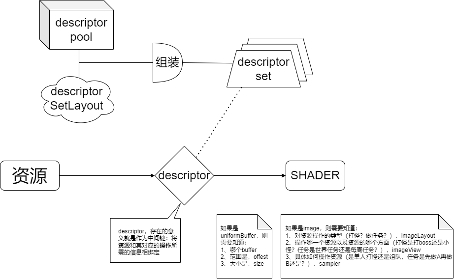

Texture

+ 创建一个image 对象，从device中获取内存

+ 用像素（来自于图像文件）填充它
+ 创建一个 image sampler
+ 添加一个绑定的 image sampler descriptor 对texutre进行采样

## 创建imageObject 并通过stagingBuffer向其中传输数据，利用barrier改变imageLayout

----

### 创建图片，并用数据填充它。步骤如下：

+ 创建一个staging resource，用像素数据填充它。（使用staging buffer）

+ 将上面的数据拷贝到最终的 image object中

  + 使用staging image也是可以的，但是呢在vulkan中我们也可以使用`vkBuffer` 来实现

+ 总结就是三步：

  + 创建一个staging buffer
  + 用像素数据填充它
  + 将staging buffer中的数据传输到image object中

+ 不同点

  + image有不同的`layout`，影响的是**像素在内存中的组织方式**
  + 不同的layout
    + `VK_IMAGE_LAYOUT_PRESENT_SRC_KHR`： present
    + `VK_IMAGE_LAYOUT_COLOR_ATTACHMENT_OPTIMAL`: attachment，从 fragment中写入数据
    + `VK_IMAGE_LAYOUT_TRANSFER_SRC_OPTIMAL`：和传输源，与`vkCmdCopyImageToBuffer`相似
    + `VK_IMAGE_LAYOUT_TRANSFER_DST_OPTIMAL`：传输目的地，与`vkCmdCopyBufferToImage`相似
    + `VK_IMAGE_LAYOUT_SHADER_READ_ONLY_OPTIMAL`：从shader中采样

+ 传输图片的layout常用的方式是，pipeline barrier。

  pipeline barrier主要用于同步对资源的访问权限。还可以用于传输queue family的ownership，当使用`VK_SHARING_MODE_EXCLUSIVE`

```c++
	void createTextureImage() {
		// 主要功能是加载iamge，并将起upload到image object中去
		int texWitdh, texHeight, texChannels;
		// 这里加入了 alpha 通道好处是可以和未来的其他材质保持一致
		// 加载的像素是一行一行排列的
		stbi_uc* pixels = stbi_load("textures/texture.jpg", &texWitdh, &texHeight, &texChannels, STBI_rgb_alpha);
		VkDeviceSize imageSize = texWitdh * texHeight * 4;
		if (!pixels) {
			throw std::runtime_error("failed to load texture image!");
		}
		// 将数据加载到stagingBuffer的stagingMemory中
		VkBuffer stagingBuffer;
		VkDeviceMemory stagingBufferMemory;
		createBuffer(stagingBuffer, stagingBufferMemory, imageSize, VK_BUFFER_USAGE_TRANSFER_SRC_BIT, VK_MEMORY_PROPERTY_HOST_VISIBLE_BIT | VK_MEMORY_PROPERTY_HOST_COHERENT_BIT);
		void* data;
		vkMapMemory(device, stagingBufferMemory, 0, imageSize, 0, &data);
		memcpy(data, pixels, static_cast<size_t>(imageSize));
		vkUnmapMemory(device, stagingBufferMemory);
		// 释放加载所占用的内存
		stbi_image_free(pixels);
	}
```


### 将staging中的内容拷贝到image Object中

理论上是shader可以通过VkBuffer对象访问图形的，ImageObject肯定相比于buffer是有优点的，通过二维坐标检索colors会更快也更容易。关于VkImageCreateInfo对象里的imageType，图片里的纹理像素应该使用怎样的坐标系。有如下几个选项

+ One dimensional images can be used to store an array of data or gradient,
+ two dimensional images are mainly used for **textures**
+ three dimensional images can be used to store **voxel volumes**

extent指的是对应维度上有多少个像素。

tiling有两个选择：

+ `VK_IMAGE_TILING_LINEAR`: Texels are laid out in row-major order like our `pixels` array
+ `VK_IMAGE_TILING_OPTIMAL`: Texels are laid out in an implementation defined order for optimal access


关于samples：

samples的参数与multisampling有关，这只与作为attachments的图像有关，一般都是one sample。flags与稀疏图像有关，就是3D texture体渲染，只需要存储纹理的部分，而不需要 store large volumes of “air" values.


关于imageLayout：

`VK_IMAGE_LAYOUT_GENERAL`这个layout支持所有的操作，但是呢就是啥都会，但是都不能达到最好的性能。一些特殊的情况可能会用到，将一张图片及作为输入也作为输出又或者是读取初始化的图像？（reading an image after it has left the preinitialized layout）


关于VkBufferImageCopy里的`imageSubresource.aspectMask`，指的是图像的哪一方面就会被操作。


## Image View and sampler

如何在pipeline中获取(利用采样)到imageObject中的图像数据。


#### 关于`imageView`和`image`的理解

chatGPT说的很好啊。我直接拿过来了

在Vulkan中，`imageView`和`image`是密切相关的概念，它们一起用于访问和处理图像资源。以下是它们之间的关系：

1. **Image（图像）**：
   - `image`是实际的图像资源，它表示了一个2D、3D或立方体图像的像素数据。这些图像可以用于颜色附着、深度/模板缓冲、纹理等不同的目的。
   - 一个`image`包括像素数据、图像的尺寸、格式、采样级别（mipmaps）、层级数等信息。它是GPU内存中的实际数据存储。

2. **ImageView（图像视图）**：
   - `imageView`是对`image`的一个抽象视图，它描述了如何访问`image`的数据。`imageView`可以看作是`image`的某个方面的窗口。
   - 通过`imageView`，你可以指定要访问的图像的哪个方面（例如颜色、深度、模板）、哪些图像层级、哪些mipmap级别，以及如何解释图像的像素格式等信息。

通常，在Vulkan应用程序中，你会创建`image`来存储图像数据，然后创建一个或多个`imageView`，以便你可以在着色器程序中或渲染通道中访问这些图像数据。`imageView`提供了对图像数据的抽象，使你能够以不同的方式使用相同的`image`。例如，你可以创建一个用于颜色附着的`imageView`，同时创建一个用于采样的`imageView`，它们都引用相同的`image`，但提供不同的访问方法。

总之，`image`是实际的图像数据存储，而`imageView`是对这些数据的抽象视图，它们一起允许你以不同的方式使用和访问图像资源。这对于实现复杂的图形渲染和计算任务非常有用。

**PS**: 这种关系就像是，`uniformBuffer`和`descriptor`。`imageView`就是指针，`image`就是内存中真实的数据，而一个`image`可以又多个`imageView`指向它


#### 在sampler中的`addressMode`与`borderColor`的区别：

+ `addressMode` 主要处理越界**坐标**的重复、截断或反射行为。它决定了越界坐标最终在纹理图像中的位置。
+ `borderColor` 主要处理越界采样时返回的**颜色**。它决定了越界采样时的颜色值。

纹理坐标系是否标准化，如果标准化，那么范围应该是在[0,1)。

`compareEable`与`compareOp`主要用于 `percentage-closer filtering` 在shadow maps中。


#### sampler在vulkan中有什么不同

不同点，image sampler与OpenGL等老牌API的不同，在Vulkan中sampler是**独立**的，也就是说可以应用到其他问题图像中去，而在OpenGL中，sampler则是**被绑定**在纹理对象中的。


#### aspectMask

在`copyBufferToImage`以及`imageView`相关对象的`createInfo`中都有这个字段，这个字段说明的是希望操作图像的那个方面。


#### anisotropic

这是一个可选的硬件特性，因此在logicaldevice需要的物理设备特性中加入`samplerAnisotropy`


### combined image sampler

为什么要用descriptor？因为前文提到过，vulkan中的sampler是独立的，而我们需要在shader中使用sampler来通过imageView对image进行相关操作因此我们需要将**资源**和其对应的**操作**相**绑定**。有如下的模型：

