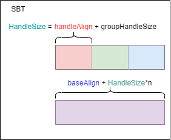

### 启用扩展

主要是raytracing pipeline以及accelerate structure


### 创建加速结构

创建加速结构的目的：减少渲染时候的 ray-triangle相交测试。

通常是在硬件中实现的一个层次化的结构。但是只有两种加速结构暴露给了开发者：

+ TLAS：包含对多个底层加速结构的引用，其上限由`VkPhysicalDeviceAccelerationStructurePropertiesKHR::maxInstanceCount`决定
+ BLAS：与场景中每个单独的三维模型对应。

TLAS通过一个3x4的变换矩阵来定位的BLAS构建的整个场景。

3x4 矩阵不能表示投影变换，因为它缺少了用于齐次坐标的第四行。这意味着它不适用于需要投影变换的场景，如透视投影或正交投影。


### BLAS

将OBJ模型的几何数据分解为多个AS builder。其实现依赖于将数据传输给`vkCmdBuildAccelerationStructuresKHR`来构建顶层和底层加速结构。

- `VkAccelerationStructureGeometryTrianglesDataKHR`: device pointer to the buffers holding triangle vertex/index data, along with information for interpreting it as an array (stride, data type, etc.) 结构体封装了构建 **BLAS** 时需要的**三角形几何信息**，包括顶点数据、索引数据、变换数据等。**BLAS 通常代表场景中的单个物体或网格**，包含静态或动态的几何形状。

- `VkAccelerationStructureGeometryKHR`

  : wrapper around the above with the geometry type enum (triangles in this case) plus flags for the AS builder. This is needed because`VkAccelerationStructureGeometryTrianglesDataKHR` is passed as part of the union `VkAccelerationStructureGeometryDataKHR` (the geometry could also be instances, for the TLAS builder, or AABBs, not covered here). 结构体提供了构建加速结构所需的**关键几何体信息**，包括三角形网格、实例化的几何体或者更高级的几何体类型（如曲面等）。这个结构体用于描述加速结构中**单个几何体的类型、数据和布局**。

- `VkAccelerationStructureBuildRangeInfoKHR`: the indices within the vertex arrays to source input geometry for the BLAS。当你构建加速结构（无论是底层加速结构 BLAS 还是顶层加速结构 TLAS）时，`VkAccelerationStructureBuildRangeInfoKHR` 结构体告诉 Vulkan **具体要从几何体数据中使用哪些部分**来构建加速结构。对于每个 `VkAccelerationStructureGeometryKHR` 结构体（它定义了加速结构中的单个几何体），都会有一个对应的 `VkAccelerationStructureBuildRangeInfoKHR` 结构体来指定具体的构建范围。

即使通过上面的描述，还是感觉有点晦涩难懂，其实VkAccelerationStructureGeometryTrianglesDataKHR与VkAccelerationStructureGeometryKHR之间的关系，后者应该是前者的一个**抽象**。 geometry的数据不只有三角网格，还可以有其他的类型。这样在创建加速结构时候，通过geometry这个中间层来抹除底层的差异。

有了geometry为什么还要有rangeinfo呢？这里可以这么理解，就是给了的数据不一定都会被用到，就像教程里说的，OpenGL里给的数据，你最后draw的时候不一定都会用到，调用draw的时候也指定了范围的。

**ps:** 关于竞争冒险，如果场景是动态的，需要动态地创建加速结构，则需要考虑竞争冒险。

**BLAS压缩：**

+ 减少内存占用
+ 提高内存带宽效率
+ 提高光线追踪性能
+ 动态场景的优化
+ 提高渲染质量与速度的平衡

BLAS 压缩可能会导致一些精度损失，这需要仔细权衡压缩率和光线追踪精度之间的关系。

压缩和解压缩操作可能会增加一些计算开销，需要确保这些开销不会抵消压缩带来的性能收益。

---


**关于scratch buffer**

英伟达把stagingbuffer，叫做scratch buffer。好像不对，chatgpt说scratch更底层。待定，目前来看似乎就是存储临时变量的。用于大批量数据的传输。

"scratch"的字面意思通常是指划痕、抓痕或擦痕，而不是暂存的意思。然而，在特定的上下文中，"scratch"有时会被用来表示**临时性或即兴性**的东西，因此在一些技术或专业领域中，"scratch buffer"可能指的是用于**临时存储数据的缓冲区**。

---


**创建BLAS需要的信息**

+ `VkAccelerationStructureBuildGeometryInfoKHR` : to create and build the acceleration structure. It is referencing the array of `VkAccelerationStructureGeometryKHR` created in `objectToVkGeometryKHR()`
+ `VkAccelerationStructureBuildRangeInfoKHR`: a reference to the range, also created in `objectToVkGeometryKHR()`
+ `VkAccelerationStructureBuildSizesInfoKHR`: the size require for the creation of the AS and the scratch buffer
+ `nvvk::AccelKHR`: the result

每一个BLAS包括：geometry，build range，size of memory， sizeof the scratch buffer。

---


**BLAS分割**

**分割原因：**在单个命令缓冲区中一次性创建所有 BLAS 可能会**导致 GPU 管线暂时阻塞**，因为 GPU 需要等待所有 BLAS 创建完成才能继续其他渲染工作。这种阻塞会影响渲染性能。**如何分割：**为了避免这种阻塞，可以将 BLAS 的创建工作**分割成多个较小的任务**。每个任务只创建一部分 BLAS，且**每部分的内存需求大约为 256MB**。这样做可以让 GPU 有机会在执行其他渲染命令的间隙中处理这些较小的任务，从而**减少对整体渲染管线的影响**。

---


#### BLAS创建步骤

在涉及到 Vulkan 射线追踪和加速结构（Acceleration Structure）的上下文中，"creating" 和 "building" 加速结构（特别是底层加速结构，BLAS）是两个明确且必要的步骤，它们分别涉及到不同的操作和 Vulkan API 调用。

翻译出来就是：1、申请一块空间，2、再往里填充内容

---

**Creating the Acceleration Structure**

"Creating" 加速结构指的是**创建加速结构所需的 Vulkan 资源**，但此时加速结构本身并未包含任何实际的几何数据。这一步骤通常涉及以下操作：

1. **确定大小**：首先，需要计算加速结构以及相关资源（如 scratch buffer）的大小。这可以通过使用 `vkGetAccelerationStructureBuildSizesKHR` 函数来完成，它基于加速结构将包含的几何体信息提供预估的大小。
2. **创建缓冲区**：根据得到的大小，创建足够容纳加速结构数据的缓冲区。这个缓冲区将用来存储加速结构的实际数据。
3. **创建加速结构**：使用 `vkCreateAccelerationStructureKHR` 函数创建加速结构的 Vulkan 对象，此时它关联到了之前创建的缓冲区，但加速结构本身还没有构建，即它还不包含任何关于几何体的数据。

在创建的时候需要两个usage bits：`VK_BUFFER_USAGE_ACCELERATION_STRUCTURE_STORAGE_BIT_KHR` 和`VK_BUFFER_USAGE_SHADER_DEVICE_ADDRESS_BIT`，需要device_address是

---

**Building the Acceleration Structure**

"Building" 加速结构是指**填充加速结构 Vulkan 对象与实际的几何数据**。这一步骤将根据你的场景中的几何体数据构建出加速结构，以便用于高效的射线交叉测试。这一步骤包括：

1. **准备几何数据**：定义加速结构将包含的几何体的信息，如顶点缓冲区、索引缓冲区等。
2. **使用 Scratch Buffer**：构建加速结构是一个计算密集型的过程，需要一个临时缓冲区（称为 scratch buffer），用于存储构建过程中的中间数据。
3. **构建命令**：使用 `vkCmdBuildAccelerationStructuresKHR` 函数（或相关函数）在命令缓冲区中记录构建加速结构的命令。这一步会实际填充加速结构 Vulkan 对象与几何数据，构建出可用于射线追踪的内部表示。

由于用了所有的BLAS使用同一个scratch buffer，因此需要使用barrier来保证后一次创建的AS在前一次已经完成之后进行。

---

高效的方法：1、分配一个大一点的scratch buffer；2、使用一个大的scratch buffer的不同区域来同时创建多个BLAS。


#### 关于压缩

后面再讲。


#### 总体结构


### TLAS

顶层加速结构（Top-Level Acceleration Structure，简称 TLAS）**充当了光线追踪场景描述的入口点**。它**不直接存储场景中的几何体数据**，而是存储对底层加速结构（Bottom-Level Acceleration Structures，简称 BLAS）的**实例的引用**。每个 BLAS 包含具体的几何体数据，如三角形网格。TLAS 通过引用这些 BLAS 实例，以及实例的变换信息，来组织整个场景。

```
VkAccelerationStructureInstanceKHR
```


#### 总体结构

和BLAS构建方法是一样的，只是底层数据，从triangles变成了instances


### vulkan中创建TLAS和BLAS中 sratchBuffer的作用

在构建底层加速结构（BLAS）和顶层加速结构（TLAS）时，Scratch Buffer 用于存储多种中间数据和临时计算结果。这些数据对于构建和优化加速结构至关重要，尽管 Vulkan 规范没有详细列出所有可能的中间数据类型，但我们可以根据加速结构构建的一般过程来理解它们可能包括哪些内容：

1. **分层包围盒（Bounding Box）计算**：在构建 BLAS 时，GPU 需要计算和优化每个几何体的包围盒。对于 TLAS，需要计算实例的包围盒。Scratch Buffer 可以用来存储这些包围盒的中间表示，以及在优化过程中产生的任何临时数据。
2. **空间分割结构**：加速结构的构建涉及到场景的空间分割，以创建数据结构（如 BVH - 边界体积层次结构），使得射线与场景交互时能高效地定位潜在相交的几何体。Scratch Buffer 可用于存储分割过程中产生的节点、分割平面、索引和其他结构化数据。
3. **排序和重排数据**：为了提高内存访问效率和减少射线遍历加速结构时的计算开销，构建过程可能会对几何体、实例或包围盒进行排序和重排。Scratch Buffer 可能用于存储排序过程中的索引、排序后的元素以及任何用于排序算法的辅助数据。
4. **优化和修剪**：加速结构构建过程可能包括优化步骤，如修剪不必要的节点或合并接近的节点以减少深度。Scratch Buffer 可用于存储与这些优化步骤相关的中间结果和决策数据。
5. **并行计算的同步和归约**：构建加速结构是一个高度并行的过程，可能需要进行同步和归约操作（例如，计算所有几何体包围盒的合并）。Scratch Buffer 可用于这些操作的中间数据存储。

**总结**

Scratch Buffer 在加速结构构建过程中**承载了多种中间数据和临时计算结果**，这些数据对于构建高效、优化的加速结构是必不可少的。虽然具体的中间数据类型取决于构建算法的细节，但上述列举的类型给出了一个大致的概念。由于这些数据通常只在构建过程中暂时使用，因此一旦加速结构构建完成，与 Scratch Buffer 相关的资源就可以被释放或用于其他目的。


### 关于Query Pool

`Query Pool` 是一种资源，用于**存储和管理**从 **GPU 查询**到的数据。允许应用程序收集关于渲染和计算操作的各种**统计信息和性能度量**。通过使用**查询池**，可以查询如渲染过程中的一些特定事件的发生次数、管线的某些阶段的执行时间，以及其他与性能和调试相关的信息。

使用流程：

+ **创建 Query Pool**：首先需要创建一个查询池，指定所需的查询类型（如时间戳、管线统计等）和查询数量。
+ **记录查询命令**：在命令缓冲区中，使用特定的 Vulkan 命令来开始和结束查询，或者插入时间戳。

+ **获取查询结果**：渲染或计算命令执行完成后，通过 `vkGetQueryPoolResults` 函数从查询池中获取查询结果。

在 nVidia的raytracing的例子中，query主要用于查询每一个具体的blas所需要的空间的大小。默认情况下`vkGetAccelerationStructureBuildSizesKHR`返回的值是最坏情况下的值。


### Ray Tracing Descriptor Set

在传统光栅化中，通常都是按照材质分组来绘制的（不同的材质可能会使用不同的渲染管线，而相同的材质一般使用相同的渲染管线来绘制）

```c++
bind pipeline;
bind descriptorset;
draw;
```


在光追中，无法预先知道光线打中了哪一个物体。因此任何shader都有可能被调用。

在vulkan中，使用一个descriptor set来囊括渲染一个场景所需要的所有资源。

**加速结构只包含position data**；

descriptor set来连接 TLAS 以及shader最后要输出的image（VK_DESCRIPTOR_TYPE_STORAGE_IMAGE）。


### 为什么顶点和索引缓冲区在光线追踪中作为存储缓冲区？

1. **非顺序数据访问**：
   - 光线追踪着色器（如最近命中着色器）可能需要基于光线和物体交互的结果访问任意顶点数据，这种访问通常是非顺序的。
   - 作为存储缓冲区，顶点和索引缓冲区可以支持着色器以任意方式读取或写入数据，这为复杂的数据交互提供了可能。
2. **光线追踪中的加速结构需求**：
   - 光线追踪技术使用加速结构（如 BVH - Bounding Volume Hierarchies）来高效地判定光线与场景中对象的交互。建立这些加速结构需要从顶点和索引缓冲区读取数据。
   - 在构建加速结构时，需要将顶点和索引数据作为输入，这通常要求这些缓冲区配置为 `VK_BUFFER_USAGE_ACCELERATION_STRUCTURE_BUILD_INPUT_READ_ONLY_BIT_KHR`，表示它们在建立加速结构过程中只读。
3. **设备地址的需求**：
   - 光线追踪 API 通常需要直接访问设备内存地址。`VkAccelerationStructureGeometryTrianglesDataKHR` 结构用于指定加速结构构建过程中顶点和索引数据的来源，这要求相应的缓冲区能提供原始的设备地址。
   - 因此，顶点和索引缓冲区还需要启用 `VK_BUFFER_USAGE_SHADER_DEVICE_ADDRESS_BIT`，以允许通过设备地址访问它们。


### Ray Tracing Pipeline

为什么要有？

因为与光栅化按照材质来绘制（按照顺序执行）不同的是，

在光追中，每个shader都有可能被调用执行。执行的着色器是在运行时在设备上选择的。

终极目标：**在运行时选择对应的着色器**。

有点像c++的虚函数表，只是是**不透明**的，需要我们自己构建。

+ 这个过程是进行光线追踪渲染的关键部分。下面将详细解释这个流程：

  1. **加载和编译着色器**

  - **操作**：首先，将 GLSL 或 HLSL 着色器代码编译成 SPIR-V 格式，然后使用这些 SPIR-V 代码创建 `VkShaderModule` 对象。每个着色器模块包含了可由 Vulkan 执行的着色器代码。

  2. **打包 `VkShaderModule` 到 `VkPipelineShaderStageCreateInfo` 数组**

  - **操作**：为管线的每个着色器阶段创建一个 `VkPipelineShaderStageCreateInfo` 结构体实例。这个结构体指定了管线中每个阶段使用的**着色器模块**，包括着色器类型（如顶点着色器、片元着色器、光线生成着色器等）。

  3. **创建 `VkRayTracingShaderGroupCreateInfoKHR` 数组**

  - **操作**：为光线追踪的每个着色器组创建一个 `VkRayTracingShaderGroupCreateInfoKHR` 实例。每个着色器组定义了一组着色器，这些着色器在光线追踪过程中作为一个单元一起工作。在这个阶段，着色器组通过在 `VkPipelineShaderStageCreateInfo` 数组中的索引来引用着色器。

  4. **使用 `vkCreateRayTracingPipelineKHR` 创建光线追踪管线**

  - **操作**：将上述两个数组和管线布局（`VkPipelineLayout`）编译成一个光线追踪管线。这个过程会把索引基的着色器引用转换成具体的设备地址或句柄。

  5. **查询着色器句柄**

  - **操作**：使用 `vkGetRayTracingShaderGroupHandlesKHR` 函数获取每个着色器组的设备句柄。这些句柄是实际用于 GPU 执行的标识符。

  6. **分配并填充 SBT**

  - **操作**：分配一个具有 `VK_BUFFER_USAGE_SHADER_BINDING_TABLE_BIT_KHR` 使用标志的缓冲区，然后将步骤5中查询到的着色器句柄复制到此缓冲区中。这个缓冲区即为着色器绑定表，它在光线追踪渲染中用于快速索引和调用着色器。


### 5种shader

#### ray generation

- 一旦光线的起始点和方向确定，光线生成着色器调用 `traceRayEXT()` 函数。这个函数是 Vulkan 光线追踪扩展的一部分，用于在场景中发射光线。
- `traceRayEXT()` 负责管理光线在场景中的传播，直到它与物体相交或完全离开场景。
- 着色器间的通信主要通过光线追踪有效负载（**ray trace payloads**）实现。这些有效负载携带了从光线生成着色器到其他着色器的数据，如颜色、深度、材料属性等。


#### mis

1. **目的**：
   - 未命中着色器在光线**未与场景中的任何几何体相交**时执行。这种情况通常意味着光线“射出”了场景边界或在场景中找不到任何对象来与之交互。
2. **功能**：
   - 未命中着色器可能用于**采样环境**映射，以模拟光线从**虚拟环境外**反射回来的效果，例如天空盒或远景。
   - 或者，它可以简单地返回一个固定的颜色，这个颜色通过光线有效负载（ray payload）返回，作为场景中未被任何物体遮挡的背景色。


#### Closest Hit

1. **目的**：
   - 当光线击中离起始点最近的几何体实例时，将调用最近命中着色器。这意味着光线已经找到了一个明确的命中目标，可以进行更详细的计算。
2. **功能**：
   - 最近命中着色器**通常执行光照计算**，包括计算光线与物体表面的交互（如反射、折射、阴影等）。
   - 它可以**处理材质属性**，结合场景的光照条件，通过光线有效负载计算并返回最终颜色或其他视觉效果。
3. **灵活性**：
   - 可以**根据需要有多个最近命中着色器**，类似于光栅化基础应用中根据不同对象使用不同的像素着色器。这允许开发者为场景中的不同物体定制光线交互的处理方式，提供高度的视觉和性能定制性。


#### intersection

1. **用户定义几何体的交互**：
   - 交点着色器允许光线与用户定义的几何体进行交互。这意味着开发者可以定义自己的算法来决定光线如何与特定的几何形状相交，而不仅限于标准的几何体形状。
2. **用途示例**：
   - **按需加载几何体**：交点着色器可以用于实现几何体占位符的交叉检测，这对于按需加载几何体特别有用。在这种情况下，真实的几何体数据可以在确定光线与其占位符相交后才被加载到内存中。
   - **过程生成几何体**：对于过程生成的几何体，如通过数学公式动态生成的形状，交点着色器可以用来直接计算光线与这些形状的交点，而无需事先对它们进行细分（tessellating）。
3. 对加速结构的影响
   + 使用交点着色器可能**需要修改加速结构**（如 BVH - Bounding Volume Hierarchies）的构建方式。因为标准的加速结构构建假设使用简单的几何体交叉测试，而交点着色器允许更复杂的交互定义，这可能影响整个加速结构的效率和组织。

如果不设置，那么硬件将直接处理交点检测。


#### any hit

1. **处理潜在交点**：

   - 当光线从起点发射并穿过场景时，可能会遇到多个物体的交点。任意命中着色器**会在每个这样的潜在交点上执行**，而不仅仅是最终的交点。
   - 这使得任意命中着色器成为评估和处理所有潜在交点的理想位置。

2. **高效实现 Alpha 测试**：

   - 任意命中着色器经常用于**实现 alpha 测试**（透明度测试）。在这种情况下，如果一个交点的材质是部分透明的（例如纹理的某些部分是透明的），着色器可以检查 alpha 值决定是否“忽略”这个交点。
   - 如果 alpha 测试失败（表示该点应透明），则可以继续光线遍历，寻找下一个交点，而不必重新启动整个光线追踪过程。

3. **光线遍历的继续**：

   - 当任意命中着色器**决定当前交点不符合条件**（例如，通过了 alpha 测试）时，它可以允许光线继续遍历，寻找更接近的或其他有效的交点。
   - 这种能力显著**提高了渲染效率**，特别是在处理复杂场景或具有多层透明材质的场景中。

4. 内置的任意命中着色器

   - 如果没有显式定义任意命中着色器，许多光线追踪实现会提供一个**默认**的“通透”任意命中着色器。这个默认的着色器通常**仅将交点信息返回给遍历引擎**，而不做任何处理。

   - 遍历引擎随后负责确定所有记录的交点中哪一个最接近光线的起点。

ps：如果不设置，默认是内置的 **pass-through** 着色器通常不会改变传入的交点数据，它只是简单地验证交点并将控制权传递给其他着色器，如最近命中着色器或未命中着色器。


ps：在光线追踪渲染管线中，各个shader触发的顺序是任意的，但是依旧保留了 ”stages“这一从传统光栅化中出来的结果。


### 着色器组类型

- **当类型是 `VK_RAY_TRACING_SHADER_GROUP_TYPE_GENERAL_KHR`**：
  - 这种类型的着色器组专用于那些**不直接与几何体交互**的着色器任务，如**光线生成、未命中**处理和可调用着色器。
  - 在这种情况下，`generalShader` 字段用于指定该组中活跃的着色器的索引。这个索引应该对应于在创建光线追踪管线时提供的 `VkPipelineShaderStageCreateInfo` 数组中的某个着色器。
  - 例如，如果你有一个光线生成着色器，并且它在 `VkPipelineShaderStageCreateInfo` 数组中的索引是 0，那么在相应的 `VkRayTracingShaderGroupCreateInfoKHR` 结构中，你应该将 `generalShader` 设置为 0。
- **当类型是 `VK_RAY_TRACING_SHADER_GROUP_TYPE_TRIANGLES_HIT_GROUP_KHR` 或 `VK_RAY_TRACING_SHADER_GROUP_TYPE_PROCEDURAL_HIT_GROUP_KHR`**：
  - 对于**处理命中事件**的着色器组（包括**最近命中**着色器、**任意命中**着色器和**交点**着色器），`generalShader` 字段通常设置为 `VK_SHADER_UNUSED_KHR`，因为这些类型的组专门处理与几何体的交互，不使用通用着色器。


### 有效负载的声明和使用

1. **声明有效负载**:
   - 在 Vulkan 的光线追踪着色器中，有效负载变量可以被声明为 `rayPayloadEXT` 或 `rayPayloadInEXT` 类型。
   - `rayPayloadEXT` 是用于声明一个可由**当前着色器**修改并**传递**给被调用着色器的有效负载。
   - `rayPayloadInEXT` 是用于**接收**来自调用着色器的有效负载的变量，也称为“incoming payload”。
2. **着色器间的调用者/被调用者关系**:
   - 这两种类型的有效负载变量建立了着色器间的调用者（caller）和被调用者（caller）关系。
   - 当一个着色器（调用者）调用 `traceRayEXT()` 函数时，它可以选择将其一个 `rayPayloadEXT` 变量传递给被调用的着色器。在被调用的着色器中，这个传递的有效负载变为 `rayPayloadInEXT` 变量。
3. **局部复制**:
   - 每次着色器被调用时，它都会为其声明的 `rayPayloadEXT` 变量创建一个局部副本。这意味着每个着色器实例有其自己的有效负载数据副本，这些数据可以在着色器执行期间修改，不会影响其他着色器实例的有效负载数据。
4. **数据传递**:
   - 使用 `traceRayEXT()` 调用时，调用者着色器可以指定哪个有效负载变量将被传递给被调用者着色器作为其 `rayPayloadInEXT`。这允许灵活地在着色器间传递数据，例如颜色信息、击中信息或其他计算结果。

每当一个着色器通过调用 `traceRayEXT()` 时，它会创建传递给被调用着色器的有效负载的一个**副本**。这种设计是为了确保数据的完整性和每个着色器调用的独立性，使得每个着色器都可以操作自己版本的数据而不影响其他着色器实例的状态。

GPU中的每个SM拥有固定数量的寄存器和共享内存。这些资源在SM上的所有线程间共享。**当每个线程使用的资源量增加时**，同一SM上**能够同时运行的线程数量就会减少**。


### SBT(Shader Binding Table)

传统光栅化的思路：绘制与资源绑定

SBT里存储的是啥？是shader的**句柄**，何谓句柄，其实就是地址，或者是更抽象的地址，特性是绑定关系，即handle所引用的资源在内存中的地址发生了变化，依然可以通过handle去访问到改资源。即**handle与资源建立了一定的连接**，即使资源挪动了，依然可以通过handle访问到该资源。

光追：绘制与资源分离

将实例与shader建立联系是在创建几何体时候就进行的。在TLAS中为每一个实例提供一个hitGroupID，决定了在绘制的时候启用具体哪一组id。

如何计算entries之间的间距？

+ `PhysicalDeviceRayTracingPipelinePropertiesKHR::shaderGroupHandleSize`

+ `PhysicalDeviceRayTracingPipelinePropertiesKHR::shaderGroupBaseAlignment`

  则是针对**单个句柄**的对齐。就是二维数组里的一维数组的内存对齐。这样可以使提升SBT表的读取速率

+ The size of any user-provided `shaderRecordEXT` data if used (in this case, no).

SBT一般是一个二维数组，包括**raygen**，**miss**，**hit**，**callable**四个着色器组：其中raygen有且仅有一个，因此其size等于stride。

**这里为什么要对齐呢？**对齐是因为硬件设计的问题。在多个显存颗粒表示一段连续的内存，都是在每个内存中的同样的位置存储数据的某一Byte，而一块内存里有8个bank也是同样的道理，我们可以利用同样的地址，来存取8个bank的数据，这样性能就提升了，如果没有内存对齐，那么这里就要计算其偏移量，就变慢了，增加了寻址的开销。

对齐有两种：

+ SBT表内的一维数组的整体的对齐，这样取某一个数组就很快，不用位置偏移。
+ 一维数组内部，每个shadergroup handle所占居的空间进行内存对齐。




之后就是从**Pipeline**中提取出**groups**的**handles**并将其填充到**SBTbuffer**中，SBTbuffer的大小为**handleSize * handleCount**。


在创建SBT表的时候，需要`VK_BUFFER_USAGE_SHADER_DEVICE_ADDRESS_BIT`，这个字段是用来允许着色器代码通过设备地址直接访问缓冲区数据。

### camera matrices

+ 由于raygen shader需要camera信息，而`camera`的信息一般都是保存在`UBO`中的，因此UBObuffer的 usage一般还要加上`VK_PIPELINE_STAGE_RAY_TRACING_SHADER_BIT_KHR`

+ `#extension GL_GOOGLE_include_directive : enable`，GLSL的拓展指令，允许GLSL着色器代码中使用`#include`指令。使得GLSL文件中**包含其他GLSL文件**。
+ 支持64位整数类型，需要启动扩展：`GL_EXT_shader_explicit_arithmetic_types_int64 : require`，require是强制启动，如果不支持则会报错，enable则是可选，如果不可用，程序也能运行下去。
+ `rayPayloadEXT`， 由被调用的hit和miss shader返回一些信息给调用ray trace的shader；`rayPayloadEXT`只是个**限定符**，并不是类型。

#### raygen

+ 声明一个`rayPayloadEXT`，变量用于传递以及接收信息；
+ 归一化浮点像素坐标，`gl_LaunchIDEXT`包含当前渲染像素的坐标；`gl_LaunchSizeEXT`，表示屏幕空间尺寸；利用这者的信息可以计算出最终的结果。这里有一个tip，就是给`gl_LaunchIDEXT`的xy都加上0.5，使用像素中心来计算。

```glsl
onst vec2 pixelCenter = vec2(gl_LaunchIDEXT.xy) + vec2(0.5); // 这里加0.5使用像素中心来计算
const vec2 inUV = pixelCenter/vec2(gl_LaunchSizeEXT.xy);
vec2 d = inUV * 2.0 - 1.0;
```


+ 计算光照的方向，这里使用的是世界空间坐标

  ps：在计算机图形学里由4个空间

  + 对象空间 * model = 世界空间
  + 世界空间 * view = 相机空间
  + 相机空间 * projection = 裁剪空间

```glsl
  traceRayEXT(topLevelAS, // acceleration structure
          rayFlags,       // rayFlags
          0xFF,           // cullMask
          0,              // sbtRecordOffset
          0,              // sbtRecordStride
          0,              // missIndex
          origin.xyz,     // ray origin
          tMin,           // ray min range
          direction.xyz,  // ray direction
          tMax,           // ray max range
          0               // payload (location = 0)
  );
```

关于`sbtRecordOffset`和`sbtRecordStride`以及`instanceShaderBindingTableRecordOffset`如何影响`traceRayEXT`选择具体的哪个`Hit shader`。


`rayPayloadEXT`的定位，是通过location的序号来确定的。具体可以查看一下[GLSL风格](https://developer.blender.org/docs/handbook/guidelines/glsl/)。整个location不必像光栅化那样输入与输出的location必须要匹配。

