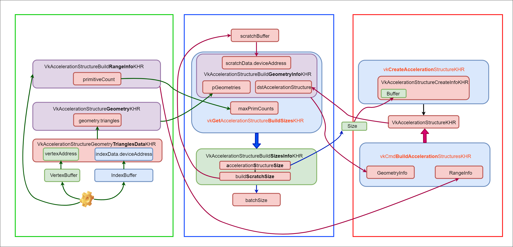

### 启用扩展

主要是raytracing pipeline以及accelerate structure


### 创建加速结构

创建加速结构的目的：减少渲染时候的 ray-triangle相交测试。

通常是在硬件中实现的一个层次化的结构。但是只有两种加速结构暴露给了开发者：

+ TLAS：包含对多个底层加速结构的引用，其上限由`VkPhysicalDeviceAccelerationStructurePropertiesKHR::maxInstanceCount`决定
+ BLAS：与场景中每个单独的三维模型对应。

TLAS通过一个3x4的变换矩阵来定位的BLAS构建的整个场景。

3x4 矩阵不能表示投影变换，因为它缺少了用于齐次坐标的第四行。这意味着它不适用于需要投影变换的场景，如透视投影或正交投影。


### BLAS

将OBJ模型的几何数据分解为多个AS builder。其实现依赖于将数据传输给`vkCmdBuildAccelerationStructuresKHR`来构建顶层和底层加速结构。

- `VkAccelerationStructureGeometryTrianglesDataKHR`: device pointer to the buffers holding triangle vertex/index data, along with information for interpreting it as an array (stride, data type, etc.) 结构体封装了构建 **BLAS** 时需要的**三角形几何信息**，包括顶点数据、索引数据、变换数据等。**BLAS 通常代表场景中的单个物体或网格**，包含静态或动态的几何形状。

- `VkAccelerationStructureGeometryKHR`

  : wrapper around the above with the geometry type enum (triangles in this case) plus flags for the AS builder. This is needed because`VkAccelerationStructureGeometryTrianglesDataKHR` is passed as part of the union `VkAccelerationStructureGeometryDataKHR` (the geometry could also be instances, for the TLAS builder, or AABBs, not covered here). 结构体提供了构建加速结构所需的**关键几何体信息**，包括三角形网格、实例化的几何体或者更高级的几何体类型（如曲面等）。这个结构体用于描述加速结构中**单个几何体的类型、数据和布局**。

- `VkAccelerationStructureBuildRangeInfoKHR`: the indices within the vertex arrays to source input geometry for the BLAS。当你构建加速结构（无论是底层加速结构 BLAS 还是顶层加速结构 TLAS）时，`VkAccelerationStructureBuildRangeInfoKHR` 结构体告诉 Vulkan **具体要从几何体数据中使用哪些部分**来构建加速结构。对于每个 `VkAccelerationStructureGeometryKHR` 结构体（它定义了加速结构中的单个几何体），都会有一个对应的 `VkAccelerationStructureBuildRangeInfoKHR` 结构体来指定具体的构建范围。

即使通过上面的描述，还是感觉有点晦涩难懂，其实VkAccelerationStructureGeometryTrianglesDataKHR与VkAccelerationStructureGeometryKHR之间的关系，后者应该是前者的一个**抽象**。 geometry的数据不只有三角网格，还可以有其他的类型。这样在创建加速结构时候，通过geometry这个中间层来抹除底层的差异。

有了geometry为什么还要有rangeinfo呢？这里可以这么理解，就是给了的数据不一定都会被用到，就像教程里说的，OpenGL里给的数据，你最后draw的时候不一定都会用到，调用draw的时候也指定了范围的。

**ps:** 关于竞争冒险，如果场景是动态的，需要动态地创建加速结构，则需要考虑竞争冒险。

**BLAS压缩：**

+ 减少内存占用
+ 提高内存带宽效率
+ 提高光线追踪性能
+ 动态场景的优化
+ 提高渲染质量与速度的平衡

BLAS 压缩可能会导致一些精度损失，这需要仔细权衡压缩率和光线追踪精度之间的关系。

压缩和解压缩操作可能会增加一些计算开销，需要确保这些开销不会抵消压缩带来的性能收益。

---


**关于scratch buffer**

英伟达把stagingbuffer，叫做scratch buffer。好像不对，chatgpt说scratch更底层。待定，目前来看似乎就是存储临时变量的。用于大批量数据的传输。

"scratch"的字面意思通常是指划痕、抓痕或擦痕，而不是暂存的意思。然而，在特定的上下文中，"scratch"有时会被用来表示**临时性或即兴性**的东西，因此在一些技术或专业领域中，"scratch buffer"可能指的是用于**临时存储数据的缓冲区**。

---


**创建BLAS需要的信息**

+ `VkAccelerationStructureBuildGeometryInfoKHR` : to create and build the acceleration structure. It is referencing the array of `VkAccelerationStructureGeometryKHR` created in `objectToVkGeometryKHR()`
+ `VkAccelerationStructureBuildRangeInfoKHR`: a reference to the range, also created in `objectToVkGeometryKHR()`
+ `VkAccelerationStructureBuildSizesInfoKHR`: the size require for the creation of the AS and the scratch buffer
+ `nvvk::AccelKHR`: the result

每一个BLAS包括：geometry，build range，size of memory， sizeof the scratch buffer。

---


**BLAS分割**

**分割原因：**在单个命令缓冲区中一次性创建所有 BLAS 可能会**导致 GPU 管线暂时阻塞**，因为 GPU 需要等待所有 BLAS 创建完成才能继续其他渲染工作。这种阻塞会影响渲染性能。**如何分割：**为了避免这种阻塞，可以将 BLAS 的创建工作**分割成多个较小的任务**。每个任务只创建一部分 BLAS，且**每部分的内存需求大约为 256MB**。这样做可以让 GPU 有机会在执行其他渲染命令的间隙中处理这些较小的任务，从而**减少对整体渲染管线的影响**。

---


#### BLAS创建步骤

在涉及到 Vulkan 射线追踪和加速结构（Acceleration Structure）的上下文中，"creating" 和 "building" 加速结构（特别是底层加速结构，BLAS）是两个明确且必要的步骤，它们分别涉及到不同的操作和 Vulkan API 调用。

翻译出来就是：1、申请一块空间，2、再往里填充内容

---

**Creating the Acceleration Structure**

"Creating" 加速结构指的是**创建加速结构所需的 Vulkan 资源**，但此时加速结构本身并未包含任何实际的几何数据。这一步骤通常涉及以下操作：

1. **确定大小**：首先，需要计算加速结构以及相关资源（如 scratch buffer）的大小。这可以通过使用 `vkGetAccelerationStructureBuildSizesKHR` 函数来完成，它基于加速结构将包含的几何体信息提供预估的大小。
2. **创建缓冲区**：根据得到的大小，创建足够容纳加速结构数据的缓冲区。这个缓冲区将用来存储加速结构的实际数据。
3. **创建加速结构**：使用 `vkCreateAccelerationStructureKHR` 函数创建加速结构的 Vulkan 对象，此时它关联到了之前创建的缓冲区，但加速结构本身还没有构建，即它还不包含任何关于几何体的数据。

在创建的时候需要两个usage bits：`VK_BUFFER_USAGE_ACCELERATION_STRUCTURE_STORAGE_BIT_KHR` 和`VK_BUFFER_USAGE_SHADER_DEVICE_ADDRESS_BIT`，需要device_address是

---

**Building the Acceleration Structure**

"Building" 加速结构是指**填充加速结构 Vulkan 对象与实际的几何数据**。这一步骤将根据你的场景中的几何体数据构建出加速结构，以便用于高效的射线交叉测试。这一步骤包括：

1. **准备几何数据**：定义加速结构将包含的几何体的信息，如顶点缓冲区、索引缓冲区等。
2. **使用 Scratch Buffer**：构建加速结构是一个计算密集型的过程，需要一个临时缓冲区（称为 scratch buffer），用于存储构建过程中的中间数据。
3. **构建命令**：使用 `vkCmdBuildAccelerationStructuresKHR` 函数（或相关函数）在命令缓冲区中记录构建加速结构的命令。这一步会实际填充加速结构 Vulkan 对象与几何数据，构建出可用于射线追踪的内部表示。

由于用了所有的BLAS使用同一个scratch buffer，因此需要使用barrier来保证后一次创建的AS在前一次已经完成之后进行。

---

高效的方法：1、分配一个大一点的scratch buffer；2、使用一个大的scratch buffer的不同区域来同时创建多个BLAS。


#### 关于压缩

后面再讲。


#### 总体结构




### TLAS

顶层加速结构（Top-Level Acceleration Structure，简称 TLAS）**充当了光线追踪场景描述的入口点**。它**不直接存储场景中的几何体数据**，而是存储对底层加速结构（Bottom-Level Acceleration Structures，简称 BLAS）的**实例的引用**。每个 BLAS 包含具体的几何体数据，如三角形网格。TLAS 通过引用这些 BLAS 实例，以及实例的变换信息，来组织整个场景。

```
VkAccelerationStructureInstanceKHR
```


### 关于Query Pool

`Query Pool` 是一种资源，用于**存储和管理**从 **GPU 查询**到的数据。允许应用程序收集关于渲染和计算操作的各种**统计信息和性能度量**。通过使用**查询池**，可以查询如渲染过程中的一些特定事件的发生次数、管线的某些阶段的执行时间，以及其他与性能和调试相关的信息。

使用流程：

+ **创建 Query Pool**：首先需要创建一个查询池，指定所需的查询类型（如时间戳、管线统计等）和查询数量。
+ **记录查询命令**：在命令缓冲区中，使用特定的 Vulkan 命令来开始和结束查询，或者插入时间戳。

+ **获取查询结果**：渲染或计算命令执行完成后，通过 `vkGetQueryPoolResults` 函数从查询池中获取查询结果。

在 nVidia的raytracing的例子中，query主要用于查询每一个具体的blas所需要的空间的大小。默认情况下`vkGetAccelerationStructureBuildSizesKHR`返回的值是最坏情况下的值。


