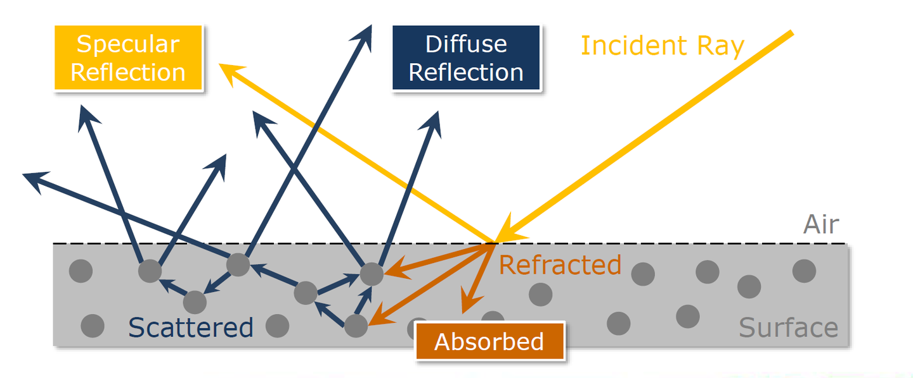

## 面经

### C++

#### 1、多态

+ 静态多态（编译时多态）

  编译器在编译阶段就能确定调用哪个函数或使用哪个模板实例。

  + 模板

    模板允许你编写**依赖于参数的代码**。模板在实例化时，编译器根据提供的**类型参数生成具体的类型或函数**。

  + 函数重载

    在同一个作用域内，可以声明多个**名称相同但是参数列表**不同的函数。根据传递给函数的参数类型和数量，编译器决定调用哪个函数。

+ 动态多态（运行时多态）

  运行时多态主要是通过**虚函数**（virtual function）和**继承**实现的。这允许在**运行时根据对象的实际类型来调用相应的成员函数**，而不是在编译时。

  + 虚函数

    在基类中使用`virtual`关键字声明的函数。如果**派生类**提供了虚函数的一个新实现（即**重写了基类的虚函数**），那么通过**基类指针或引用**调用该**虚函数**时，会根据对象的**实际类型调用相应的函数实现**。

  + 虚继承

    在基类中声明虚函数时，可以将其定义为`= 0`，这表示函数没有实现（即**纯虚函数**）。包含纯虚函数的类称为**抽象基类**，**不能直接实例化**。纯虚函数的主要目的是**定义接口规范**，强制派生类实现该接口。

#### 2、虚函数表

 + 1、编译器为每一个类维护一个虚函数表，每个对象的**首地址保存着该虚函数表的指针**，同一个类的不同对象实际上指向同一张虚函数表。

 + 2、当一个对象包含虚函数的时候，这个类内存首地址包含虚指针，也就是说，一个对象只要有**虚指针**，其内存所占大小至少是**4字节**以上。

 + 3、构造函数和析构函数能不能是虚函数？

   **构造函数不能为虚函数**，在构造过程是这样的，**首先分配一块内存，然后调用构造函数**。如果构造函数是虚函数，那么就需要虚函数表来调用，此时面对一块新鲜出炉的内存，去哪找虚函数表呢？因此构造函数不能为虚函数。

   **析构函数相反**，通常我们通过基类指针销毁对象时，如果析构函数不为虚函数，就不能**正确识别对象类型**，从而不能正确销毁对象，带来可能的内存泄漏问题。

 + 4、函数指针如何访问虚函数表

   通过调用对象的虚函数表指针(vptr)间接访问虚函数表。

#### 3、STL容器

+ 常见容器：vector、deque、priority_queue、set/map、unordered_set/map

+ 序列容器、关联容器、无序关联容器和容器适配器。

+ **vector** 底层使用的是**连续的内存空间**来存储元素，就像一个普通的数组，维护三个指针

  + **开始指针**：指向数组的第一个元素。
  + **结束指针**：指向数组中最后一个元素之后的位置，也就是第一个无效元素的位置。
  + **容量末尾指针**：指向分配的内存空间的末尾，这定义了 `vector` 可以在不重新分配内存的情况下存储多少元素。

  计算新容量，通常是当前容量的两倍（具体可能不同），分配新内存，释放旧内存，更新指针。

+ `priority_queue` 的底层是以堆（通常是最大堆或最小堆）的形式实现的，而**堆本身通常使用连续的内存空间**（如数组或 `vector`）来表示。

  插入元素，都是放在最底层，然后再与其父节点比较

#### 4、智能指针

智能指针

+ **`std::unique_ptr`**: 它是**一种独占所有权的智能指针**，确保同一时间只有一个`unique_ptr`可以指向一个给定的资源。当`unique_ptr`离开作用域时，它所指向的资源会被自动释放。**它不允许复制，确保了资源的唯一所有权，但可以进行移动操作**，将资源所有权从一个`unique_ptr`转移到另一个。

+ **`std::shared_ptr`**: 它是一种**共享所有权**的智能指针，允许多个`shared_ptr`实例**指向同一个资源**。`shared_ptr`使用引用计数机制来跟踪有多少个`shared_ptr`指向同一个资源。当**最后一个指向**该资源的`shared_ptr`被**销毁或重新指向其他资源时**，**原始资源将被释放**。这种机制使得资源管理变得简单，但也增加了一些开销。

+ **`std::weak_ptr`**: 它是一种配合`std::shared_ptr`使用的智能指针，不增加引用计数。它用来解决`std::shared_ptr`可能导致的循环引用问题。通过`weak_ptr`，**可以观察但不拥有资源，当资源被释放时，所有指向它的`weak_ptr`将自动变为空。**

实现机制

- **`std::unique_ptr`** 通常通过构造函数和析构函数来实现其**管理内存**的功能。**构造函数接管一个裸指针，而析构函数负责调用`delete`来释放这个裸指针**指向的内存。移动语义通过移动构造函数和移动赋值操作符来实现，它们传递所有权并将原始指针置为`nullptr`。
- **`std::shared_ptr`** 的实现更为复杂，因为它涉及到引用计数。除了管理资源的指针外，`shared_ptr`还维护了一个**引用计数器**，通常是通过一个**控制块**来实现的。每当一个新的`shared_ptr`被**创建或赋值**为指向相同资源的另一个`shared_ptr`时，这个资源的引用计数就会**增加**。当`shared_ptr`被**销毁或重新**指向其他资源时，引用计数就会**减少**。当**引用计数归零时，资源会被释放**。

循环引用发生在两个或多个`std::shared_ptr`实例相互引用，形成一个闭环。在这种情况下，即使这些`std::shared_ptr`实例已经不再被任何外部引用，它们所指向的对象的引用计数也不会降到0，因为它们互相持有对方，导致对象无法被释放，从而引发内存泄露。

#### 5、extern、static、const关键字

`extern`、`static`和`const`是C和C++中的三个重要关键字，它们分别用于声明变量或函数的**链接性、存储期和修改权限**。理解它们的用法对编写高质量的代码至关重要。

+ `extern`关键字用于声明一个变量或函数是在另一个文件或本文件的其他地方定义的。它用来在**多个文件之间共享变量或函数**。当你在一个文件中声明一个`extern`变量时，你告诉编译器这个**变量的定义在别的地方**，链接器会在所有的编译单元中寻找这个变量的定义。
+ `static`关键字有多种用途，但主要用于改变变量的存储期和链接性。
  - 在**函数内部**使用`static`声明的变量，其**生命周期**为整个程序执行期间，但只在声明它的**函数内可见**。这意味着该变量的值在函数调用之间保持不变，但在函数外部不可见。
  - 在函数**外**部使用`static`声明的**全局变量或函数**，会使其链接性变为**内部链接性**（仅限当前文件可见），这有助于避免不同文件间的命名冲突。

+ `const`关键字用于声明变量的值不可修改。一旦变量被`const`修饰并初始化之后，其值就不能被改变。这对于定义不变的常量非常有用。

ps: 在同一声明中同时使用`extern`和`static`是矛盾的，因为`extern`指示变量或函数可以在**其他文件**中访问，而`static`（在文件级别变量或函数上使用时）限制了访问范围，使之**仅在定义它的文件**内可见。

#### 6、C++的内存分配

+ 栈（stack）：又称堆栈，栈是由编译器自动分配释放，存放函数的参数值，局部变量的值等（但不包括static声明的变量，static意味着在数据段中存放变量）。除此之外，在函数被调用时，栈用来传递参数和返回值。由于栈的先进后出的特点，所以栈特别方便用来保存/恢复调用数据。其操作方式类似于数据结构中的栈。
+ 堆（heap）：堆是用于存放进程运行中被动态分配的内存段，它的大小，并不固定，可动态扩张或缩放。当进程调用malloc/free等函数分配内存时，新分配的内存就被动态添加到堆上（堆被扩张）/释放的内存从堆中被提出（堆被缩减）。堆一般由程序员分配释放，若程序员不释放，程序结束时可能由OS回收。注意它与数据结构中的堆是两回事，分配方式倒是类似于链表。
+ **全局数据区（静态区）**（static）：全局变量和静态变量的存储是放在一块的，初始化的全局变量和静态变量在一块区域，未初始化的全局变量和静态变量在相邻的另一块区域。
+ 文字常量区：常量字符串就是放在这里，程序结束后由系统释放。
+ 程序代码区：存放函数体的二进制代码

C语言在编译和连接后，将分成**代码段**(Text)、**只读数据段**(ROData)和**读写数据段**(RWData)。在运行时，除了以上三个区域外，还包括未初始化数据段(BSS)区域和堆(Heap)区域和栈(Stack)区域。

#### 7、 new 和 malloc的区别

1. **语言层面**：
   - `new` 是 C++ 语言中的操作符，而 `malloc` 是 C 语言中的库函数。
2. **构造和析构**：
   - `new` 在分配内存的同时会**调用对象的构造函数，为对象进行初始化**。当使用 `delete` 释放内存时，会先调用对象的析构函数，然后释放内存。
   - `malloc` 仅仅分配内存，**不调用构造函数，因此不会初始化对象**。相应地，`free` 用来释放由 `malloc` 分配的内存，但它也不会调用析构函数。
3. **返回类型**：
   - `new` 返回的是**指定类型的指针**，不需要类型转换。
   - `malloc` 返回的是 `void*` 类型，**需要显式转换**为需要的类型指针。
4. **错误处理**：
   - 如果 `new` 不能分配足够的内存，它会抛出一个 `bad_alloc` 异常（除非使用了 `nothrow` 版本的 `new`，这种情况下会返回一个空指针）。
   - `malloc` 在无法分配内存时会返回 `NULL`。
5. **内存分配大小**：
   - `new` **自动计算要分配的内存大小**，根据所需类型确定。
   - 使用 `malloc` 时，必须**手动指定**需要分配的内存大小（以字节为单位）。
6. **重载**：
   - `new` 和 `delete` 可以被重载，以提供特定的内存分配和释放行为。
   - `malloc` 和 `free` 不能被重载，因为它们是 C 语言的库函数。
7. **用法**：
   - `new` 通常用于 C++ 中，用于对象的动态分配。
   - `malloc` 通常用于 C 中，或在需要精细控制内存分配的 C++ 代码中。

#### 8、free和delete的区别

`free` 和 `delete` 的主要区别在于它们的使用上下文（C 语言 vs. C++）、**是否调用析构函数**以及与哪种内存分配函数配对使用。在 C++ 中，推荐使用 `delete` 或 `delete[]` 来释放 `new` 或 `new[]` 分配的内存，以确保对象的析构函数被正确调用。而在 C 语言中，由于没有析构的概念，使用 `free` 来释放 `malloc`、`calloc` 或 `realloc` 分配的内存。

### 图形学八股

#### 1、渲染管线

(1). 渲染管线就是**一堆原始图形数据经过各种变化处理最终出现在屏幕的过程。**渲染管线可分为三个阶段，**应用程序阶段，几何阶段，和光栅化阶段**

**(2). 应用程序阶段**由CPU主要负责。CPU将GPU渲染需要的灯光、模型准备好，并设置好渲染状态，为GPU渲染做好准备。

**(3). 几何阶段**把输入的3D数据转换成2D数据。包括**顶点着色器、图元装置、裁剪和屏幕映射**几个过程。**顶点着色器**主要进行**顶点坐标变换**。将输入的**模型空间**顶点坐标变换到**裁剪空间**顶点坐标**。图元装配**将**顶点**装配成指定**图元**的形状。**几何着色器**改变图元。通过产生新顶点构造出新的图元来生成其他形状。

裁剪：通过透视投影后的顶点处于标准立方体中；屏幕映射阶段：它将处于NDC空间图元的3D顶点的xy坐标转换到**屏幕坐标系(Screen Space)**下

**(4). 光栅化阶段**把图元映射为最终屏幕上显示的颜色。包括**光栅化**，**片段着色，深度测试和混合。光栅化将**顶点转为屏幕上的像素。**片段着色器**计算每个像素的最终颜色。**深度测试**通过深度信息判断像素的**遮挡关系。混合阶段**通过**透明度**将像素进行混合。

(5). 最终渲染好的颜色先被送入后置缓冲，随后再替换前置缓冲，显示在屏幕上

作者：CarlHer
链接：https://zhuanlan.zhihu.com/p/575930904
来源：知乎
著作权归作者所有。商业转载请联系作者获得授权，非商业转载请注明出处。

#### 2、渲染方程

#### 3、brdf

## C++基础知识

### 序列容器

序列容器按照严格的线性顺序存储元素。

- **`vector`**：表示可变大小的数组。支持快速随机访问，尾部添加/删除元素也非常高效，但在中间或头部插入/删除元素可能较慢。
- **`deque`**：双端队列，支持从头部和尾部高效地添加/删除元素。随机访问也很快速，但比`vector`慢。
- **`list`**：双向链表，支持在任何位置高效地插入和删除元素，但不支持快速随机访问。
- **`forward_list`**（C++11）：单向链表，与`list`类似，但只支持单向顺序访问，性能上比`list`更优，但功能较少。

### 关联容器

关联容器根据**键**来存储元素，支持快速的查找操作。

- **`set`**：集合，包含唯一键的集合，元素会按照键的顺序排序。
- **`multiset`**：多重集合，允许键值重复的集合，元素也会按照键的顺序排序。
- **`map`**：映射，包含“键-值”对，每个键只能出现一次，元素按照键的顺序排序。
- **`multimap`**：多重映射，允许键重复的映射，元素按照键的顺序排序。

### 无序关联容器（C++11）

基于**哈希表**实现，提供快速的访问能力。

- **`unordered_set`**：无序集合，包含唯一键的集合，元素无序存储。
- **`unordered_multiset`**：无序多重集合，允许键值重复，元素无序存储。
- **`unordered_map`**：无序映射，包含“键-值”对，每个键唯一，元素无序存储。
- **`unordered_multimap`**：无序多重映射，允许键重复，元素无序存储。

### 容器适配器

容器适配器提供了一种修改容器接口的方式，使其提供不同的功能。

- **`stack`**：栈，提供后进先出(LIFO)的数据结构。
- **`queue`**：队列，提供先进先出(FIFO)的数据结构。
- **`priority_queue`**：优先队列，元素按优先级出队，内部通常使用堆来实现。

+ priority_queue：
  + **大顶堆 ：每个结点的值都大于或等于其左右孩子结点的值。** 最小 K 个数
  + **小顶堆 ：每个结点的值都小于或等于其左右孩子结点的值** 最大 K 个数

## 图形学知识

#### PBR核心理念（毛星云）

- **微平面理论（Microfacet Theory）**。微平面理论是将**物体表面建模**成无数微观尺度上有**随机朝向**的**理想镜面**反射的小平面（microfacet）的理论。微观几何（microgeometry）的效果是在表面上的不同点处**改变微平面的法线**，从而改变反射和折射的光方向。出于着色的目的，通常会用**统计**方法处理这种微观几何现象，将表面视为具有微观结构法线的随机分布，并将宏观表面视为在每个点处多个方向上反射（和折射）光的集合。在微观尺度上，表面越粗糙，反射越模糊，表面越光滑，反射越集中。
- **能量守恒 （Energy Conservation）**。出射光线的能量永远不能大于入射光线的能量。随着粗糙度的上升镜面反射区域的面积会增加，作为平衡，镜面反射区域的平均亮度则会下降。
- **基于F0建模的菲涅尔反射（Fresnel Reflection）**。菲涅尔效应表示**观察看到的反射光线的量与视角相关**的现象，且掠射角度（90度）下反射率最大。万物皆有菲涅尔效应。在宏观层面看到的实际上是微观层面微平面菲涅尔效应的平均值，即影响菲涅尔效应的关键参数在于每个微平面的法向量和入射光线的角度，而不是宏观平面的法向量和入射光线的角度。F0即0度角入射的菲涅尔反射率。任意角度的菲涅尔反射率可由F0和入射角度计算得出。
- **线性空间光照（Linear Space Lighting）**。线性空间渲染为光照计算提供了正确的数学运算。在线性空间中，能够还原现实世界方式的光与物质的交互的方式。所以颜色值的计算和颜色操作必须在线性空间中执行。而为了将渲染图像正确地呈现给观看者，需要将图像编码为伽马空间，所以基于物理的渲染会往往会涉及到线性空间和伽马空间之间的相互转换。
- **色调映射（Tone Mapping）**。也称色调复制（Tone Reproduction），在图形学中，表示以感知上令人信服的方式**将HDR场景的强度值转换为显示强度**的过程，也可以理解为将宽范围的光照级别拟合到屏幕有限色域内的过程。通常，由于通过HDR渲染出来的亮度值会超过显示器能够显示最大亮度，所以需要结合色调映射（Tone Mapping），将光照结果从HDR转换为显示器能够正常显示的LDR。
- **基于真实世界测量的材质参数（Real-World Measurement Based Substance Properties）** 。PBR的正统材质参数往往都基于真实世界测量。真实世界中的物质可分为三大类：**绝缘体（Insulators），半导体（semiconductors）和导体（conductors）**。在渲染和游戏领域，我们一般只对其中的两个感兴趣：导体（金属）和绝缘体（电解质，非金属）。菲涅尔反射率代表材质的镜面反射颜色与强度，是真实世界材质的核心测量数值。其中非金属具有非彩色的镜面反射颜色，而金属具有彩色的镜面反射颜色，即非金属的F0是一个float,金属的F0是一个float3。
- **光照与材质解耦（Decoupling of Lighting and Material）**。基于物理的渲染的核心原则之一便是材质和光照信息的解耦，以模拟真实世界的光照现象，保证场景中所有对象之间具有视觉一致性。通过这种理念，相同的光照可以应用于所有物体和材质，无需传统光照模型所需的额外调整和hack，就能直接得到预期而自然的渲染表现，以提升美术同学的工作效率。

**渲染与物理光学**

波动光学又称物理光学，电场与磁场矢量以90°相互振荡并同时向传播方向振荡。磁场矢量与电场矢量长度的**比**固定，称为**相速度**（phase velocity）。折射率，光在不同材质中相速度的比率称为**折射率**（Index of Refraction， IOR）， n

**复折射率**

n+ik, K表示介质将光能转换为其他形式能量的**吸收**性。

+ n， 度量了物质如何影响光速
+ k，光在传播时是否被吸收

**折射发生条件**

+ 光在表面的折射条件是需要在**小于**单一波长的距离内发生折射率的**突然**变化。

+ 折射率**缓慢**的逐渐**变化**不会导致光线的分离，而是导致其**传播路径**的**弯曲**

**物质对吸收和散射的特性组合决定其外观**

+ 光与物质之间的两种相互作用模式为**散射**（scattering）和**吸收**（absorption）
+ **散射（scattering）决定介质的浑浊程度。** 大多数情况下，固体和液体介质中的颗粒都比光的波长更大，并且倾向于均匀地散射所有可见波长的光。高散射会产生不透明的外观。
+ **吸收（absorption）决定材质的外观颜色。** 几乎任何材质的外观颜色通常都是由其吸收的波长相关性引起的。

材质的最终外观由**镜面反射**以及物质对**折射光线的吸收和散射**的特性组合综合决定。

光与介质边界交互类型总结：

- **反射（Reflection）。**光线在两种介质交界处的直接反射即**镜面反射（Specular）**。金属的镜面反射颜色为三通道的彩色，而非金属的镜面反射颜色为单通道的单色。
- **折射（Refraction）。**从表面折射入介质的光，会发生吸收（absorption）和散射（scattering），而介质的整体外观由其散射和吸收特性的组合决定，其中：
- **散射（Scattering）。**折射率的快速变化引起散射，光的方向会改变（分裂成多个方向），但是光的总量或光谱分布不会改变。散射最终被视作的类型与观察尺度有关：
- **次表面散射（Subsurface Scattering）。**观察像素小于散射距离，散射被视作次表面散射**。**
- **漫反射（Diffuse）。**观察像素大于散射距离，散射被视作漫反射**。**
- **透射（Transmission）**。入射光经过折射穿过物体后的出射现象。透射为次表面散射的特例。
- **吸收（Absorption）。**具有复折射率的物质区域会引起吸收，具体原理是光波频率与该材质原子中的电子振动的频率相匹配。复折射率（complex number）的虚部（imaginary part）确定了光在传播时是否被吸收（转换成其他形式的能量）。发生吸收的介质的光量会随传播的距离而减小（如果吸收优先发生于某些波长，则可能也会改变光的颜色），而光的方向不会因为吸收而改变。任何颜色色调通常都是由吸收的波长相关性引起的。

不同物质与光交互的总结：

- **金属（Metal）**。金属的外观主要取决于光线在两种介质的交界面上的直接反射（即镜面反射）。金属的镜面反射颜色为三通道的彩色，R、G、B各不相同。而**折射入金属内部的光线几乎立即全部被自由电子吸收**，且折射入金属的光不存在散射。
- **非金属（No-Metal）**。非金属即电介质，其的整体外观主要由其吸收和散射的特性组合决定。同样，非金属与光的交互分为反射和折射两部分。而折射按介质类型的散射和吸收特性，分为多类：
- **反射（Reflection）**。非金属的镜面反射颜色为单通道单色，即R=G=B。
- **折射（Refraction）**。光从表面折射入非金属介质，则介质的整体外观由其散射和吸收的特性组合决定。不同的介质类型的散射和吸收特性不一：
- **均匀介质（Homogeneous Media）**。主要为透明介质，无折射率变化。不存在散射，光总以直线传播并且不会改变方向。存在吸收，光的强度会通过吸收减少，传播距离越远，吸收量越高。
- **非均匀介质（Nonhomogeneous Media）**。通常可以建模为具有嵌入散射粒子的均匀介质。具有折射率变化，分为几类。
- **混浊介质（Cloudy Media）**。混浊介质具有弱散射，散射方向略微随机化。根据组成的不同，具有复数折射率的物质区域引起吸收。
- **半透明介质（Translucent Media）**。半透明介质具有强散射，散射方向完全随机化。根据组成的不同，具有复数折射率的物质区域引起吸收。
- **不透明介质（Opaque Media）**。不透明介质和半透明介质一致。具有强散射，散射方向完全随机化。根据组成的不同，具有复数折射率的物质区域引起吸收。

**微平面理论（microfacet theory）**

在宏观上表现为法线分布集中度

**菲涅尔**

+ 视线垂直于表面时反射较弱，而当视线非垂直表面时，夹角越小，反射越明显的一种现象。即反射与视线与平面夹角成负相关。

+ 影响菲涅尔效应的关键参数在于**每个微平面的法向量**和**入射光线**的角度，而不是宏观平面的法向量和入射光线的角度
+ 导体(如金属)的菲涅尔效应一般很弱，主要是因为导体本身的反射率就已经很强

菲涅尔方程是麦克斯韦的特殊形式，将**F0**即0度角入射时的菲涅尔反射率，作为材质的**特征反射率**

Fresnel-Schlick近似
$$
F_{Schlick}(h,v,F_0) = F_0 + (1-F_0)(1-(h.v))^5
$$

**Cook-Torrance BRDF**
$$
f_r=k_df_{lambert}+k_sf_{cook-torrance}
$$
其中$kd$,$k_s$分别指入射光线中被折射部分的能量所占的比率与被反射部分的比率(一般由菲涅尔项决定)

漫反射BRDF是常数项，即1/pi，

镜面反射项：
$$
f_{cook-torrance} = \frac{F(l,h)G(l,v)D(h)}{4(n.l)(n.v)}
$$
其中：

+ `v` 表示反射方向， `l`为入射方向，`n`为宏观表面法向，`h`为微观平面法向
+ F：菲涅尔方程(Fresnel Rquation)，描述了物体表面在不同**入射**光角度下**反射**光线所占的**比率**
+ G：几何函数(Geometry Function)，描述了**微平面自遮挡**的属性。当一个平面相对比较粗糙的时候，平面表面上的微平面有可能挡住其他的微平面从而减少表面所反射的光线。
+ D：法线分布函数(Normal Distribution Function)，其代表了所有微观角度下微小镜面法线的分布情况，**粗糙表面法线分布相对均匀**，**光滑表面法线分布相对集中** (这种解释可能会有些抽象，后面会给出更加直观的物理上的解释)

#### 迪士尼原则BRDF与BSDF

+ 漫反射项

  很少有材质的漫反射表现和Lambert反射模型相吻合。

  - Oren-Nayar模型（1995）预测粗糙漫反射表面逆向反射的增加会使漫反射形状变平。然而，其逆向反射波峰不像测量数据那样强，并且粗糙测量的材质通常不显示漫反射的平坦化。
  - Hanrahan-Krueger模型（1993），源自**次表面散射**理论，也预测了漫反射形状的平坦化，但在边缘处没有足够强的峰值。与Oren-Nayar相比，该模型呈现出完美光滑的表面。下图中比较了Oren-Nayar、Hanrahan-Krueger和Lambert模型。

迪士尼的理念是开发一种“原则性”的**易用模型**，而不是严格的物理模型。

而从本质上而言，Disney Principled BRDF模型是**金属**和**非金属**的混合型模型，最终结果是基于金属度（metallice）在金属BRDF和非金属BRDF之间进行线性插值。

**Disney Principled BRDF的参数**

- baseColor（固有色）：表面颜色，通常由纹理贴图提供。
- subsurface（次表面）：使用次表面近似控制漫反射形状。
- metallic（金属度）：金属（0 = 电介质，1 =金属）。这是两种不同模型之间的线性混合。金属模型没有漫反射成分，并且还具有等于基础色的着色入射镜面反射。
- specular（镜面反射强度）：入射镜面反射量。用于取代折射率。
- specularTint（镜面反射颜色）：对美术控制的让步，用于对基础色（basecolor）的入射镜面反射进行颜色控制。掠射镜面反射仍然是非彩色的。
- roughness（粗糙度）：表面粗糙度，控制漫反射和镜面反射。
- anisotropic（各向异性强度）：各向异性程度。用于控制镜面反射高光的纵横比。（0 =各向同性，1 =最大各向异性。）
- sheen（光泽度）：一种额外的掠射分量（grazing component），主要用于布料。
- sheenTint（光泽颜色）：对sheen（光泽度）的颜色控制。
- clearcoat（清漆强度）：有特殊用途的第二个镜面波瓣（specular lobe）。
- clearcoatGloss（清漆光泽度）：控制透明涂层光泽度，0 = “缎面（satin）”外观，1 = “光泽（gloss）”外观。

其核心为 cook-torrance BRDF

+ Lambert漫反射模型在**边缘**上通常**太暗**，Disney使用了Schlick Fresnel近似，并修改掠射逆反射（grazing retroreflection response）以达到其特定值由粗糙度值确定，而不是简单为0。

+ D：GGX 07年 EGSR；如何将微表面反射模型推广到表面**粗糙**的**半透明**材质，从而能够模拟类似于**毛玻璃**的粗糙表面透射效果

  Trowbridge-Reitz和Berry的形式的对比，Disney发现其具有相似的形式，只是幂次不同，于是，Disney将Trowbridge-Reitz进行了N次幂的推广，并将其取名为Generalized-Trowbridge-Reitz，**GTR**：
  $$
  D_{GTR} = c/(\alpha^2cos^2\theta_{h}+sin^2\theta_{h})^{\gamma}
  $$
  

+ G: Disney参考了 Walter的近似方法，使用**Smith GGX**导出的G项，并将粗糙度参数进行重映射以减少光泽表面的极端增益，即将α 从[0, 1]重映射到[0.5, 1]，α的值为(0.5 + roughness/2)^2。

**迪士尼BSDF**

Disney Principled BRDF基于物理的着色系统，但对于**折射**和**次表面散射**等效果而言，需要与BRDF分开计算

Disney新增了⼀个参数**specTrans**（镜面反射透明度）来控制**BRDF** 和**BSDF**的混合

BRDF + DIFFUSE + SPECULAR + SUBSURFACE + REFRACTION