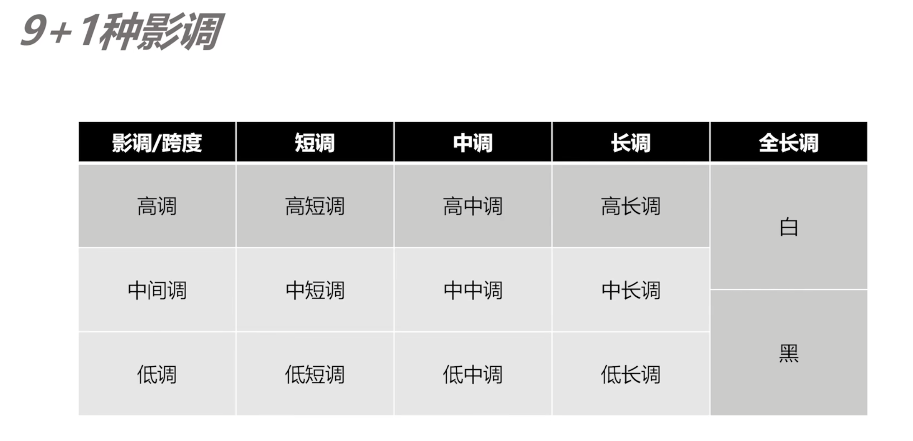
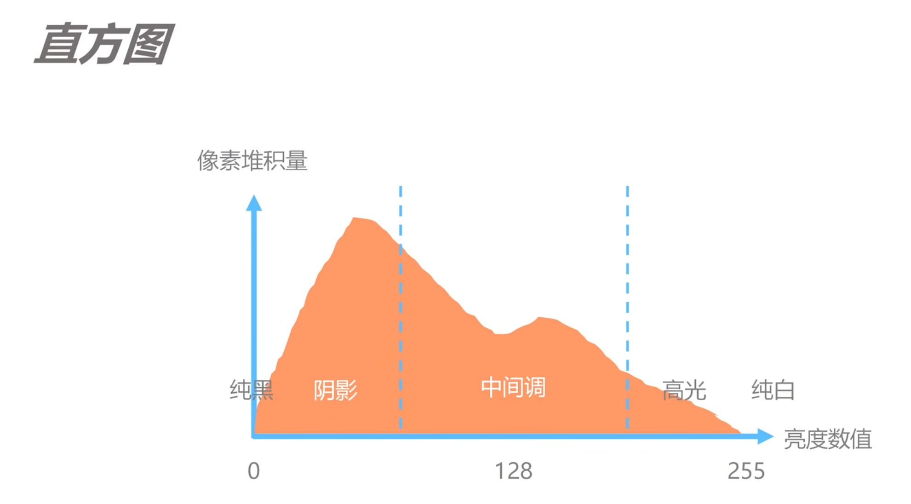
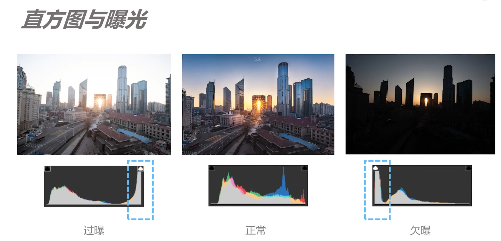

11、数码时代的正确曝光与影调

### 什么是影调

比较感性的部分，

画面中的明暗，由**暗到明**；**低**调，**中**调，**高**调

图片所有的亮部所在的位置，来区分。按照**跨度**来区分**长中短**调 

### 影调量化

一般使用直方图，

相机的测光模式：

评价测光：一种通用的测光模式，也能适用于逆光被摄体。相机自动调整适合场景的曝光。绝大多数都用

局部测光：由于逆光等原因而导致被摄体周围有过于明亮的光线时有效。局部测光覆盖取景器中央约6.1%的区域

点测光：当被摄物体或场景的某一特定部分进行测光时有效，点测光覆盖取景器中央约 1.3%的区域，将取景器中显示点测光圈

中央重点平均测光：测光偏重于取景器中央，然后平均到整个场景。

直方图：

直方图判断曝光：

从左到右为从亮到暗。

### 数码时代的最佳曝光方式

胶片：前期得要拍出准确的曝光

数码时代：前期利用高宽容度记录更多的细节，向右曝光（让画面的直方图的右侧尽可能贴近直方图边缘）

向左曝光：特殊情况，**大光比**的情况。留住亮部细节，损失暗部。让亮部的部分不过爆。