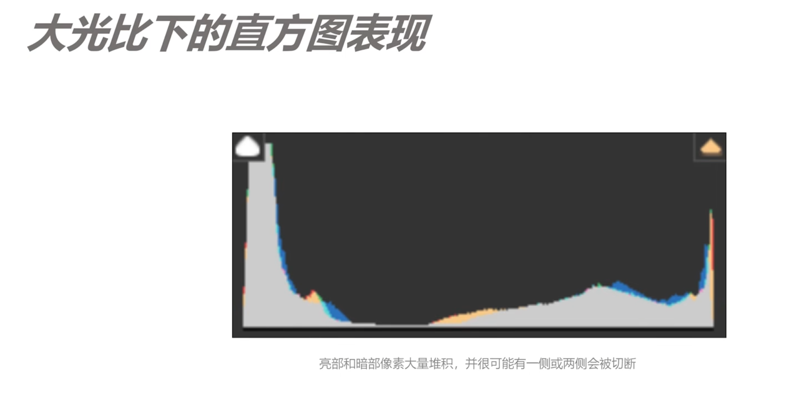

12、大光比场景下、平衡光比的多种应对方式

### 如何定义大光比的情况

高动态范围，明暗反差大。

在直方图中的表现为，亮部和暗部堆积的像素较多，中间很少。

#### 常见的大光比场景

+ 日出日落
+ 夜景灯光
+ 逆光人像

### 不同情况下的应对方式

平衡光比，让照片明暗的反差更小。让相机记录下所有的细节。

+ 曝光合成 HDR, AEB

  场景的动态范围大于了相机宽容度，可以拍摄多张，宽容度不同的。后期合成在一起。

  

+ 宁欠勿过、后期提亮

  对相机比较好的，保护高光拍摄，后期单张提亮

  

动态的：

+ 补光
+ 拍摄剪影，保护高光

其他方法：

+ 摇黑卡
+ GND滤镜