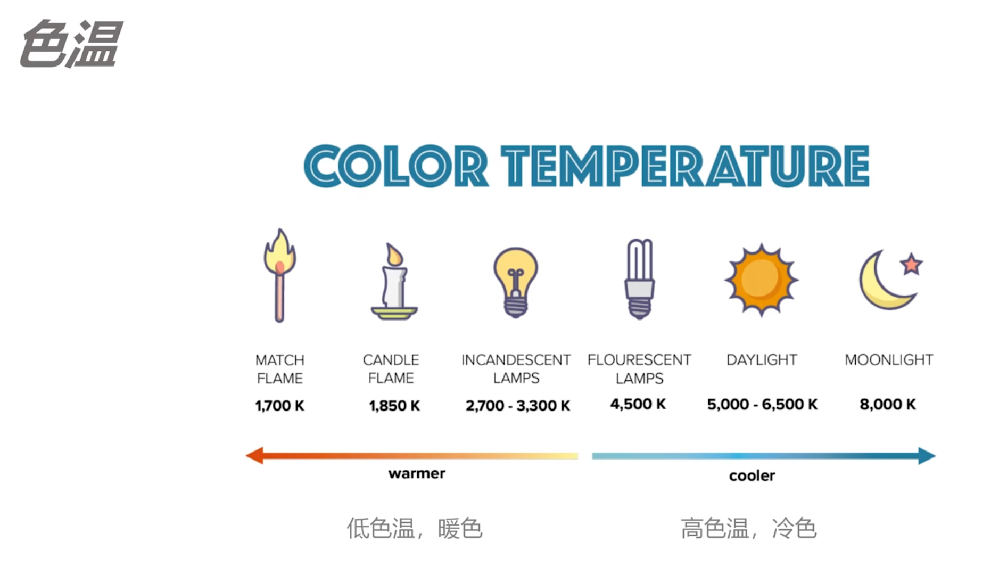
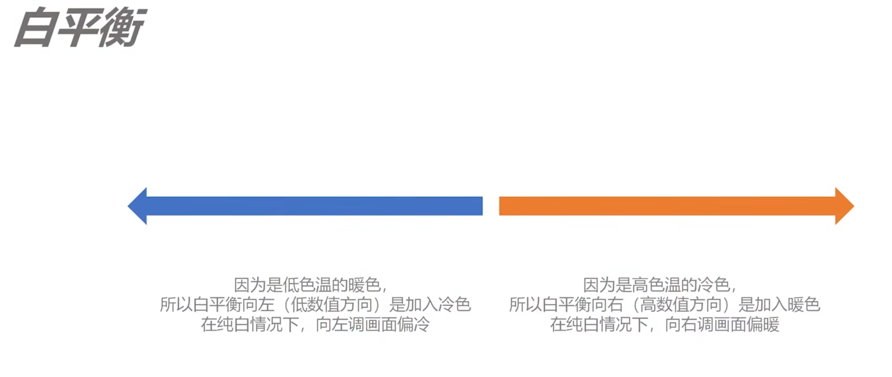
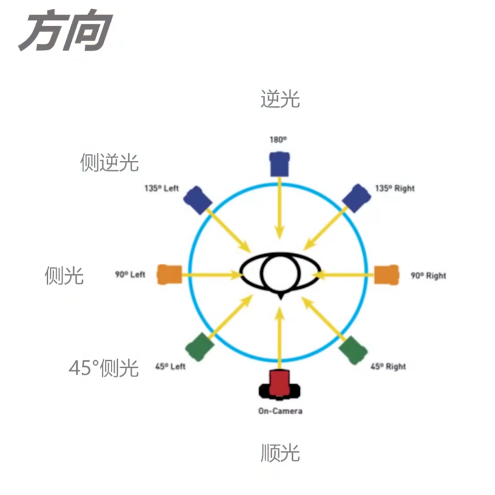
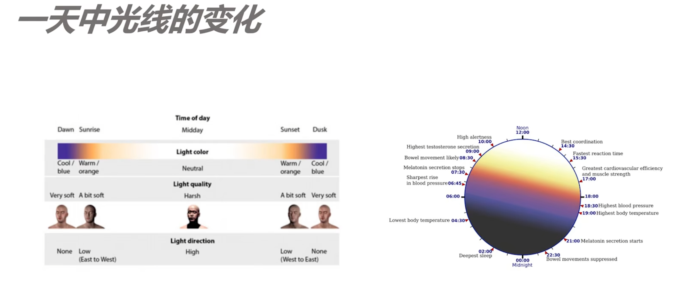

13、摄影用光指南：如何利用好光线

### 光线的特性

+ 强度，明暗
+ 色温，低色温暖色；高色温冷色。

白平衡：和色温反着的，加入相反的颜色。

+ 因为低色温的暖色，所以白平衡（低数值方向）是加入冷色，在纯白情况下，向左画面偏冷

+ 因为高色温的冷色，所以白平衡（高数值方向）是加入暖色，在纯白情况下，向右画面偏暖

白平衡设定为 AWB（自动白平衡），后期可以无损调整

+ 方向

  + 逆光 180°
  + 侧逆光 135°
  + 侧光 90°
  + 45°侧光
  + 顺光 0 °, 要避免，会感觉是个二维的

  

+ 软硬

  人物面部阴影分割线， 分隔过渡是均匀的，那就是柔光。如果是硬的过渡，那就是一个硬光。

### 自然光拍摄指南

正午的光是顺光，要尽量避免。日落更像是侧光。日落日出前后比较适合。

如何利用太阳光：柔光补光

### 人造光拍摄指南

打光的目的：

+ 制造阴影，
+ 形成立体感，
+ 分离前后
+ 平衡光比

持续光源与瞬间光源如何选？

LED好上手，所见即所得。种类多。缺点是瞬间输出功率低很多。

闪光灯要会看。模式：TTL（闪光灯自己测光，M手动调节）高速同步。这里面学问还挺多的。尽量不要怼着人，利用跳闪。

闪光灯曝光指南：M档，低的ISO

+ 光圈决定闪光灯功率
+ 快门控制环境光亮度，不影响闪光灯，因为快门时间高于闪光灯

常见布光方法：三点布光

+ 主光，keylight，照亮主体
+ 辅助光，fill light 填充光，减弱阴影
+ 发丝光，backlight，边缘光，让人和背景分离

伦勃朗光：人物脸部的一侧会有一个三角的区域，通常在男性的时候，一侧高位45°

蝴蝶光：在人物下面会形成鼻子阴影（形状似蝴蝶），光线在正上方，斜下方向。