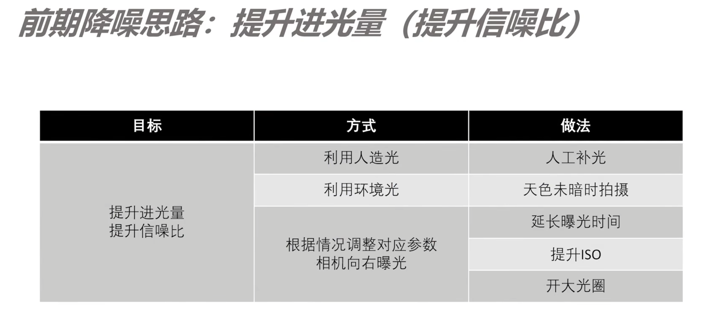

14、拍摄技巧和建议

### 噪点

+ 明度噪点
  + 白色小颗粒
  + 手机拍摄弱光会遇到的
+ 色彩噪点
  + 绿色，蓝色，红色等带颜色的颗粒
  + 长曝光会出现

在弱光或一张照片的暗部容易出现噪点，进光量不足的情况下。光更多的地方信息也就更多，信噪比会提升。

辨析：

+ 在进光量充足的前体下，ISO越低，画质越好。
+ 否则提升ISO获得更多进光量，反而可以获得更好的画质（只有sanli噪声）

后期降噪：denoise ai

降噪思路综合运用：高ISO高细节，向右曝光

杰夫流程2.0

### 反光

利用反光：

+ 人像（玻璃场景下拍摄人像）
+ 风光（水中倒影）

消除反光：

+ 雨林，森林题材（利用CPL偏振镜去除）
+ 夜景

### 如何拍摄好身边的美

+ 寻找光线
+ 寻找细节

### One More Thing

+ 多角度拍摄
+ 长期主题拍摄
+ 摄影不只是摄影：
  + 人像：服装，化妆
  + 自然风光：地理，气象
  + 空间建筑：建筑思维