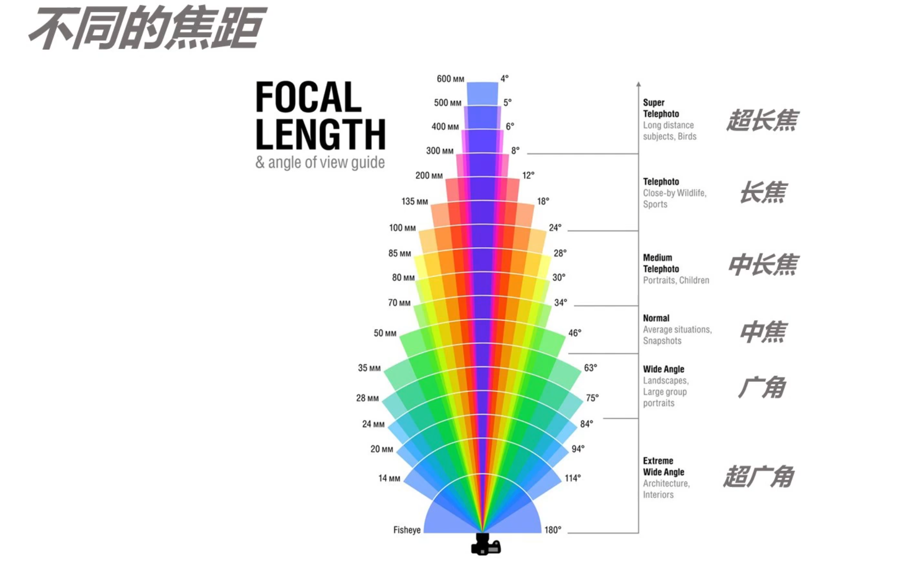

认识相机、传感器和镜头

### 常见相机种类介绍

按照镜头是否可更换分类：

+ 可更换镜头相机

  + 微单（Mirrorless）

  + 单反（DSLR）

    区别：光学结构不同，微单比单反小一点点，微单比单反少了反光板和棱镜的结构。单反的实时取景模式与微单没有区别。

+ 不可更换镜头相机

  + 卡片
  + 运动相机

按照传感器（底，cmos）大小分类：会决定画面的画幅

+ 大画幅：偏向于技术相机，日常较少接触
+ 中画幅 645 （53x40mm）：哈苏 H6D-100C
+ 中画幅 4433 （44x33mm）：富士GFX100, 哈苏X1D II 50C
+ 全画幅 135 （36x24mm）：佳能R5， 尼康Z7， 索尼A7
+ 残幅 APSC （23.5x15.6mm）：佳能90D， 尼康Z50，索尼A6400
+ M43 （17.3x13mm）：松下 GH5S
+ 一英寸（13.2x8.8mm）：索尼黑卡 ----------------------- 不可更换
+ 1/1.7英寸
+ 1/2.3英寸 手机运动相机

### 主流机型产品线说明

#### 佳能相机产品线（EOS）

+ 单反：D-EF / EF-S
  + 0D：全系列全画幅单反（5D4/ 6D2 / 1DX3）及一款旗舰APS-C单反（7D2）
  + 00D：高端APS-C单反（90D）
  + 000D：中端APS-C画幅数码单反（850D）
  + 0000D：低端APS-C画幅数码单反
+ 微单：R-RF / M-EF-M
  + R/RP：一代试水机/全画幅专微
  + R5：高端full-frame 专微
  + R6：入门full-frame 专微
  + M5：高端 APS-C 微单
  + M6：中高端 APS-C 微单
  + M00：中端APS-C微单
  + M000：低端APS-C微单

#### 尼康相机产品线

+ 单反：F-FX / DX
  + D0：全画幅旗舰单反（D6）"速度机"
  + D000：高端（旗舰）全画幅单反（D850/D780）以及一款旗舰APS-C旗舰单反（D500）
  + D0000：APS-C 画幅数码单反

+ 微单：Z-FX / DX

  + Z7：全画幅旗舰微单
  + Z6：全画幅中端微单
  + Z5：全画幅低端微单
  + Z50：APS-C微单

  

#### 索尼相机（命名最混乱的）

+ A6X00：APS-C 画幅微单（A6100, A6400, A6600）
+ A7R：画质型全画幅微单（A7R IV）α
+ A7：均衡型全画幅微单（A7 III ）
+ A7S：视频型全画幅微单（A7S III）
+ A9：速度型全画幅旗舰微单（A9II）

### 常见镜头种类介绍

#### 根据品牌分类

原厂：自己的相机品牌配着自己的镜头

​	佳能，尼康，索尼

副厂：相机配副厂镜头

​	sigma（适马），zeiss（蔡司），tamron（腾龙）

#### 根据焦距分类

焦距控制的是视野范围的区间，

+ 焦距越**短**，视角越**大**，画面中所能容纳的东西越**多**，单个主体占比也就会越**小**
+ 焦距越**长**，视角越**小**，画面中所能容纳的东西越**少**，单个主体占比也就会越**大**

不同焦距：

+ 超长焦：300mm以上
+ 长焦：100-300mm
+ 中长焦：70-100mm
+ 中焦：35-70mm
+ 广角：24-35mm
+ 超广角：fisheye - 24mm

#### 其他分类

+ 变焦与定焦
+ 手动对焦与自动对焦
+ 恒定光圈与浮动光圈

 

#### 镜头上的参数

+ 镜头信息识别

  恒定光圈，指的是相机在不同焦段都可以使用到的最大光圈。

  防抖: 佳能：IS，尼康：vr，索尼：oss

+ 镜头前口径

  + 遮光罩，保护镜头，防止逆光情况下的炫光

+ 防抖及防抖模式

+ 对焦模式

  + AF：自动对焦
  + MF：手动对焦

+ 锁定按钮

+ 对焦/变焦环

  + 前圈：对焦环；后圈（有数字标识）：变焦环

+ 等等

  + STABILIZER：镜头稳定
  + STABILIZER MODE：
    + 1：上下左右
    + 2：上下
    + 3：只有拍摄时稳定
  + 长焦会有脚架环

+ 卡口：

  + ef卡口

佳能红圈，尼康金圈，索尼gm镜头

#### 常见镜头介绍：变焦镜头

+ 大三元
  + 16-35/14-24 f2.8
  + 24-70 f2.8
  + 70-200 f2.8
+ 小三元
  + 16-35/11-24 f4
  + 24-70 f4
  + 70-200 f4
+ 其他
  + 18-33（套头）
  + 100-400
  + 150-600

推荐的镜头组合：

+ 只选一支：24-70/24-105
+ 两支：16-35 + 70-200/100-400
+ 三支：前两只+50或大三元
+ 三支以上：+35+85等等

### 如何选购自己的相机

+ 最高预算
+ 用途和需求
+ 个人偏好
+ 易用性