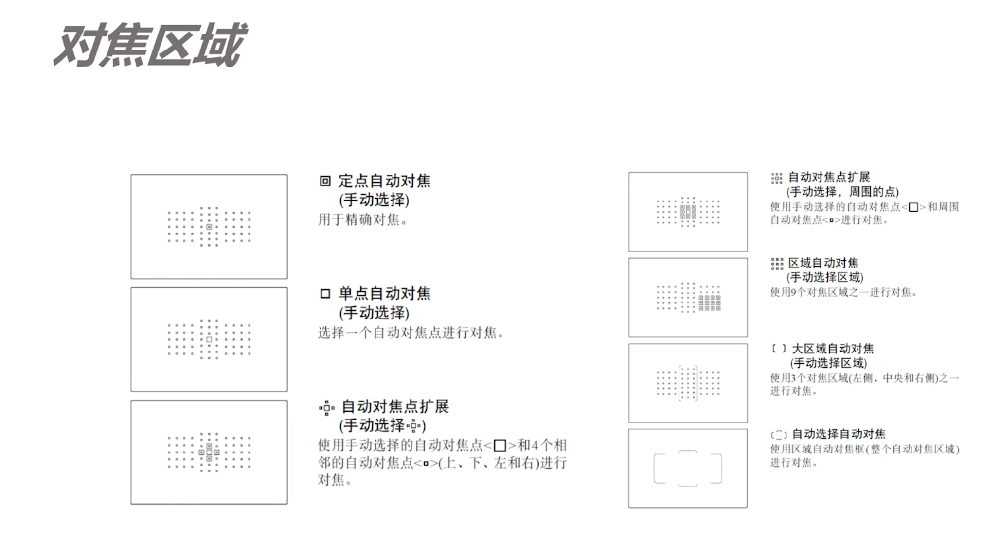

9、对焦、景深、虚化

### 对焦

景深：画面中最清晰的平面为焦平面，焦平面前后会有一定的清晰的范围；和**光圈**有关系，以及**焦距**和**拍摄距离**。

大光圈，虚化强，前（小）景深，而使用小光圈

小光圈，清晰的画面，大景深，深景深。

基本都能自动对焦，手动对焦使用的情况很少。

AF就是自动对焦。

自动对焦，对焦模式：

+ ONE SHOT/AF-S: 单次自动对焦（静态）
+ AI FOCUS/AF-A: 人工智能自动对焦，二者之间
+ AI SERVO/AF-C: 连续伺服自动对焦（运动）

对焦区域：对焦中可以被对焦物体的区域大小，对焦的精确度。

对焦点：

如何使用对焦：

+ 拍哪儿对哪儿（触摸）
+ 锁定对焦
+ （陷阱对焦）

对不上焦：

+ 超过对焦距离
+ 开启手动对焦
+ 对焦与快门分离
+ 场景太暗
+ 场景没有反差

### 背景虚化

背景虚化四要素：

+ 背景离主体远，拍人像常用到
+ 相机离主体近，（微距）
+ 光圈较大
+ 焦段较长

### 画面的虚实控制

合焦：拍摄时通过对焦等使得拍摄对象清晰成像，主体和背景合焦

应该合焦：风光大场景，主体及人物眼睛

全实画面：把画面全部对焦一遍，后期对焦点合成。

可以虚化：长曝光轨迹，杂乱的背景/干扰元素。

想要的就合焦，不需要的就虚化。

画面拍虚：

+ 没有对上焦
+ 景深太浅/对焦位置不对
+ 快门速度过低（运动速度/安全快门 1/60 焦距的倒数 ）
+ 相机有运动（震动/手抖）