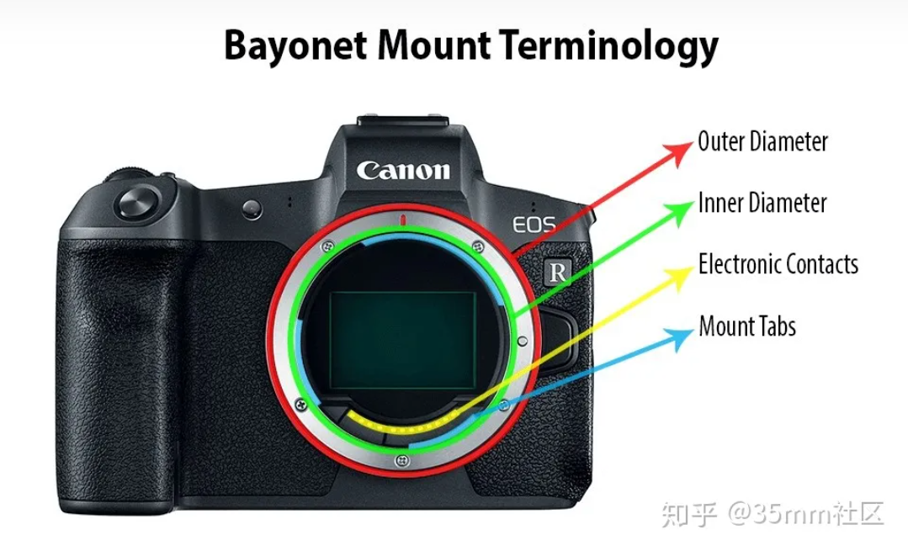

番外：镜头卡口

---

镜头卡口组成：

- 外径：outer diameter，红色部分，卡口的外部直径
- 内径：inner diameter，绿色部分，卡口弄内部直径（含插刀）
- 电子触点：electronic contacts，黄色部分，卡口上的金属触点
- 插刀：mount tabs，蓝色部分，用来固定相机的镜头

每一款相机都有自己的卡口尺寸，**法兰距**，电子触点数量，甚至电子触点的位置也是不相同的。

法兰距是什么呢，法兰距的英文是：flange distance。对镜头而言，法兰焦距是指镜头无限远对焦时，镜头卡口平面到镜头理想像平面（即透镜焦点）之间的距离。对机身而言，**法兰焦距是指卡口到焦平面**（即CCD或CMOS所在的平面）**之间的距离**。当然同一卡口的话，机身法兰焦距与镜头法兰焦距是相等的，即一种卡口只有一个法兰焦距。

---

了解镜头卡口 这一篇就够了 - 摩天的文章 - 知乎
https://zhuanlan.zhihu.com/p/56205130