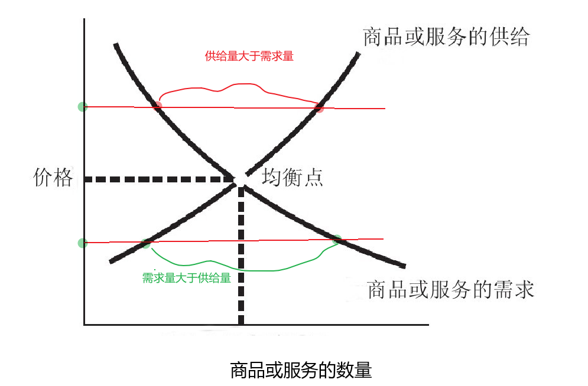

斯坦福极简经济学

### 序言

经济学的研究分成两大类:

+ 微观经济学和宏观经济学 
+ 微观经济学是从个人 企业的观点展开研究,
+ 宏观经济学则是探讨经济的整体观点

在实践中，承诺保证本金的金融产品收益率超过6%就要打问号，超过8%就很危险，10%以上就要准备损失全部的本金。

### 微观经济学

#### 1、人们卖弄的经济学原理只有50%是正确的

经济学的三个基础问题：

+ 社会应该生产什么
+ 应该如何生产
+ 谁来消费所生产的东西


应该严肃看待权衡取舍，例如关于企业课税得任何敏感话题，都应该聚焦于实际上哪些人最后要来支付这笔税款。

例如新闻里的一张脸，当我们听到某些个人故事的时候，我们应该关注的是哪些人没有出现在新闻故事里，却以不同的方式受到同一议题的影响。 "趣闻轶事"并不是数据，很多经济取舍都有一个特色，它能帮助某些人，却同时伤害了其他人。经济学家关心的是统计受到伤害或帮助的所有人，而不只是新闻报道里的几张脸孔。


**看不见的手**

在追求自己利益时，可能也会给别人带来好处。


**所有成本都是机会成本**

当你做一个选择时，你没有选择的东西就是经济学家所谓的机会成本。真正的成本不是你已经花的钱，而是你放弃的东西。


价格是由市场决定的，而非生产者。市场的供需情况在某种是程度上改变了，才促使他们做了这个决定。


没有哪个人可以得到想要的每样东西，也没有哪个社会可以得到想要的每样东西，因此，取舍不可避免。在人们有各种技能与欲望的现代经济社会中，问题在于如何协调决定生产什么、如何生产以及为谁生产。


#### 2、做自己最适合做的事，就有更好的生产力

分工使工人聚焦于他们最适合做的事，又使企业能充分利用当地资源。

分工使企业得以利用规模经济（economics of scale），例如大厂相对于小厂可以用较低的平均成本来生产。


**仓库管理经济学**

生产的东西，就放入仓库。

想买某样东西，就从仓库取货。

进入仓库的东西跟离开仓库的东西必须是一样的。生产或储存一个没人要用或没有特别功能的商品，是没有意义的；还有一个要避免发生的情况是，很多人在仓库后门等待某个买不到的商品。

在市场经济中，送进仓库及从中取出的商品的价值，是由供给与需求决定的。


#### 3、市场均衡点并不表示人们对结果感到满意

在家庭和厂商两个群体之间所经过的三个市场：

+ 商品市场：产品从生产厂商流向家庭；家庭对这些产品付款则是流回厂商。厂商是产品的供给者，而家庭是产品的需求者。

+ 劳动力市场：劳动力从家庭（也就是工作者）流向雇佣这些人的厂商。厂商需要劳工，而家庭供给劳工
+ 资本市场：在资本市场里,家庭将金钱作为投资,而成为资本,无论是直接购买股票还是间接把钱存在银行,这些钱又会投资或借给厂商;家庭则收到厂商支付的股利与利息 因此,**家庭是资本的供应者**,而**厂商是需求者**(应该注意的是,厂商也可能供应资金,但它们是代表业主或股东投资,也就是说,家庭仍是资本的供给者)


**交换价值与使用价值**

对非经济学家来说，价格是关于个人价值取向的价值承载。而经济学家则有 "钻石与水的矛盾"，钻石有很高的交换价值，但是却没什么使用价值，而水是生活的基本必需品有很高的使用价值，但却非常便宜，交换价值很低。

当经济学家谈到价格时，指的就是交换价值，一个商品的交换价值与稀有程度有关 ---- 商品值多少钱，和多少人想要拥有它有关。

价格是视世界上的供需互动，即人们意愿且能够取得的状况而定的。


**替代效应与收入效应**

商品数量为横轴，价格为纵轴。代表需求的曲线是向下倾斜的，表示价格越低，需求量越多。

**替代效应**

```wiki
当商品价格越来越高时，人们可能会拿其他商品取而代之
```

**收入效应**

```wiki
当商品价格上涨时，收入的购买力降低，会买较少的东西或者同样的东西少买一点
```


**需求与需求量**

+ 需求量：在某一特定价格下，人们想要得到商品的特定数量
+ 需求：价格和需求量之间的关系，指的是在任何可能的价格或每种价格下,人们想要该商品的数量是多少

**供给与供给量**

+ 供给量：指在某个特定价格下所生产的特定数量
+ 供给：供给是指在每种价格下生产多少数量

```wiki
供给是指商品的供给量与价格之间的关系。当商品价格上涨时，供给量也容易上升，这是因为当价格上涨时，厂商会变得更愿意供给商品。因此，需求曲线向下倾斜，而供给曲线向上倾斜。
```

均衡点：需求量会等于供给量

+ 如果商品的价格高于均衡点，那么该商品的供给量将超出需求量，东西将开始滞销；为了清除库存，卖家必须开始降价，直到人们愿意购买。
+ 商品价格落在均衡点下方，那么需求量将超出供给量。此时，人们往往排队抢购该商品。供给者发现此现象，便会开始提高价格，结果导致需求量下降，供给量开始上升，直到这两种数量再次相等，且价格达到均衡点。
+ 需求或供给的任何改变（记住，是整条曲线的改变），都将使均衡点发生位移。

 


#### 4、在任何情况下都必须有所取舍

**价格上限造成供不应求**

如果你设定的价格上限低于原本的均衡价，那么想购买的消费者的反应就会很热烈，但该商品的供给者则不然。需求量上升，供给量下降，结果就是供不应求。政府可以抑制价格，但是在一个自由社会中，无法迫使卖家进行大量生产，而且各种规避价格上限的方式也不易管理。


**价格下限导致供过于求**

如果你设定的价格在均衡点上方，供给者会很乐见，供给量就会变多；然而，需求量会因此变少，结果造成供给过剩：供给量超出需求量。政府可能会采取行动，通过配额（限制生产者可销售的数量）避免生产过剩，或通过购买来储存过剩的产品。


**价格管制会掩盖成本**

需求面的帮助，比价格管制更精准。

讽刺的是，**价格下限与上限**，在学理上并不是最好的政策工具，却是**官方最倾向采取的方案**。经济学家自认为在任何情况下都必须有所取舍，而政客常喜欢隐瞒政策的真实成本。价格下限与上限看起来像是**零成本**的政策，因为政府不需要增加支出或减税。事实上，价格管制会掩盖成本。

短缺或过剩所造成的浪费，在政府的资产负债表中虽然并没有明确的税收或补贴，但其实是真实的成本。


#### 5、增加的生产成本可以转嫁给消费者吗？

**关乎数量如何响应价格的变化**

需求弹性：需求变动的百分比 / 价格变动的百分比

供给弹性：供给量变动百分比 / 价格变动百分比

**三种需求弹性：**

+ 需求无弹性的商品，弹性 <1。高度无弹性的商品，往往很难用较便宜的商品来取代。
+ 需求有弹性的商品，>1。需求量有高度的伸展性，它可以大幅移动以对应价格的变动。就是可以有其他商品替代
+ 需求单一弹性的商品， == 1。当商品需求量变动的百分比刚好等于价格变动的百分比时，我们说它是单一弹性。

**三种供给弹性：**

+ 供给无弹性的商品，弹性 <1。完全无供给弹性的经典例子是毕加索的画作——**无论价格涨多少，供给量都没办法更多**。一般而言，厂商**很难快速扩大原料供应与增加熟练劳工的任何产业**，其所生产的商品往往是无供给弹性的。
+ 供给有弹性的商品，>1。也许是因为有剩余产能，厂商很容易快速增加产量。
+ 供给单一弹性的商品， == 1。当商品供给量变动的百分比刚好等于价格变动的百分比时，我们说它是单一弹性。

知道需求或供给有无弹性或是否为单一弹性后，在实务上可以广泛应用于价格设定，以及市场如何应对需求与供给的位移。
**若需求无弹性**，**提高价格会带来更多的营收**；**若需求有弹性，则否**

**短期而言，需求与供给常常是无弹性的；长期而言，则是有弹性的。**

弹性解释了为什么一个经济体的价格短期内容易暴涨暴跌，因为需求与供给的弹性都不大，但长期来看，供需的数量都会调整，价格就会变得更稳定（尽管如此，价格并非固定不动）

当需求无弹性时，增加的生产成本往往可以转嫁给消费者；当需求有弹性时，增加的成本就会由生产者承担。


#### 6、你的薪水最终由你的产出决定

劳动力市场与工资：在每个人才市场，工资的均衡点是由该市场的劳动力供给量相对于劳动力需求量而决定的。

在商品市场，企业是供给者，家庭和个人是需求者；在劳动力市场，家庭和个人是供给者，企业是需求者。

那么纵轴就是工资，横轴就是员工数量。

劳动力需求在短期内通常相当无弹性，但是长期来看，当厂商有机会整顿生产时，劳动力需求就会有更大的弹性。

**产出**（也就是不同的商品与服务）**的需求变动**，会改变劳动力需求。

厂商雇用工人的意愿，**最终取决于生产力**，即劳工生产多少东西。如果工人的生产力与工资有落差，厂商就不会雇用他们。如果工人的生产力高于工资甚多，那么在市场经济里，其他厂商就会用较高的工资挖墙脚。一般而言，工资将随着时间，由劳工生产的商品价值来决定。


**劳动力供给曲线的移动**，可能是**人口增减**等缘故——有了更多可以工作的人，在特定工资水平下即可供应更多劳工，反之亦然。**人口结构变化**也会改变劳动力供给，例如在一个人口老化的社会，离开劳动的人会多于加入的人，即劳动供给力下降。**社会趋势**也会影响劳动力供给，例如预期什么人应该去工作。20世纪70年代，很多原本是家庭主妇的美国妇女决定走出家庭，工作赚钱，改变了特定工资水平下的劳动力供给。


**最低工资是一刀两刃**

失业率变高这种成本，不太可能平均分布于整个社会，反而可能集中在经济处于劣势的区域。失业率变高这种成本，不太可能平均分布于整个社会，反而可能集中在经济处于劣势的区域。

价格下限有其替代方案，因为它们是由供需力量运作的：

+ 资于技能训练计划，
+ 补贴雇用低技能工人的厂商
+ 提供减税优惠给收入低于基本门槛的人


**工会的存在不是坏事**

工会提供两个基本功能。

+ 第一，找机会通过劳动契约的协商**提高会员工资**，并以罢工威胁为后盾。激进的工会的规模通常会随着时间而缩减
+ 第二个功能是**培养**一个更好的、更具生产力的劳动力


#### 歧视：差别待遇

用经济术语来说，劳动力市场的歧视，发生在一个人找工作被拒绝或是比同样工作者薪资低的时候，理由是这个人的性别、种族、年龄、宗教或某些因素。

歧视显然一直存在于，但现阶段把大部分责任归于雇主，并不准确也无济于事。你必须在歧视可能发生的任何地方，找到它们的源头。

从雇主的观点来看，所谓的均衡工资就是雇主支付报酬的总成本。

对任何员工来说，当雇主提供这些“慷慨的”福利时，员工仍然是支付这些福利的人，代价就是实际薪资变低。

你的薪资与福利不是因为你的老板慷慨或喜不喜欢你而决定的，也不是由某个公平的标准来决定的。追根究底，劳动力是一个市场，你的薪资及福利，是根据你的产出定出的价格。


#### 7、折现值是个很重要的观念

金融市场与报酬率：就像商品市场或劳动力市场一样，资本市场也可以用同样的供需架构来解释。

利息（就是资本市场的价格）

但资本市场的利息与报酬是抽象的，而且资本市场的运作似乎是看不见的。

金融投资：资本供给

实物资本投资：用来建立资产的资本需求


**储蓄好？投资好？**

我（作者）会经常用**利率**作为资本报酬率的具体例子，其实购买公司**股票**或小企业**股份**的投资报酬也属于资本报酬

资本供给是家庭的资金供给量（也就是家庭储蓄）与它们提供资金所得到的价钱（也就是报酬率）之间的关系。

在实务上，人们储蓄的资金量似乎没有随着报酬率的上升而大幅增加。相反，人们储蓄的金额似乎更取决于习惯、文化形态以及雇主因素。

资金有很多不同的市场，就像劳动与商品有很多不同的市场，主要差异在于被投资的对象，是大厂、小厂、个人还是政府？

思考**资本市场**如何运作时，它的关键**交易是跨时间发生的**。当你正在买卖商品时，交易是在一个时间点发生，劳动也是在一个时间点履行。

相较于未来还款所付出的代价，你该如何计算这笔贷款目前的价值？经济学家利用**折现值**（present discounted value）的概念来计算，它是把不同时间点发生的成本或效益拿来直接比较的一种方式，指的是**未来所要得到的款项，如果现在就回收，会值多少钱**。

计算方法是：折现值（PDV）等于未来值（FV）除以“1+利率（r）”的 t 次方，t为年期。


**企业筹资的管道**

厂商的资金来源：

+ 留存收益（retained earnings）：留存”的意思是企业决定**持有**这笔钱，将它再投资于企业而非以股利付给股东。对于历史悠久的企业而言，留存收益是用于实际投资的主要资金来源

+ 向银行借钱

+ 发行债券：债券有面额、利率与期限三项要素，债券只是厂商借钱的一种方式，但不是向银行借，而是向买家借。

+ 有价证券：较常听到的是公司股票。公司股票基本上是把公司的一部分所有权卖给股票持有人。股票不像债券有预先决定的利率，也根本无法保证股票持有人会获得固定利息或任何报酬。买卖股票可能比债券的报酬率更高或更低，甚至会出现负数。

  不能无限制发行股票，因为股票是公司的部分所有权，发行越多股票，表示这家公司的所有权被分割得越细。

债券所付的利率是根据风险而变动的。


#### 8、人一生积累财富的关键是什么？

个人投资：评估投资标的时，要衡量四个要项：**报酬率、风险、流动性、税负**。

人一生累积财富的关键，在于**复利**（compound interest）的力量。利息金额每年都增加一些（称为复利），这是因为计算时的本金每年都在增长。随着时间的拉长，复利的力量可以使储蓄带来令人满意的可观报酬。

**投资风险**的定义是，报酬率相对于该投资的平均期望值有多高或多低，资本市场就是用这种方式来说明“实际情况因人而异”的。

投资特定公司或特定债券的风险，可以借由“多样化”分散投资而减少。**多样化**（diversification）的意思是购买许多不同投资标的，以降低整体风险。（鸡蛋不要放在一个篮子里）

“**流动性**”，是把**投资转换为现金**的意思。银行账户相当有流动性，很容易把钱取出来；房子不是很有流动性，因为要花一些时间和精力才能卖掉；金融投资，比如股票与债券，则介于这两个极端之间。一般而言，在其他条件（例如报酬与风险）不变的情况下，你会偏好流动性好的投资。**取钱的容易程度**

**税法**是否有利于该投资。**某些投资可免除所得税**，例如政府债券的利息收入；而有些投资所得是要课税的，在你卖掉该投资时才付税金，投资股票与房子的资本利得也是。


**各种个人投资工具**

尤其是报酬率和风险之间的取舍，借用伯顿·马尔基尔（Burton Malkiel）所说，以睡眠安稳量表来反映风险程度：如果把钱投入这项金融投资，你晚上睡得安稳吗？

+ 先说**银行账户**。银行提供很低的报酬率，而且利息要课税，但非常安全且流动性很好。
+ 银行账户往上升一级，可能是**货币基金**。货币基金投资于很多风险很低的债券，可能是政府或大公司发行的债券。
+ 下一个投资类别是**定期存单**（简称定存或称CD）。定存是在一定时期内，把资金存放在银行或金融机构的合约。不论时间多久，**你在这段时间不能碰这笔资金**。这么做的好处是，你会得到比一般银行账户**更高的报酬率**。定存的资金很显然**不是很有流动性**，遇到紧急情况时，虽然可以取回这笔钱，但得付点罚金。然而，它的报酬率优于银行账户，而且多少有些保障。
+ 至于多样化的公司债投资组合，或投资于这类债券的**共同基金**。记住，**债券**是在一段固定时间内，可以**预先决定报酬率**的一种投资工具。若把钱投入债券基金，风险会高一些。
+ **蓝筹股**投资组合：蓝筹股（blue chip stocks）指的是**大型、知名公司的股票**，股票有节税优点，因为在卖出之前，你不必对资本利得缴税。
+ 多样化的高**成长股**票投资组合：成长股是较不成熟的公司的股票，这种投资一般会比蓝筹股提供更高的报酬率。
+ 你买了一套房子，它不只是一个住的地方，也是一项**房地产投资**。对多数人而言，房子是他们至今做过的最大的单笔投资。换句话说，长期（以十年为单位）风险相当低，但短期（以月或年为单位）风险高了很多。
+ 个人可从事的最后一种投资是**贵金属**，例如黄金、白金，这些贵金属是个人可从事的风险最高的投资之一。


**你能用多少时间投资？**

没有一体适用的方法。考虑你的投资时间规划，会是一个有用的出发点。短期而言，股市的风险很高，但如果视为长期储蓄（例如几十年后的退休生活），那么行情的起伏很容易互相抵消，**长期**下来，很有可能因耐心而得到回报。你若要确保钱的安全、流动性，就别奢望高报酬率。

所有的投资忠告最终都基于一个事实：**你需要存些钱，越早开始越好**。无论你是二十几岁、三十几岁、四十几岁还是五十几岁，总是有上百万个理由让你无法存钱，但如果你不稳定储蓄，到了60岁或65岁才想求得锦囊妙计，让你在退休后享有高水平的收入，那根本是缘木求鱼。

也许多数人对其退休金所犯的最大错误，是没有承担足够的风险，尤其是在早期阶段，因为太在意财务安全，所以把太多钱投入债券、银行及货币基金。人们即使到了五六十岁，一般预期也可以再活20年或30年甚至更久，那可是一段很长的时间，可利用复利来累积财富。

股价上涨的原因是，新信息显示该公司会比以前更赚钱，但这些**新信息就本质而言是不可预测**的。正因为你不能预测会出现什么样的新信息，所以**股价涨跌是不可预测**的，这就是统计学家或经济学家所说的“**随机漫步**”11（random walk）。

你真正想买的股票，是别人认为前景不好（需求量低，因此价格低），但未来每个人都将认为是只金母鸡（需求量高，因此价格高）的股票。（**笋盘**）


---


#### 9、垄断的本质是对勤劳者的课税

微观经济牵涉到市场上（商品、劳动力与资本市场）供给与需求互动的力量。从本章起，我们要讨论**这些市场力量走偏的状况**。

政府在经济上所扮演的角色之一是**制定法规架构**，鼓励追求获利的**正面结果**，并抑制上述**黑暗**的经济力量。

**企业分类：**

+ **独资**（proprietorship）是由单个人所有
+ **合伙**（partnership）是由一群人所有
+ **公司**（corporation）则是有法律实体的组织，独立于其持有者，可能由一人或一群股东所有。

公司的数量在一个国家的企业数中可能不是最大的，但是在规模上占有主要地位。


**四种类型的竞争：**

+ “**完全竞争**”（perfect competition），有很多小企业在制造几乎一样的产品。

  完全竞争产业的**主要特征**是**价格接受**（price taking），也就是说，完全竞争的企业必须接受市场给定的价格。这些产业的厂商别无选择，原因是消费者很**容易**找到**替代品**。

+ “**垄断竞争**”（monopolistic competition），是指很多企业争相销售稍微不同的产品

+ “**寡头垄断**”（oligopoly），它有点接近垄断，只是并非由一家企业囊括全部的市场营收，而是少数企业在特定市场拥有大部分或全部营收

+ “**垄断**”（monopoly），单一生产者在特定市场几乎拥有全部的营收

**要如何才能达到垄断状态？**

+ 通常是用一些**障碍**，阻止其他厂商进入市场。
+ 有些垄断是由**法律**创造出来的。
+ 另外一个进入障碍是所谓的“**自然垄断**”。当这个产业出现**规模经济**现象，提供大型、稳定的企业胜过新进企业的优势时，会发生自然垄断。
+ 若产业中所有**大厂**都**合并**，或至少同意一起行动，理论上也会发生垄断，但以反托拉斯法而言，这是违法的行为。

19世纪的英国经济学家、哲学家约翰·斯图尔特·密尔13（John Stuart Mill）说过：“**没有竞争的地方，就有垄断。垄断的本质就是对勤劳者课税**（如果不是掠夺），它之所以能这么做，是因为懒惰者的支持。”


#### 10、大池塘里的小鱼、还是小池塘里的大鱼

经济学始祖亚当·斯密在《国富论》中的名言：“即使只是为了欢笑作乐，同业也很少聚在一起；倘一旦有了对话，往往不是密谋对大众有所不利，就是共谋涨价手段。”

“大部分**企业合并**案使企业得以更有效率地营运，实际上有利于竞争与消费者。”， 但“有些企业合并案可能削弱竞争，导致价格提高、可获得的商品或服务减少、产品质量降低，以及创新减少。”

**企业不必真的合并**，也可以**规避竞争**，例如协议同时进行涨价。


**市场上的竞争程度（市场占有率）：**

+ **四大企业集中度**（four-firm concentration ratio），做法是将该产业前四大企业的市场占有率（简称市占率）加总起来。
+ **赫芬达尔-赫希指数**（Herfindahl-Hirschman Index, HHI，或称赫氏指数）是一个更精确的竞争程度衡量指标。这个公式考虑每家企业的**市占率**，先算出每家企业的**营收占市场总营收的百分比**，然后把每家**企业市占率的平方加总起来**。

原因是很难界定个别市场的范围。


**反托拉斯大战**

除了观察市场占率，另一个方法是**观察市场价格**的模式。

史泰博的价格在**没有**欧迪的城镇会**高于**两家公司**都存在**的城镇

企业也可能密谋用各种方式消弭市场竞争。**价格垄断**（price fixing）的卡特尔（cartel）组织，是由同一市场的一群企业组成的，彼此协议共同设定产出水平和价格。

除了形成卡特尔组织外，潜在竞争者也可能形成**种种限制性的商业惯例**：

+ 在一份**价格维持**（price maintenance）合约里，制造商把东西卖给一群经销商，**坚持某个最低转售价格**，以防止经销商彼此竞争过头。
+ 当制造商要求经销商只能卖自己的产品，而不能卖竞争者的产品时，称作**独家交易**（exclusive dealing）。
+ **搭售**（tie-in sale）或**捆绑销售**（bundling），是指顾客只有在买了某个产品时，才能买另一个产品。这可能是合法的，例如球队的季赛联票或是绑售的软件包，但如果类似产品不能单独购买，那就可能违法了。
+ **掠夺性定价**（predatory pricing），是指既有厂商大幅削减价格，幅度够低且时间够长，把新的竞争者赶出市场后，再提高价格以达到独占水平。


#### 11、最佳的管制法或许就是解除管制

在某些产业中，市场竞争不可能正常运作，反而会导致所有厂商蒙受巨大损失而无以为继。市场竞争在公用事业中不易运作。

**为何管制？怎么管？**

这些被管制的产业都有一个共同特征：**必须依赖某种网络建设**。**兴建整体网络的成本**是较高的，而**经营的成本**通常是较低的。

+ 公用事业定价最常见的方法是**成本加成管制法**（cost-plus regulation）：精算过公司的生产成本后，**允许一个较低的获利水平**（通常以一般企业在竞争市场可赚到的报酬为依据），且锁定价格以便能获取该水平的利润。

  问题：在成本加成管制法下的厂商，甚至有动力去拉高生产成本、兴建庞大的新厂或雇用更多员工，因为其**价格设定是以足以支付成本为前提的**。不需想办法削减成本或变得更有效率，而且**没什么动力去创新**。

+ **价格上限管制法**（price-cap regulation）。在这个制度下，管制者（也就是政府）设定一个价格，让被管制的厂商在未来几年可以依此收费。

  好处：公司在未来几年不需降价，如果能自行降低成本，其利润就能提高。

当管制者开始以为他们的使命是保护产业利润及其员工，而非保护市场竞争与消费者时，任何的管制法都会面临经济学家所说的“**管制俘虏**”

市场竞争的力量可以鼓励创新与提高效率，并惠及消费者。但是，在某些泾渭分明的情况下，当市场竞争无法良好运作时，政府可以扮演有用的角色，作为经济竞争的仲裁者。


#### 12、主张绝对的零污染是不可行的

核心的经济学概念是“**外部性**”（externality），指在直接的买家与卖家之外，有**第三方直接受到这笔交易的影响**。

污染是负外部性（negative externality）最重要的例子。在不受约束的市场交易中，厂商只注意生产商品的私人成本，至于**社会成本**，是不用支付的生产成本，因此厂商不会将其纳入考虑范围。


**用激励取代控制**

“**命令与控制**”（command and control）是经济学家专指这类管制政策的用词，它**规定了可合法排放污染的最大量**。

问题：

+ 管制者可能会开始考虑产业利益，这是任何管制制度都可能出现的问题。例如先前讨论的**管制俘虏**的情境。
+ 命令与控制的管制标准通常是**无弹性**的，甚至**明确规定**必须使用什么技术来减少何种污染，也**不会奖励**一开始就避免污染或把污染减少至法定标准以下的创新做法。


遵循**市场导向的环保政策大方向**。这些政策试图以市场激励来运作，而非命令厂商采取某种行动。

+ 其一是对生产者每单位的污染**课征污染税**或污染费，有很高的弹性，生产者可以自行决定污染减排的方法
+ "**可交易的许可**”（marketable permit）制度。可交易的许可给污染者排放某个污染额度的法律权利，且通常获许可的污染量会随着时间递减。如果污染者排放的污染量未超过许可额度，那么剩下的额度就可以卖给别人。
+ 以**财产权**（property right）做激励。设立保护区，让保护区旅游的收益给原住民，那么他们就有理由去保护当地的动物。

合理的政策目标是**平衡生产效益与污染成本**，换言之，让生产的社会成本与社会效益彼此平衡。


#### 13、自由市场并不保证给发明者奖励

正外部性与技术：即使有法律保护，创新成功的公司也只能拿到它所创造价值的30%～40%。

在污染的例子中，交易双方之外的第三者得**忍受**环境成本。就新技术而言，生产者与消费者交易之外的人，**不需补偿**发明者就可从中受益。因此，创新是正外部性（positive externality）的一个例子。

推动创新的关键因素，是**创新者**从研发投资中得到大部分**经济利益**的能力，经济学家称之为“**专属性**”（appropriability）。

对污染等**负外部性**的适当措施，是找到一个**使生产者正视社会成本**的方法；相反，对创新等**正外部性**的适当措施，则是**帮忙补偿生产者的创新成本**。


**保护知识产权发展出的四种形式：**

+ **专利**（patent）是由政府授权，于特定、有限期间内（在美国通常是20年），独家制造、销售或使用一项发明的法律权利。
+ **商标**（trademark）是表明商品来源并帮助卖家建立商誉的字词、名称或符号。只要商标仍然在使用，厂商就可以无限期地更新商标。
+ **著作权**（copyright）是以法律保护原创作品（包括文学、音乐、艺术），未获作者同意，别人不能复制或使用。
+ **商业机密**（trade secret）是指配方、过程、装置或信息项目给予企业凌驾于竞争者的优势，它们不是常人所知或易于被发现的，企业会用合理的努力来保守机密


**企业**投入研发的优势之一，是它较能聚焦于**短期内会有实质效益**的应用技术。相反，**政府**资助的研发较**偏重影响层面**，尤其是可能跨多个产业，而且可能在最近几十年不会看到回报。

另一个鼓励研发的方法，是提供企业研发支出的**税负减免**，它的优点是很有弹性。


**专利：保护创新，也阻碍创新**

补贴创新的最终目的其实是使消费者受益，而非使厂商更容易长期赚到庞大利润。

**绝大多数的专利最后毫无经济价值**，但其中很少数的专利会产生非常大的经济价值。

**专利是用来预防竞争的**，但对其他想进入市场的竞争者而言，这些专利可能会变成**巨大的（有时是永远的）障碍**，并且阻碍额外的创新。

专利丛林在某些产业中仍然是个问题，尤其是在制药与复杂电子等高科技产业，它们的产品可能要依赖很多不同的专利。

还要考虑的是，新的创新经常建立在旧的创新上。如果你给目前的发明者很多权利以保护其创新，那么你也可能阻碍了建立在那些发明上的创意发展。

经济创新的最终目的不是要讨好创新者，而是要鼓励稳定持续的创新，以提高社会的生活水平。


#### 14、缴税是用强迫的方式克服搭便车问题

公共物品：顺着每个人自利的本性，将无法创造公共物品，所以政府必须征税来建设。

公共物品有两个重要特性：

+ **非竞争性**（nonrivalrous），非竞争性是指商品本身不会因为更多人使用而变少。
+ **非排他性**（nonexcludable），指卖家无法排除那些没付钱也能使用商品的人。

公共物品很难由私人提供。

托马斯·杰斐逊（Thomas Jefferson）所言：“我将思想传授他人，他人之所得，亦无损于我之所有；犹如一人引我的烛火点烛，光亮与他同在，我却不因此身处黑暗。”

当某些人从公共物品中受益，却没有付出相对合理的成本时，经济学家把这个问题称作“**搭便车**”（free-rider）。

大部分时候，经济学主张生产者与消费者顺着**自利的本性**，就能为社会提供很多效益。但是，就**公共物品**而言，如果每个人都顺着狭隘的自利本性，结果将更糟。

缴税是用强迫的方式克服搭便车问题：如果你不为公共物品纳税，你就要坐牢，这些利益与成本是**隐性社会契约**的一部分。如果社会成员不用某种方式合力提供公共物品（经由政治或社会机制），则大家都会蒙受损失。


#### 15、社会福利计划是在援助与激励之间拔河

贫穷与福利计划：社会保障网不应是令人难以起身的吊床，而应能缓冲你掉落下来时的力道，并让你再弹上去。

奥珊斯基因此有创意地结合这两个概念，**以食物成本来决定生活成本**，从而得出贫穷的定义。

如何定义“收入”？


**社会救助的两难局面**

很明显，**让人自给自足比让他产生依赖心更好**，但是，在立即给人们帮助与帮他们学习自助之间有一种矛盾：当你教人钓鱼时，他想要吃的是什么？在学习过程中，你需要给他鱼吃，是等他学成之后，才停止给鱼吗？是否会有这个人**拿走了鱼**，**却不学技术**的潜在风险？

这牵涉到激励问题。

经济学家把这个问题称作“**负所得税**”（negative income tax）。**政府在一个人赚到额外收入时减少他的福利**，就会产生负所得税。这会打击贫困家庭去工作的动力。

**正所得税**是指你赚钱时，政府拿走其中一部分。

避免贫穷陷阱的另一种方式是**提供实物的帮助**，意即以某种非现金的服务来支持，医疗补助保险与食物券都属此类。

大多数计划都在援助与激励之间拔河，**最终的目标应该不只是分配金钱**，让人们有高于贫穷线的收入，而是帮助人们**发展他们需要的技能**，让他们在不断变动与成长的社会里谋生。


#### 16、什么样的收入不均程度算合理？

贫穷是指收入低于某个水平。收入不均是指低收入者和高收入者之间的差距。

在一个公平的社会，报酬和不平等不应该受到出生、家庭背景甚或运气的摆布，而应该与人们的努力和技能有合理的因果关系。


**家户收入5等份评估法**

用一些方式来描述整体收入分配的状况，而不只是收入低的族群。

标准方法是把收入分配分成5等份、10等份甚至100等份，然后算出每一等份的人的收入占整体收入的比重。

完美的平等不是一个可达成的目标，较好的问题可能是：目前收入不均的程度合理吗？


**问题在于“流动性”**

处理这个问题的一种方式，是观察收入分配的流动性。

人们随着时间移动的迹象，表明他们不会一直陷入某个收入水平。

PSID数据显示了人们在收入分配5等份之间的**合理移动量**，但这种移动大多是在**一个或两个等份**之间发生。

全世界大部分的高收入经济体，在同一时间，收入不均也有一些增加。最大的理由似乎是**信息与通信技术**的改变，以及**它们对劳动力市场的影响**。

劳动力市场不是一个庞大僵化的市场，而是由很多不同市场组成的。技术工人的供给量随着时间逐渐增加，但是，科技的非凡发展也明显**增加了对技术工人的需求**。

**科技**并不是收入不均恶化的唯一原因。**进出口贸易**（或全球化）的增加，意味着美国的工人必须更直接地和低工资国家的工人竞争，这会压低企业对美国低技术劳工的需求与工资。

虽然收入不均逐年恶化使我烦恼，但我（作者）比较担忧的是穷人每天面对的生活条件，而不是富人的高收入。


#### 17、品牌可以让消费者对质量比较放心

由于信息不完全，风险和不确定因素就会来搅局。

市场上有各种试图减少信息不完全的方法。万一产品的功效不像广告所宣称的那样，**公司的担保、保证和服务合约**将有助于承担消费者的风险；**商标和品牌**则可以让消费者对商品质量比较放心。在劳动力市场，**履历和推荐人**有助于减少信息不完全的问题，教师、护士、会计师、律师、物理治疗师和不动产经纪人持有的**资质证明**也是如此。在金融市场，**信用评级、放款担保人和抵押品**等机制也有一样的效果。


**道德风险与逆选择**

**保险的运作方式**：根据统计，我们知道一个群体里有多少比例的成员可能发生某件憾事，但我们不确定该群体里哪个人会出事。当人们购买保险时，他们把钱投入一个共享的基金池，这笔基金被用来赔偿遭遇不幸的人。

两个关键点：

+ 第一，保险公司在提供这项服务时，需要**支付员工薪资和经营费用**，而且理论上要赚一点利润。
+ 第二，在收到保费和支付理赔的时间之间，保险公司可以将这笔钱**投资于金融市场并赚取报酬**。

上述的保险市场隐含着一个基本规则：**平均一个人在一段时期内投入保险的钱**，必须非常接近他在这段时期拿到的保险金。

有些负面时间的发生在某种程度上受到人们自己行为的影响：

+ **道德风险**：意思是拥有保险会使人**不太会采取预防措施**来避免或阻止坏事发生。被保险人较没有动机改变习惯或改善条件，以致对坏事更无招架之力。
+ **逆选择**（adverse selection）：特别**可能遭遇坏事**的人更可能**购买保险**，而风险很低的人不太可能会购买。

保险方案中有各种方式来解决道德风险和逆选择问题。排除条款、部分负担和共同保险可以**把一些财务风险转回客户身上**，而且可以鼓励客户尽量减少有道德风险的行为。


**棘手的难题**

没有哪个国家对医疗系统完全满意，也没有人找到神奇的方法与制度架构，可以在扩大承保范围的同时，遏制医疗成本的上升。


#### 18、谁能监督代理人

虽然企业领袖有能力以低廉的价格提供高质量的商品与服务，并为员工提供好工作，政治家则能在符合公众最大利益的原则下制定有远见的法案，但我们也知道有些企业领导人会搞垮公司以自肥，有些政治人物对保住官位和收回扣的兴趣，远大于为民谋福利。

在**代理人问题**中，委托人这一方想**激励**对方，也就是让代理人以某种方式尽力工作。

代理人问题通常涉及**信息不完全**，委托人很难知道代理人是否努力（或有效率地）工作，或是依委托人的最佳利益来做事。


**谁能监督代理人？**

如果个别委托人缺乏控制代理人的力量，那么代理人将缺乏动力完成有利于委托人的事。

还有谁可以监督大公司的高级主管？在现代金融市场，给投资人操作建议的股票分析师、放款给企业的银行、财经媒体记者，这群人存在的目的都是为了评估公司的健康状况，也有力量来监督高级主管。


**代理人制度常失灵**

把话题转移到政府治理。最不信任公司治理的人，反而最有可能相信政府可以监督公司去履行企业责任。但经济学家指出，公司和政府都会出现类似的治理问题。

对民主国家的很多公民来说，无论政治信息本身透露了什么，理性的行为是绝不考虑对该信息多花费成本。不管该免费信息对理性的公民透露政党之间的差距有多明显，或自己还不确定要支持哪一党，他都明白自己的一票几乎没有机会影响选举结果。

**如果大多数人都不表露心声**，有谁会呢？答案是特殊利益团体。它们人数虽少，但组织健全，可能会对立法议员施压，牺牲别人的利益而制定对其有利的公共政策。

**专项拨款**，也称为“**政治分肥支出**”（pork-barrel spending），是另一个例子。这是对民主的挑战，利益集中在有限的地方，成本却要广摊。

除了**投票率低**和**特殊利益团体**的问题，当出现多重选择时，选举结果可能**无法反映多数人的偏好**。

公共治理的最后一个难处是**政府发觉它很难退出**，

除了少数例外，政府内部并没有机制允许较好的生产者参与。

政府是由一群**代理人**组成的，选民和公民试图引导和控制方向，但不一定会有成效。


#### 微观经济学总结

到这个章节为止，我们已经谈完了微观经济学的基本原理，让我们来总结一些重要概念。我们需要同时理解下面几个潜在对立的问题：
市场是非常有用的制度，社会可以通过市场来分配其稀有资源。市场为有效率的生产、创新、善用资源、满足消费者需求和欲望，以及逐渐提高生活水平提供动力。
市场有时可能会产生我们不想要的结果：垄断、不完全竞争、负外部性（例如污染、无法支持技术或无法生产公共物品）、贫穷、收入不均、信息不完全，以及管理不善的问题。
政府在处理市场问题时可以扮演有用的角色，但它的行动也是不完美的，在某些情况下，甚至会造成自身更大或另外的问题。
思考经济政策时，你的挑战在于**保持务实**。要**诚实**面对市场发生的问题，答案要**明确**。对政府的作为**要实事求是**，坦然面对权衡取舍和风险。当你采取这种方法时——无论最后得出什么样的政策结论——你的思考方式就像经济学家了。


### 宏观经济学

#### 19、人均GDP是一个有用的比较工具

宏观经济政策的四个目标：

+ 经济增长
+ 充分就业
+ 物价稳定
+ 国际收支平衡


宏观经济政策的两组主要工具：

+ 财政政策：政府税收和支出的政策
+ 货币政策：中央银行的政策，会影响利率、信用以及社会上借款和放款的数量


GDP：可以根据生产与销售商品的价值、或需求与购买的商品价值来衡量


GDP的内涵：

GDP = C + I + G + X - M; 

GDP = 消费(CONSUME) + 投资(INVEST) + 政府支出(GOVERMENT)+出口(EXPORT)-进口(IMPORT)


实际国内生产总值：经过通货膨胀调整后的GDP。

GDP不会反映社会所生产的商品或服务数量的实际变化，只反映这些商品是在家生产还是从市场上购买的。

很多东西影响人们的生活水平与幸福感，但无法像商品般被量化。GDP只是把买卖的东西加起来，它和价值判断无关。（相同加个的东西是否有相同的价值？）

GDP只包括成品，不包括投入制造这些商品的中间产品，所有权的移转也不会显示在GDP上。就像买卖的股票或者二手物品，它们没有创造任何东西，只是交换，只有这其中收取的的服务费会被计入GDP。


#### 20、为什么人么重视经济增长

长期来看经济增长是唯一会影响生活水平的因素

经济增长随着时间产生复利效果。

后发优势（追赶式成长）落后国家可以复制和运用别人已发明的技术，不需要自己发明。


经济长期增长的根本原因是生产力的提升，也就是说，每一工时的产出增加，或是每位员工的产出增加

生产力的三大驱动因素：

+ 实物资本增加（意即有更多的资本设备让员工使用）、
+ 更多的人力资本（意即员工有更多的经验或更好的教育）
+ 以及更好的技术（意即更有效率的生产方式）


#### 21、经济衰退、薪资很少会大幅下降

失业：劳动需求下降，才会导致失业

每月调查并记录有多少人没有工作且正在找工作，不符合这两个条件的人则被归为“非劳动力”

当经济衰退且劳动力需求量下降时，薪资很少会大幅下降，而会带来失业。

经济学家认为，某人愿意以符合他的技能和经验水平的薪资行情来工作，但无法找到工作，才能算失业。根据这个观点，失业是指薪资因某个理由僵固在均衡点上方，使得劳动力的供给量超过需求量。


不可避免的自然失业率：

自然失业和周期性失业。自然失业来自动态衰退以及员工就业与产业的变动。任何经济体无论是在什么时候，都会有员工换工作，有些新人正要进入劳动力的行列，有些人正要退休，而有些人因为各种理由**暂时进入或离开劳动力市场**。


经济波动带来周期性失业：

周期”是指经济从谷底到峰顶的经济周期。在经济衰退期间，很多企业无法达成它们的业绩目标。绝大多数企业为了保住原本的业务，不会选择削减工资，而是以减少雇用或降低劳动力需求来应对。


长期而言，工资增加的基础在于提升员工的平均生产力，亦即更好的教育投资、更好的实物资本设备投资，以及发明并采用新技术。


#### 22、通胀率走高会使市场运作不顺畅

通货膨胀：温和的通货膨胀，由于过度补贴所造成的通货紧缩。

在通胀的情况下，很多必需品（例如汽油和食物）的价格会同时飙涨，多数家庭必须做出周期调整来应对。

为了衡量整体价格水平的提高，有必要收集很多不同商品价格变动的数据，并找到某种方式来计算平均价格水平的变动。基本的方法是定义“**一篮子**”商品，其中每个商品的数量代表一个家庭在某段时间内的典型消费。然后，你可以计算购买整篮商品（不是任一个别商品）的总成本随着时间而变化的情况。


各种通胀指标：

+ 消费者价格指数（Consumer Price Index, **CPI**）是一个常见的通胀衡量指标，它由美国劳工统计局根据消费者支出调查（非常详细地调查**家庭实际购买的东西**）计算而得
+ 生产者价格指数（Producer Price Index, **PPI**），它是根据**生产者购买的一篮子商品**（例如钢材、石油及其他原料或设备）来计算的。
+ 批发价格指数（Wholesale Price Index, **WPI**），它观察的是**零售商支付的批发价格**。
+ GDP平减指数（GDP Deflator）则包括GDP的每个项目。


使用一篮子商品来计算通胀有个问题，就是**篮子里的商品在现实中不会维持固定不变**，人们不会年复一年购买一模一样的商品。固定一篮子商品会发生的另一个问题来自**技术变化**。


**通胀不是洪水猛兽**

在现实世界里，通货膨胀**不是均匀分配**的，且不容易预知，因此会有某些团体受益，并把成本转嫁给别人。

应对通胀而自动调整的过程称作“物价指数连动”。

**恶行通胀：**

虽然较高的通胀率可能有很多不同的原因，但都和整个社会**太多的钱追逐太少的商品**有关。因此，对抗通胀的政策工具都会涉及抑制整体需求，使追逐商品的钱变少。

就要先用固定利率借钱，再用通胀后的货币还钱。通货紧缩会使目前的所有贷款额变高，且会造成违约欠款增加，导致经济增长停滞。


#### 23、贸易顺差的真正意思是借钱给国外

贸易差额：贸易顺差与逆差，谈的是金钱的流向，以及向哪边的流动比较大。

**经常账户余额**（current account balance）是单一统计值，可描绘一个国家贸易余额最全面的轮廓。该数据包括**商品贸易**，还包括**国际服务**、**国际投资**及所谓的“**单边移转**”（unilateral transfer）。单边移转是没有购买商品或服务却送出的款项

金钱流到海外，且不以商品或服务的形式回来，表示它是以金融投资的形式流回美国。

贸易逆差真正的意思是，结算下来，一国是从国外借钱，而且有国外的投资流入。

贸易顺差真正的意思是，结算下来，一国是借钱给国外，且有对外投资的流出。

贸易顺差与逆差，谈的是金钱的流向，以及向哪边的流动比较大。


**国民储蓄与投资恒等式**

国民储蓄与投资恒等式始于一个基本概念：金融资本的**总供给量**必须等于金融资本的**总需求量**

金融资本**供给**有两个主要来源：国内资金的**储蓄**加上国外资金的**流入**。

金融资本**需求**也有两个主要来源：国内实物资本的**投资需求**和**政府借款**。

国内储蓄 + 国外资金 == 投资 + 政府借款


**未来的偿债能力才是重点**

无论国家还是个人，借款后的挑战都是如何运用这笔借来的资金，使其产生充分的效益或回报以偿还贷款。

减少贸易逆差（维持活跃的国内投资）需要较高的国内储蓄，提高经济增长率也需要通过较高的储蓄率让国内投资保持活跃。企图提高经济增长与维持合理贸易逆差的政策是相似的：都应该**鼓励国内储蓄**。

虽然**不公平的贸易惯例确实存在**（例如，通过税务和法规，使美国出口的商品在其他国家较难销售），但没有证据显示**不公平是因这种法规而引起的**。


**保护主义行不通**

保护主义（限制从国外进口商品）也不能解决贸易逆差的问题。若国民储蓄与投资之间有大缺口，将出现贸易失衡。

贸易逆差并非取决于较高的贸易程度，或是对世界经济有较大的开放性。

**双边贸易逆差**（bilateral trade deficit），例如美国对其他国家（中国或日本）的贸易逆差。**双边贸易逆差在宏观经济中并不重要**。根据经济条件，理论上，美国应该会对某些国家有贸易顺差，而对其他国家有贸易逆差。在经济层面上，我们**没有理由对每个国家都争取贸易平衡**。


#### 24、短期看需求，长期看供给

总供给与总需求：对整体经济来说，总供给量必须等于总需求量

同时追求四个不同的宏观经济目标（经济增长、充分就业、物价稳定、国际收支平衡）可能会引起混乱。

+ 总供给是宏观经济中所有产品的总供给，它受到潜在国内生产总值（potential GDP）的限制。潜在GDP也称为“充分就业GDP”，表示工人和机器都被充分运用。**总供给移动**的两个主要原因是大量企业的**技术发展**以及**生产条件**发生剧烈**改变**。


**供给创造需求？需求创造供给？**

总需求定义为由五个要素构成，那就是C+I+G+X-M，我们用它们来决定GDP。

消费通常是GDP的最大构成要素，

投资是变动最大的，

政府支出也许是最直接的政策目标工具。

出口与进口，则会受到其他国家经济状况的严重影响。


**萨伊定律**（Say's Law）是以19世纪初期法国经济学家让-巴蒂斯特·萨伊（Jean-Baptiste Say）的名字来命名的，主张“**供给创造其自身的需求**”（supply creates its own demand）。该理论指出，每当商品或服务生产和销售时，表示某人赚到了钱，无论他是生产商品的厂商，还是生产链上的供货商。支持萨伊定律的现代经济学家，称为**新古典学派经济学家**。

萨伊定律及新古典学派经济学面临的主要挑战是**经济衰退**。在经济衰退时，失败的企业远多于成功的企业，假如供给能创造其自身的需求，很难解释为什么会有**经济紧缩**。


**凯恩斯法则**（Keynes’s Law），它是以20世纪英国经济学家约翰·梅纳德·凯恩斯（John Maynard Keynes）的名字命名的，主张“**需求创造其自身的供给**”（demand creates its own supply）。凯恩斯认为，**经济大萧条**以及很多**一般性的经济衰退**，不是由潜在供给（例如劳动力、实物资本和技术）下降引起的。相反，经济衰退是因为**整个社会缺乏需求**，以致厂商没有足够的动力生产。但社会在任何时间点能生产的商品数量确实面临**限制**。生产的商品是有限的。


**短期看需求，长期看供给**

价格变动会产生成本，经济学家称之为菜单成本（menu cost）

有些经济学家已接受工资刚性理论，并把它延伸到价格。很多公司每年印制一次或两次产品目录，价格不会随着市场每日波动，因此价格是刚性的。

改变整个社会所有商品价格的过程（无论是向上还是向下）**需要时间**。如果某些市场的价格**没有快速调整**，就可能会出现**生产过剩**（商品堆积在货架上）或**生产短缺**（至少短期内商品会销售一空）的情况。


#### 25、菲利普斯曲线是一种短期现象

失业与通胀之间的取舍，为什么当总需求开始增加，超出潜在GDP时，经济会处于低失业高通胀的状态。这个问题很好理解，钱多货少

+ 高失业，低通胀：潜在需求低于GDP；相当于是货多钱少
+ 低失业，高通胀：潜在需求高于GDP；相当于是货少钱多

金发女孩经济（goldilocks economy）：不过热，不过冷、刚刚好的状态，即潜在GDP的总需求恰好与总供给匹配。


**菲利普斯曲线之争**

通胀率与失业率之间的取舍关系。


经济倾向于从高通胀低失业移动到低通胀高失业，并且往返移动。


**凯恩斯学派与新古典学派之争论**

**凯恩斯学派：**

供给大致稳定成长，但需求的波动较多，这是因为需求的构成要素（投资，消费等）会受到各种非理性的压力。

**宏观经济可能会有很长的时间被困在潜在GDP下方，**即使政府没有介入，经济在长期也会慢慢恢复到充分就业状态。但如同凯恩斯的名言——“**长期而言，我们都已死去**”，等待长期的结果要付出很大的成本，如果经济需要花时间重新调整，这对人们的生命与职业生涯来说都是很长的时间。因此，凯恩斯派经济学家倾向于支持政府积极的宏观经济政策，尽可能对抗失业、刺激经济以及缩短衰退与萧条的时间。


**新古典学派**经济学家信奉萨伊定律（供给创造需求），往往强调经济会随着时间调整到潜在GDP的状态；新古典经济学家偏好宏观经济政策有清楚的实施准则，事先详细说明，这么做可限制政府的裁量权，也便于市场机制把各项规则纳入考虑。


宏观经济政策应兼顾短期经济波动与长期经济增长


#### 26、政府的钱是怎么花的

**财政政策**（fiscal policy），是经济学家用来概括政府的租税与支出政策的专有名词。虽然政府预算每年略有不同，但有些长期模式是可判读的。


如果政府的支出超过它的税收，就会有赤字；若政府的税收超过它的支出，就会有盈余


当政府的支出超过税收时，发行债券。债券是一种金融工具，它有某个面额以及在特定时期内承诺支付的利率。


**政府预算如何影响宏观经济政策？**

1、经济增长；对整体经济而言，国内储蓄与外资流入（美国经常账户赤字的对立面）的资金供给量，必须等于实物资本投资与美国政府预算赤字融资的资金需求量。如果**政府借了很多钱**，就可能会**减少私人投资**可取得的资金，也可能会使政府和整体经济更依赖外资流入，因而扩大贸易逆差。

2、充分就业；周期性失业与经济衰退有关，适当的财政政策可以增加政府支出或减少税收，以提升总需求

3、降低通胀；财政政策可以通过减少支出或增加税收来降低总需求，这两种手段都会把钱抽出来，以避免通胀

4、国际收支平衡；当政府资金需求量很高时（例如每年占GDP的3%或4%），会吸引外国投资。因此，高额的政府借款是和大规模贸易逆差有关的。

无论是增加民间投资还是减少政府借贷，只要提高国民储蓄，就能让整个社会不那么依赖外资。
